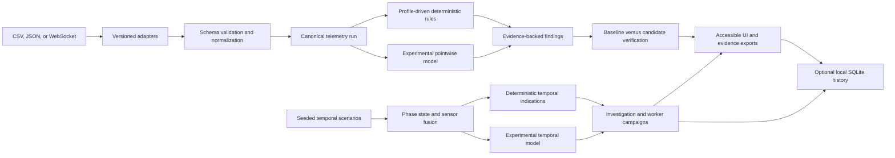
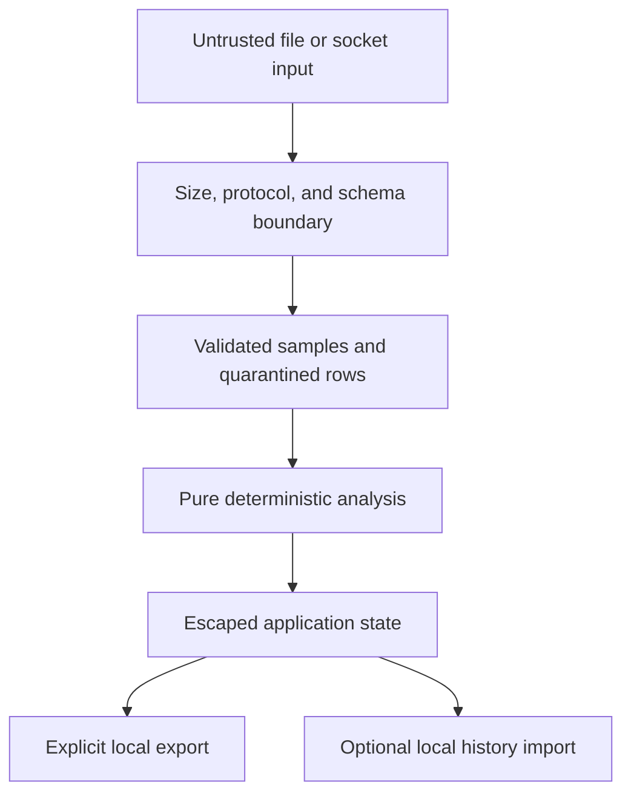

# Architecture

## Purpose

Flight Diagnostics Workbench turns external synthetic telemetry into reproducible diagnostic and verification evidence. The design separates input handling, validation, detection, comparison, presentation, and persistence so that each stage can be tested without a browser.

Every bundled dataset, threshold, profile, and injected scenario is synthetic and unclassified. The architecture is educational and is not intended for operational or safety use.

## Data flow



The deterministic path is the authority. Experimental model output is an additional comparison signal and cannot suppress or downgrade deterministic findings.

## Layers

### 1. External inputs

- **Legacy CSV adapter:** preserves the included fixture and its exact field mapping.
- **Versioned JSON adapter:** requires a supported schema version and explicit units.
- **Browser demo adapter:** produces protocol messages locally without a network dependency.
- **WebSocket adapter:** accepts only the documented versioned message protocol.

Adapters do not guess units, repair malformed values, or silently discard records. A mapping either declares the external field and unit or fails validation.

### 2. Validation and normalization

Validation is split into two levels:

- **Fatal run issues** prevent analysis, such as an unsupported schema, missing required columns, incompatible profile, or input above a hard limit.
- **Recoverable row issues** quarantine the affected record and remain visible in the verification report, such as blank, nonnumeric, nonfinite, or invalid timestamp values.

The normalized representation has one time basis and explicitly declared units. Raw source values are retained only as limited evidence where safe and necessary. They are never interpreted as markup.

### 3. Canonical contracts

`TelemetryRun` contains:

- schema version and run metadata;
- selected adapter and profile provenance;
- sources and canonical samples;
- accepted and quarantined counts;
- validation issues and source hash.

`TelemetrySample` contains:

- source ID;
- optional sequence number;
- normalized timestamp;
- channel measurements;
- explicit units;
- quality flags.

`DetectionProfile` contains:

- profile ID, version, and synthetic-data declaration;
- supported schema and channels;
- allowed units and field mappings;
- enabled rules and parameters;
- cadence and freshness expectations where applicable.

`Finding` contains:

- stable rule ID and severity;
- source, time, and optional sequence location;
- observed value and expected condition;
- deterministic evidence and quality context.

`VerificationRun` contains:

- application, schema, profile, and adapter versions;
- dataset hashes and record counts;
- validation summaries;
- baseline and candidate findings;
- resolved, persisting, and newly introduced classifications;
- requirement results and final pass or fail status.

### 4. Deterministic rule engine

Rules are pure operations over a canonical run and profile. Each rule has a stable identifier, explicit inputs, declared expected condition, and deterministic output order. Profile data controls thresholds and channel applicability. Source code controls rule semantics.

Rule families cover:

- presence and numeric validity;
- absolute range;
- rate of change using actual timestamps;
- duplicate, out-of-order, and gapped timestamps;
- missing and duplicate sequences;
- frozen sensors and stale feeds;
- schema and profile mismatch;
- the preserved overspeed, rapid-descent, and fuel-change compatibility conditions.

### 5. Fault injection

Fault injectors accept a seed, a declared scenario, and a nominal synthetic run. They return the changed run plus a manifest of injected faults. The same inputs must produce byte-equivalent manifests and equivalent findings.

Injection is separate from detection. A detector cannot inspect the injection manifest. Evaluation compares detector output with the manifest after both operations complete.

### 6. Verification

Verification uses a stable finding identity derived from rule ID, source, and diagnostic location. It classifies candidate findings as:

- **resolved:** present in the baseline and absent in the candidate;
- **persisting:** equivalent evidence is present in both;
- **new:** absent in the baseline and present in the candidate.

The comparison records validation changes as well as detection changes. A candidate with fatal validation errors cannot pass.

### 7. Presentation

The browser layer renders five views from immutable application state:

- **Monitor:** charts, gauges, alerts, and replay controls.
- **Diagnostics:** filterable findings and evidence.
- **Verification:** baseline and candidate selection, classification, and pass or fail evidence.
- **Investigation:** seeded temporal missions, linked traces, phase and lifecycle bands, sensor-fusion residuals, deterministic indications, advisory hypotheses, and campaign evidence.
- **Configuration:** active versions, mappings, rules, provenance, and declared limits.

All status is represented with text and icons in addition to color. Controls expose accessible names and keyboard behavior. A failed load clears or replaces incompatible current state so prior results cannot be mistaken for the new file.

### 8. Exports

JSON verification reports and CSV findings are versioned evidence artifacts. They exclude uploaded source samples by default. A source-data export requires a separate explicit user choice and is clearly labeled.

### 9. v2.1 streaming

The local simulator and browser demo use the same protocol:

```text
hello      protocolVersion, sourceId, sequence, timestamp, schemaVersion, profileId
telemetry  protocolVersion, sourceId, sequence, timestamp, measurements, units
heartbeat  protocolVersion, sourceId, sequence, timestamp
end        protocolVersion, sourceId, sequence, timestamp, reason
```

Each connection has a bounded queue. When pressure exceeds the configured capacity, the system increments a visible dropped-message count. It never presents silent loss as a complete stream. Reconnect uses bounded exponential backoff, and heartbeat age is reported separately from transport status.

### 10. v2.1 learned baseline

Python training generates nominal synthetic telemetry, fits a versioned robust covariance artifact, and evaluates held-out seeds with labeled injected faults. TypeScript inference consumes only the exported artifact. The UI shows anomaly score and per-channel residual contribution next to deterministic findings.

The model is disabled by default unless held-out evidence meets both gates: F1 at least 0.85 and false-positive rate at most 5 percent. Meeting those gates does not make the model authoritative and is not a claim about real-world performance.

### 11. v2.1 history analytics

Python's standard `sqlite3` module owns migrations and integrity checks. The schema includes runs, sources, findings, injected faults, requirement results, benchmarks, and model evaluations. Foreign keys are enabled for every connection. Indexed identifiers and timestamps support documented trend queries.

Local databases are generated artifacts and are not committed or sent by the web application.

### 12. v2.2 model registry and agreement

Each learned artifact is registered by profile and version. The entry declares training, calibration, held-out evaluation, model-card, and quality-gate evidence references. Compatibility evaluates schema, profile, channels, units, cadence, window length, artifact identity, configuration identity, stored quality evidence, and the user's enablement choice. Unsupported combinations return explicit reasons and never fabricate a score.

Agreement records distinguish both-indicate, rules-only, model-only, and both-nominal states. These labels compare signals; deterministic rules remain the production authority.

### 13. v2.2 temporal scenarios and phase state

The temporal generator produces seeded, redundant, noisy synthetic measurements for ground, takeoff, climb, cruise, descent, and landing. Ten declared fault classes include onset, active duration, and recovery labels. A deterministic state machine uses confirmation windows and hysteresis to record phase transitions with evidence.

The fault manifest is display and evaluation truth only. Deterministic indications and model features read observed telemetry, never fault labels.

### 14. v2.2 sensor fusion and temporal inference

A two-state altitude and vertical-rate estimator predicts hidden state, updates from redundant measurements, and retains innovations, normalized residuals, gains, missing-sensor evidence, and 95 percent uncertainty bands. This is a simplified synthetic Kalman baseline, not a flight estimator.

The temporal evidence has two deliberately separate tracks. Model v1 is research-evidence-only. Its separate five-channel generator supports the same-population persistence, linear, unchanged covariance, and compatible deterministic-rule projections plus the disjoint post-hoc challenge. Those metrics do not describe the browser's production-integrated path.

Model v2 is the production-integrated advisory artifact. It is fitted in Python from the actual TypeScript mission generator, Investigation projection, and 51-feature browser encoder, then scored locally in TypeScript with parity fixtures. Its held-out values cover one deliberately selected 40-sample causal window for each seed-label mission. They are selected-window observations, not episode-level or full-stream performance. Runtime inference evaluates every rolling window after warmup, so end-to-end false alarms, onset detection, delay, phase, duration, and recovery require separate campaign evidence. Its normalized distance scores rank hypotheses but are not calibrated probabilities.

### 15. v2.2 campaign execution

`CampaignSpec` expands declared profiles, parameterized scenarios, and seeds into a deterministic case matrix. The wired fixed-wing campaign covers three severity, duration, and onset-phase configurations per fault family and fails other profile identities closed. An inline worker evaluates one active request, publishes progress, yields between cases to observe cancellation, contains per-case failures, and returns a versioned complete or partial `CampaignResult` with replay hashes. Metrics include expected, missing, and unexpected detections; confusion by profile, phase, and fault; episode precision, recall, and F1; false alarms; detection delay; calibration; abstention; and deterministic bootstrap intervals.

The browser exports campaign evidence without uploaded telemetry. Ordered Python `sqlite3` migrations ingest explicit campaign reports into local history tables with foreign keys, indexes, integrity checks, queryable variation fields, and run-scoped deterministic case identity. The full result stays in SQLite, while concise history output omits the duplicate serialized payload.

### 16. v2.2 Investigation presentation

Chart.js renders linked observed, predicted, fused, uncertainty, phase, fault-lifecycle, detection, and residual evidence. Replay and chart seeking use a shared selected-sample index. Keyboard controls, text status, reduced motion, responsive layouts, and explicit empty, unsupported, warning, cancellation, and failure states remain part of the UI contract.

## Trust boundaries



The browser is the primary trust boundary. GitHub Pages serves static assets only. The local simulator and analytics tools are developer features and do not receive public web uploads.

## Build and deployment

- Vite builds strict TypeScript modules with dependencies bundled locally.
- The Pages artifact and offline HTML artifact come from the same commit and lockfile.
- CI checks normal, empty, failure, accessibility, responsive, and offline paths.
- Release automation generates an SBOM, checksums, and provenance for the exact release artifacts.
- GitHub Pages deploys only after CI succeeds for the selected commit.

See [configuration-management.md](configuration-management.md) for version ownership and [release-verification.md](release-verification.md) for the evidence gate.
