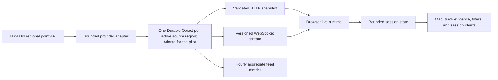

# Live Airspace v3.0

## Current implementation status

The authoritative [Ultra full-stack roadmap](v3-ultra-roadmap.md) is the execution plan. A+B remains selected. M1, M2-map, M2-Lab, the local M3.1 shared-service checkpoint and the local M3.2 linked investigation are implemented and locally verified for their recorded source identities. Fresh raw-artifact smoke and exact 2,000-record maximum profiles pass for the current local R3-exit source identity. The earlier real 30-minute soak remains historical evidence for source-content digest `32d2ff35734f8dfebcdbab319d577b57587cdff379ea5ea285eb47b2f60353bb`. All three are local Miniflare/workerd evidence, not Cloudflare, provider, deployment, or production proof. A raw synthetic integration source crosses the actual adapter, regional Durable Object, admitted and acknowledged WebSocket protocol and measured-time React view. Actual regional geography, feed-scoped receipt selection, linked trails/charts/text, and the React-owned Monitor, Diagnostics, Verification, Investigation, Campaign, and Configuration Lab workflows are integrated.

This is a controlled development preview, not a released public live dashboard. The server verifies and labels its source, and production remains disabled. ADSB.lol was contacted and supplied general operating guidance on 2026-08-30, but no real-aircraft request has been made and the exact pilot envelope was not approved. Numeric application admission, the required Live CI definition, the measured local workerd harness, the complete local A+B investigation, deterministic Replay, Evidence, the four-workspace shell, all six React Lab workflows, and the unified one-file React offline artifact now exist. The evidence-first UI renders a compact live proof strip, exact-receipt measurement ribbon, and bounded regional quality ledger; browser and Worker identities come from one build target and source identity. The offline artifact visibly disables Live while preserving Replay, the six-workflow Lab, and static Evidence under a no-connect policy. D1 and R3-01 through R3-06 are now implemented and locally verified on the current dirty tree, including artifact sanitization, operations compatibility, typed numeric policy, privacy/G2 firebreak, browser budgets and performance, deterministic visual baselines, eight runbooks, and candidate-bound receipt verification. Current-source raw smoke and maximum executions pass locally; the real 30-minute soak remains historical and all three must repeat against the frozen retained candidate. M3.3 is locally accepted with the validation-receipt caveat recorded below. M3.4 was demonstrated locally by the historical retained candidate named below; the current post-candidate source still requires a new retained candidate before any committed-SHA or release claim. Hosted CI evidence, account-level controls, physical platform capacity, the owner-approved operating envelope, a frozen retained candidate, and release gates remain open.

### Ultra implementation checkpoint, 2026-08-29

The first roadmap slice is implemented locally. Live and Replay share the refined investigation surface without duplicating semantic markup. The selected receipt puts altitude, ground speed, and vertical rate ahead of independent timestamps; the newest five regional quality transitions retain code, kind, region, optional aircraft ID, and explicit non-safety wording; and the desktop rail becomes viewport-sticky without creating a nested scroll region on smaller screens. A compact six-field strip exposes source, transport, feed state, conservative backend-receipt age, received versus positioned counts, and full feed-epoch text for assistive technology.

Evidence no longer silently defaults every route to `development-preview`. Vite now bakes the same application version, source SHA or `local-unreleased` fallback, release status, and target into the browser that it supplies to Worker variables. Local production-disabled and mock-staging artifacts built and passed isolation inspection. Historical load rows include exact source, Worker, report, command, and execution-window identity; unbound checks no longer display as current executions.

The most recent complete pre-Investigation run passed all 23 Live/Lab/Replay/Evidence cases. It first exposed a prohibited accessible label on the abbreviated feed epoch and a narrow-screen receipt table that could be partially obscured; the feed epoch now preserves full screen-reader text, and retained receipts reflow into labeled evidence cards without nested horizontal scrolling. React Diagnostics browser proof then exposed cached-width quarantine evidence and an offscreen Lab tab; React Configuration proof exposed keyboard-inaccessible scroll regions. Evidence cards now paint normally, the then-implemented Lab tabs wrap visibly, and every contained Configuration table is a named focusable region. The exact mobile cases and complete 23-case matrix passed for that source state. The guarded outage/recovery flow and M3 desktop/mobile portfolio walkthrough also passed. That count remains historical and is not inferred as current post-offline proof.

React Verification now has direct `#lab-monitor` and `#lab-verification` routes without replacing the retained in-memory Lab session. It compares captured baseline and candidate snapshots, distinguishes nominal, pass, regression, blocked, and incompatible outcomes, renders exact resolved/persisting/introduced groups and canonical requirement evidence, and exports the captured candidate through a source-minimized diagnostic report. `verification.v2` adds accepted/quarantined/validation counts, schema and adapter versions, versioned finding identity, requirement results, and binding/provenance integrity checks. The nine-case React Lab browser suite passes direct routing, Back/Forward, skip and keyboard behavior, chart/timer teardown, 390- and 320-pixel reflow, 200 percent text size, reduced motion, and serious/critical Axe checks using guarded synthetic local data.

React Diagnostics now has a direct `#lab-diagnostics` route and exact legacy-compatible severity, rule, source, and evidence search predicates with bounded pagination. It distinguishes nominal and filtered-empty evidence, displays source-minimized quarantine details, creates all 13 declared deterministic canonical or legacy-CSV candidates atomically, cancels superseded or hidden work, and hands successful candidates to the retained React Verification result. Typed scenario, seed, target, expected, and detected evidence reaches the diagnostic report and analytics importer. The focused browser journey proves direct entry/reload, Back/Forward and filter retention, safe quarantine rendering, 390- and 320-pixel reflow, 200 percent text size, reduced motion, zero serious or critical Axe findings, zero Local or Session Storage, and no Live, provider, map, or external request.

React Configuration now has a direct `#lab-configuration` route and exposes exact shell, deterministic-engine, run, adapter, profile, channel, rule, mapping, registry, artifact, canonical-configuration, evidence-split, quality-gate, activation-purpose, compatibility, and authority evidence. Learned comparisons remain advisory, default disabled, and fail closed until exact identity, quality, context, and explicit user-intent gates pass. Its seeded two-source browser simulator retains only bounded aggregate and health evidence, opens no data-plane fetch or WebSocket, never becomes a diagnostic run, and releases timers and listeners across stop, route, page, clear, profile, run, and Strict Mode lifecycles. `configuration-report.v1` excludes source samples, stream payloads, per-source health, endpoints, and browser state. The focused 171-test matrix and guarded browser journey pass Back/Forward retention, reload reset, 390- and 320-pixel reflow, 200 percent text size, reduced motion, zero serious or critical Axe findings, zero Local or Session Storage, and no Live, provider, map, or external request.

React Investigation now has a direct `#lab-investigation` route inside the six-tab Lab. It preserves the reviewed `gradual-drift`, seed `3101`, 180-sample defaults; validates all declared scenarios and exact bounds; snapshots advisory intent at analysis time; verifies bundled model identities and quality gates; and keeps deterministic rules authoritative over robust-covariance and temporal advisory evidence. The linked replay, expected/observed/predicted/estimated evidence, exact comparison identity, overlays, accessible charts, stale-work cancellation, and Strict Mode chart/listener cleanup are React-owned. `investigation-report.v1` contains only build identity, the synthetic reproduction tuple, compact verification-only lifecycle, exact model activation evidence, and aggregate results. Its all-false export policy excludes source data, samples, points, series, measurements, truth, per-sample labels, browser state, and endpoints, with no raw-data opt-in.

`FDW-LUI-015` and `TC-LUI-016` link the Investigation runner and prepared evidence contract, strict export schema and privacy tests, Lab session lifecycle, `#lab-investigation` route, six-tab view, chart ownership, and guarded browser journey. `FDW-LUI-016` and `TC-LUI-017` link the React Campaign route, strict seed and matrix contract, one-worker ownership, progress, cancellation, terminal evidence, and minimized `campaign-report.v1` export. Focused contract, session, component, chart, schema, route, and Campaign browser proof passes locally on the current dirty tree. This is not frozen-source, retained-candidate, hosted, provider, deployment, or release evidence.

The unified React offline slice is implemented locally under `FDW-LUI-017` and `TC-LUI-018`. Its generated `dist-offline/index.html` was the only runtime file and measured 1,315,264 bytes at this checkpoint. It opens directly through `file:`, defaults to a text-visible Live-unavailable state, and keeps Synthetic Replay, all six Lab subviews, and static Evidence hash-addressable. Replay uses a truthful map-unavailable substitute, Evidence has no service-health action, and the artifact excludes the Live service, provider, health, socket, MapLibre, map-asset, and external subresource runtime. A strict no-connect policy remains compatible with the inline blob Campaign Worker, which is counted separately and cleaned up.

Focused offline acceptance passed three browser cases with one intentional duplicate mobile parity skip. The journey covers direct entry, reload, Back and Forward retention, reload reset, all six workflows, deterministic Investigation and Campaign parity with the connected React build, active-resource cleanup, empty browser storage, 390- and 320-pixel reflow, 200 percent text, reduced motion, and no serious or critical Axe findings. No file, HTTP, HTTPS, WebSocket, secure-WebSocket, provider, tile, CDN, analytics, telemetry-upload, or external subresource request was observed. This is dirty-tree local evidence, not a frozen or retained artifact, hosted run, provider approval, deployment, or release.

The complete post-offline dirty-tree regression recorded at that checkpoint was green. Formatting, zero-warning ESLint, all three TypeScript configurations, and strict traceability passed at 202 requirements, 297 declared tests, and 53 areas. Application coverage passed 2,043 tests across 107 files with 95.02% statements, 91.01% branches, 95.83% functions, and 96.67% lines; 130 Worker tests across seven files and 43 Python tests passed. Browser execution passed 25 of 25 Live/React Lab/Replay/Evidence cases, 49 legacy/accessibility/responsive/offline cases with one intentional duplicate mobile parity skip, live-flow 1 of 1, and the M3 walkthrough 1 of 1. Normal, offline, production-disabled, and mock-staging builds, artifact isolation, local R2 map seeding, and the Worker dry run passed. Those counts predate R3 and remain historical dirty-tree evidence, not frozen, retained, committed-SHA, hosted, provider, deployment, or release proof.

### R3 local exit checkpoint, 2026-08-30

Operational Evidence Option 1 and Runtime Policy Option 2 are fully implemented locally. Strict traceability now binds 218 requirements, 313 declared tests, 55 areas, both selected option IDs, all 16 selected requirements, all 16 selected test cases, and exact regular-file evidence through a source-content manifest. The complete configured static, application, Worker, Python, connected-browser, legacy/offline-browser, flow, walkthrough, build, privacy, runbook, browser-budget, visual-regression, browser-performance, and Worker dry-run gates pass on the dirty development tree.

The runtime policy owns one deeply immutable `runtime-policy-limits.v2` contract for protocol, provider, history, delivery, admission, map, bundle, and performance limits. The current conservative real-source envelope is one fixed Atlanta query, one shared attempt no more often than every 20 seconds while viewers exist, and at most 25 attached or closing stream viewers. Synthetic assurance retains all three fixed Georgia presets. All seven routes derive enablement, path, method, query, body, upgrade, and response-security decisions from that contract; encoded reserved paths fail closed, and generated candidates route static assets through the Worker while Vite keeps transformed development assets. Both generated connected targets sanitize deployment metadata and pass whole-artifact policy inspection. Operations evidence preserves partial regional results and distinguishes application, provider, delivery, admission, and freshness dimensions. Its closed schema now has recursive property-based privacy tests, and Evidence covers 200-percent text, 320-pixel reflow, keyboard access, reduced motion, and serious or critical Axe findings. Four deterministic A+B baselines cover desktop and mobile Overview and Investigation. Eight operator procedures are machine-checked and synthetically rehearsed without provider, network, cloud, deployment, runtime, or production action. Fresh raw smoke and exact 2,000-record maximum profiles pass against the current local source; the retained-candidate bridge and acceptance recorder are implemented and tested, but no current candidate was retained or accepted by this checkpoint.

This closes local R3 only. The base HEAD still has a dirty working tree. One committed exact source, retained candidate, retained-byte browser and load matrix, hosted CI, Cloudflare operating envelope, provider approval, real-source observation, deployment, and publication remain separate R4 and G0 through G3 gates.

The verification-history analytics importer now recognizes the minimized `diagnostic-report.v1` envelope with nested `verification.v2` evidence. It imports the captured candidate identity and counts, resolved/persisting/new classification labels, canonical requirement/test links, and top-level synthetic fault provenance without requiring excluded source samples or raw quarantined values.

The most recent complete pre-Investigation local checkpoint passed 1,869 application tests across 95 files, 130 Worker tests across seven files, 43 Python analytics and ML tests, all 23 Live/Lab/Replay/Evidence browser cases, and 49 legacy desktop/mobile browser cases with one intentional duplicate parity skip. Formatting, zero-warning lint, all TypeScript configurations, 199-requirement/294-test/50-area required-evidence traceability, normal/production-disabled/mock-staging/offline builds, artifact isolation, and the generated Worker dry run passed for that source state. Those counts are historical after the Investigation changes; the current complete post-offline counts are recorded above. Both checkpoints are dirty-tree development evidence. A frozen exact-SHA candidate, retained-artifact matrix, current load and soak, hosted CI, Cloudflare, provider, deployment, and public proof remain open.

### Historical planning-only refresh, 2026-08-28

The user's repeated replan received a fresh independent reviewer explicitly configured for Ultra reasoning. It retained the architecture and A+B direction. The roadmap now assigns closure of the known free-tier operating-envelope conflict, adds a regional logical-byte budget alongside the 100-viewer acknowledgment window, names HTTP/health/reconnect/map/control overload cases, and requires content-identified local evidence. The two-MiB envelope and 2,000-record safety cases remain separate from the 500-aircraft responsiveness target. Completed timing, map, history and retention work is preserved rather than reopened.

The historical M3.4 candidate demonstrates the exact-root, rollback and retained-artifact workflow locally. It is not proof for the current post-candidate source. At this 2026-08-28 checkpoint, the first 500-record smoke and 2,000-record maximum reports had been superseded and corrected executions remained open. The corrected smoke, maximum and real 30-minute soak later passed on recorded source digest `32d2ff35734f8dfebcdbab319d577b57587cdff379ea5ea285eb47b2f60353bb`. Hosted CI remains open. Physical Cloudflare measurement and the explicit operating-envelope decision remain G1. Provider/license review begins as a decision packet, without contacting a provider. The four remaining React Lab workflows and complete offline v3 stay required. A new current-source retained candidate, mock Cloudflare proof, bounded real-provider access and public cutover remain separate gates; the external actions remain owner-authorized.

That planning refresh initially changed documentation only. Subsequent local checkpoints implemented the bounded delivery core, A+B investigation and M3.3 work described here. No aircraft-observation request, provider message, cloud action, commit, push or deployment occurred.

The checkpoint sections below are a dated implementation ledger. Statements that a later test was still open describe that checkpoint, not the authoritative current schedule. Use [v3-ultra-roadmap.md](v3-ultra-roadmap.md) for current status and next work.

### M3.1 bounded-delivery core, 2026-08-28

The stream now uses strict delivery batches with one receipt-controlled window per viewer. Complete envelope bytes count against a fixed eight-MiB regional ledger, connection/close credit is reserved for all 100 possible viewer slots, and slow or closing viewers retain their credit until they detach. Batches share one prepared snapshot/health/error state rather than copying aircraft payloads into socket attachments. The browser validates the whole batch, preserves existing ordering/timing behavior and returns a bound delivery acknowledgment.

An independent Ultra review found that an earlier version's connection reservation could grow after the ledger was full. The correction reserves all slots up front. The old implementation fails the new late-join regression; the corrected implementation passes it and the focused delivery/client/capacity regression set.

The final post-review validation passed **1,488 application tests across 69 files, 120 Worker tests across six files and 42 Python tests**, formatting, lint, typing, traceability, normal build and offline build. All 373 Git tracked or untracked nonignored files retained the same content fingerprint during the complete command matrix. Twelve actual Live/Lab browser cases passed in 51.3 seconds, followed by the 58.1-second synthetic outage/recovery walkthrough. Generated local build, coverage and workerd files changed as expected and are not release evidence.

Disabled-production and named mock-staging Live artifacts both built after the protocol change. Artifact isolation passed: production contains no mock service or fixture, while mock staging contains its deployable synthetic service. No deployment occurred.

This checkpoint proves the local logical delivery contract. It does not prove physical Cloudflare memory/buffering, process-wide egress denial, platform billing, provider entitlement or deployment. The request-admission and local-CI checkpoint below extends M3.1 without closing those external and physical gates.

### M3.1 request-admission and local-CI checkpoint, 2026-08-28

The Worker now rejects excess work before expensive downstream calls through fixed, numeric, per-isolate request, byte and concurrency limits. The policy covers total API/map attempts, preflight, catalog, three-region health fanout, snapshots, stream handshakes, ranged map reads and map response streams. Invalid stream upgrades, unsupported map conditions and invalid or excessive ranges fail before Durable Object or R2 access. Large map objects require a bounded range, and an admitted response keeps its concurrency lease until the stream completes or is canceled.

The current R3 policy convergence adds one deeply immutable, versioned numeric contract in `src/live/runtimePolicyLimits.ts`. The compiled `runtime-policy.v1` identity and closed JSON Schema include the exact contract. Protocol validation, provider response and cadence controls, bounded browser history, quality-event retention, delivery and control credit, request admission, map range reads, browser bundle budgets, optimized paint and interaction thresholds, and retained load scenarios now derive from it. Legacy environment-based provider selection and compiled-policy selection pass an exhaustive target/mode equivalence matrix, and any artifact that changes a limit without recompiling the exact policy is rejected. These checks are current dirty-tree evidence, not a committed release or deployed operating envelope.

WebSocket controls now have both a per-socket sliding window and a regional active-runtime token bucket. Oversized or binary controls fail before regional state scans, abusive clients close with bounded retry behavior, and a healthy socket can recover after overload. These counters contain no aircraft records or persistent client identity. The HTTP admission controller is also isolate-local and resets when the Worker isolate is replaced. It bounds application work but is not an account-wide denial-of-service or billing control.

Local workerd services now replace native `fetch` with a fail-closed egress guard and probe the Worker, regional object and synthetic mock-provider paths. Deployable production and mock-staging artifacts are separately inspected to ensure that test guard modules do not ship. This proves the guarded native-fetch paths exercised in local tests, not a process-wide network firewall.

The required `live-assurance` CI job is now defined locally with pinned actions, integrity-keyed map inputs, fresh local R2 seeding, both Live builds, build-isolation inspection, a generated-production Worker dry-run, actual-browser/flow tests and the executable capacity model. It is included in the required-job aggregator and has no deployment authority. Because the workflow has not been committed or run by GitHub Actions, this is configuration evidence, not hosted-CI evidence.

An independent Ultra post-implementation review found three defects in the first version of this checkpoint: a health-fanout concurrency lease could release while sibling calls were still running, ETag preconditions could lose precedence to range handling, and three acceptance descriptions were broader than their tests. The health fanout now waits for every branch to settle before release, map 304/412 semantics are restored before range work without touching R2, and the exact-boundary, recovery, sustained-rate and stream-release matrices now have direct regressions.

This locally closes numeric application admission and CI configuration. The later checkpoints below close mixed near-limit fairness and reconnect-storm behavior. The load harness exists, but its first smoke and maximum reports are diagnostic only. M3.1 remains open for corrected smoke and maximum execution, the qualifying 30-minute soak and hosted execution; physical Cloudflare capacity, authorized account-level controls, actual metering and Kato's operating-envelope decision remain G1 work. No provider request, cloud action, commit, push or deployment occurred.

### M3.1 publication durability and safe exhaustion checkpoint, 2026-08-28

The remaining local ordering audit found one concrete defect: a coordinator whose durable sequence had reached `Number.MAX_SAFE_INTEGER` reserved another attempt and contacted the provider before rejecting the unsafe next sequence. The coordinator now treats the durable maximum sequence itself as the terminal condition. It stops before attempt reservation and provider I/O, removes provider polling from alarm reconciliation while preserving acknowledgment and metric-maintenance deadlines, returns explicit degraded health, and publishes the final safe sequence once with that terminal status. No duplicate exhaustion flag was added, and the provider-specific `retryBlocked` state was not overloaded.

Eight actual-workerd publication cases now cover cold restart after a committed reservation; failures before reservation, after fetch but before commit, after commit but before broadcast, and during metric recording; same-deadline duplicate alarms; final safe-sequence publication; cold exhausted eviction; and zero provider calls after exhaustion. Regional-delivery coverage now reconstructs mixed sent and reserved-unsent receipt metadata after a controlled mid-fan-out interruption. A genuine hibernation test verifies the same mixed receipt states, valid acknowledgment isolation, unsent expiry and the next higher sequence.

Focused publication/delivery verification passed: 32 application cases, 53 Worker cases, Worker type checking and focused lint. After the reconnect requirement was added, strict traceability reports 195 requirements and 290 declared tests across 47 areas. Both current Live build targets passed isolation inspection, and `pnpm worker:dry-run` validated the generated production Worker, its 26 static assets, Durable Object, R2 and fixed variables without deploying. The dry-run is now ordered before candidate retention in `live-assurance`; hosted execution remains unproven.

This closes the named local publication-boundary and safe-sequence gap, not M3.1 as a whole. The subsequent mixed-load checkpoint closes the near-limit fairness and reconnect-storm cases. The corrected smoke and maximum profiles, qualifying 30-minute soak, hosted execution and physical platform evidence remain open. The static `pnpm live:capacity` report is still a source-counted estimator, not a load test or Cloudflare memory/billing measurement.

### M3.1 mixed near-limit fairness and reconnect checkpoint, 2026-08-28

A valid 2,000-aircraft delivery now exercises 2,018,977 encoded bytes, 96.27 percent of the two-MiB envelope ceiling. With 100 logical viewers and only enough regional credit for a small prefix of those envelopes, the test repeatedly releases one receipt, verifies the oldest ready near-limit viewer advances, proves no fast viewer receives a second turn while an older ready viewer remains, and drains the queue until every viewer has received service. Complete wire bytes and the eight-MiB regional ledger are checked after every release.

An actual-workerd reconnect test fills all 100 regional viewer slots, consumes the remaining 28 stream-admission tokens through bounded `VIEWER_CAPACITY` responses, and verifies the next attempt receives a bounded isolate-scoped `STREAM_ADMISSION_LIMIT` response. It then closes one real client, observes 99 attached sockets, advances the deterministic admission clock by the exact 250-millisecond refill interval, reconnects to 100, and confirms the provider call count remains one.

The capacity model now classifies reconnect attempts, accepts and rejects separately. Its explicit full-region example records 100 initial connections, 30 reconnect attempts, one accepted reconnect and 29 rejected reconnects; rejected attempts remain counted as offered application work. The static model still does not measure latency, throughput, memory, runtime errors, active duration or Cloudflare billing.

These cases close the planned local mixed near-limit, eventual-fairness and reconnect-storm behavior. The following checkpoint records diagnostic, superseded local smoke and maximum reports, not accepted profiles. M3.1 still needs corrected smoke and maximum execution, the qualifying 30-minute soak and authorized hosted CI. Physical one/three-region Cloudflare memory, buffering, metering, restart and headroom evidence remains G1 work.

### M3.1 diagnostic local workerd load reports, 2026-08-29

The measured harness runs the generated mock-staging Worker through local Miniflare/workerd over loopback WebSockets. A deterministic in-process service supplies fixed-region synthetic observations, the generated Worker topology and limits are validated, and unexpected external fetches fail closed. It records offered, admitted and rejected connections; lower-and-upper provider cadence; exact complete-sequence delivery counts; causally linked ACK-then-ping/pong probes; reconnect accounting observed through the next scheduled publication; runtime/client errors; source and artifact hashes; Node-driver-plus-Miniflare-host memory; and separately sampled local workerd process RSS.

`test-results/live-load/smoke.json` reported a passing 15-second, 500-record run under the then-current gates. Its one-region case offered 102 connections, admitted the initial 100 plus one post-expiry replacement, returned one bounded `VIEWER_CAPACITY` rejection, matched all 200 ordered acknowledgment probes and kept provider calls at two before and after reconnect. Its three-region case admitted all 30 viewers and matched all 60 probes. `test-results/live-load/maximum.json` likewise reported a passing 30-second, 2,000-record run under those gates: the one-region case admitted 101 of 102 offered connections, matched all 497 probes and retained exact 2,000-record snapshots up to a 1,199,596-byte envelope; the three-region case admitted all 30 viewers and matched all 91 probes. A post-run read-only audit found that cumulative-delay Windows PowerShell/CIM sampling caused projected sample incompleteness, cadence offsets included pre-measurement setup calls, counters froze before the end-sequence watermark drained, and post-boundary traffic contaminated global ACK/delivery gates. Neither self-reported outcome is accepted evidence and neither closes `TC-EDG-013`.

The superseded smoke report has SHA-256 `f5878506fe806f860d418e11c2443b63de41003567faacd4761d42f41b6ebc05`; the superseded maximum report has SHA-256 `7d0e3a40a836b2211998666c8da64215811fe1018e59b9727dd180750a545b9a`. Both captured HEAD `80c1e47b1d3662163f297b67e8a3c86477159231` plus dirty-tree source-content SHA-256 `ff4f2fdfca724028e5afe0295809440812efc4732fccd6cf20840f6acf81f189`, verified that identity remained unchanged during execution, and exercised Worker bundle SHA-256 `18e84c4cad96686e129d689de83471821871b1c235f8333dd5736eff18765c93`. Those provenance facts identify the diagnostic runs; they do not repair the measurement defects or establish acceptance.

The corrected harness runs capacity rejection, stalled-client expiry and replacement admission before the fixed measurement window, drains and captures one exact start watermark, freezes an end watermark before bounded delivery/ACK drain, and separates later provider sequences from late receipts belonging to the measured window. Workerd discovery runs once, then a persistent targeted sampler uses absolute deadlines, explicit timing/error states and an exact final boundary sample. Deterministic fault tests cover skipped slots, boundary collisions, causal-probe exclusion, late in-window drain, post-boundary accounting and ACK freeze-before-drain. Acceptance is report-driven rather than inferred from a filename: every corrected profile must pass all gates with unchanged source and artifact identities. Driver RSS includes the Node load driver plus in-process Miniflare orchestration; sampled workerd RSS remains process-level, not per-Durable-Object heap or Cloudflare isolate memory. The release-required soak must execute for at least 30 real minutes, retain a stable workerd process identity, collect the exact scheduled sample set and pass the declared post-warmup RSS plateau gate. Hosted GitHub Actions, physical Cloudflare staging, provider approval, deployment, billing, production capacity and public release remain unproven.

Ultra artifact-integrity addendum, 2026-08-29: raw and retained-candidate modes now copy the accepted tree to a private hash-matched directory and execute only that copy. The selected input and private execution snapshot are independently rehashed after measurement. Source identity v2 inventories all tracked working-tree files, includes executable-mode truth when Git enforces it, and fails closed on changes hidden by Git `assume-unchanged`. Report output is confined to a normalized, untracked canonical path beneath `test-results/live-load`, rejects symlink or junction ancestors, protected aliases, case aliases, and tracked targets, and is revalidated immediately before atomic publication. The private snapshot must be removed successfully before a report can be published. CI uses an unconditional post-load candidate verification step, so a failed load cannot skip integrity cleanup. The latest raw smoke ran from `2026-08-29T15:04:43.908Z` to `15:05:43.508Z` and passed both workerd topologies against dirty-tree source-content SHA-256 `6293507cb3e2f251af9390ac937a4fbb3a056f9e644d0ed49b166240a35498b6`. Its selected and execution-snapshot trees have the same 30-file SHA-256 `7acdc893928129912750c7051e62540cb51e71431743b7d00305cb1589f15edd`; its report SHA-256 is `c1a2f4ce2f097f5ce1005b6bce0698e5d8c68e938fb2415890b218d5974a267c` and contains no absolute repository path. That report predates the current sanitized build policy and remains development evidence for its recorded source only. Current connected-build tests now prove that generated deployment metadata omits `configPath` and `userConfigPath` and passes the allowlisted artifact policy. Candidate-mode smoke, maximum, and the qualifying 30-minute soak still require a future frozen clean candidate.

This integrity model is fail closed for ordinary local and CI use, not a hostile same-user attestation boundary. A process with the same account could still attempt a filesystem race and restore bytes between checks; stronger evidence would require an isolated account or container and a read-only artifact mount. Atomic rename also does not make the report power-loss durable without file and directory synchronization. Those residuals do not affect the current local planning gate, but they must not be represented as tamper-proof or crash-durable evidence.

`FDW-EDG-012` and `TC-EDG-013` make this boundary explicit. Strict structural traceability now reports 196 requirements mapped to 291 declared tests across 47 areas. That mapping proves catalog completeness only; it does not convert either diagnostic report into an accepted test result.

### M3.2 A+B linked investigation, 2026-08-28

The local Live workspace now keeps one feed-scoped receipt identity synchronized across the selected map point, segmented trail, altitude and ground-speed charts, selected-track panel and complete textual evidence table. Position, measurement, provider-snapshot and backend-receipt times remain independent. Missing values and gaps remain visible; the application does not align unrelated measurements, fill gaps or infer a route.

The final M3.2 source tree passed 1,519 application tests across 72 files and 120 Worker tests across six files. The 205 focused M3.2 cases, 15 actual Live/Lab browser cases, one 53-second synthetic outage/recovery flow and 30 legacy workbench desktop/mobile browser cases also passed. Type checking, ESLint, Prettier, traceability, normal build, Live build and build-isolation checks passed. These are local synthetic and controlled-integration results, not a real-aircraft request, hosted CI run, deployment or public release.

All three fixed regions, complete filters/sorting, exact-versus-latest receipt selection, final receipt expiry, retained session history, map failure fallback, keyboard operation and desktop/mobile semantic order are covered locally. M3.3 Replay/Evidence is locally accepted. M3.4 was later demonstrated for the historical candidate recorded below; a current-source candidate, M3.1 external/platform closeout, offline v3 and release gates remain open.

### M3.3 Replay, Evidence and portfolio walkthrough, 2026-08-28

Replay now uses a strict versioned fixture contract, reserved synthetic identifiers, deterministic scenario seeds and a virtual clock with play, pause, seek, reset and 1x/2x/4x controls. Nominal, data-quality-gap and outage/recovery scenarios traverse the same normalized session, map, trail, chart, table and textual evidence projections used by Live. Replay does not open a provider, catalog, health, analytics or Live transport, and the Live parser rejects replay identity.

The four-workspace shell now exposes Live, Replay, Lab and Evidence with isolated lifecycle owners. Evidence reports source, schema, map, build, license, privacy, limitation and gate state without claiming a release. Its optional health check is explicit, bounded, same-origin, aggregate-only and poll-free; static evidence remains available if that check fails. Keyboard, 320px reflow, 390px mobile, WebGL-loss recovery and zero serious/critical automated accessibility findings are covered in the executed browser matrix.

The current checkpoint passed 1,661 application tests across 81 files, 120 Worker tests across six files and 42 Python tests. Formatting, ESLint, all TypeScript configurations, traceability, normal/offline builds and at least 92% coverage on statements, branches, functions and lines passed. Nineteen actual Live/Lab/Replay/Evidence browser cases, the controlled outage/recovery flow and the full desktop/mobile M3 walkthrough also passed. Disabled-production and separately named mock-staging builds passed artifact-isolation inspection.

Both complete validation commands exited 0. The verification helper classified their content receipts as `source_changed_during_check` because validation regenerated ignored offline and temporal artifacts; the Git working-tree status fingerprint was identical before and after the second run. Therefore this is local source and behavior evidence, not the immutable built-candidate proof assigned to M3.4. No real aircraft request, hosted CI run, deployment or public release occurred.

### M3.4 retained-candidate demonstration, 2026-08-28

Historical candidate `mock-staging-9d75130be95cff81a5647459` passed all five dedicated retained-artifact browser cases with zero retries. It served the exact v3 root and four workspace histories, the approved v2 rollback bytes, the retained Worker, mock provider, Durable Object and WebSocket paths, and exact retained map ranges while missing routes failed closed. Candidate verification before browser execution, after browser execution and after receipt creation reported unchanged checksums.

That result is local mock-staging evidence for source-content SHA-256 `b1c03e2ba1243b87d2ab876b7e8310a5d99fe63db742497ce496ef1246c7394d`. It includes the ordinary-suite selection and named map-region corrections, and the subsequent broad local regression matrix left the candidate bytes unchanged. It is not hosted CI, a committed-SHA run, Cloudflare deployment, real-provider evidence or public-release approval. Publication durability, mixed-delivery and fairness recovery, reconnect/accounting, traceability and Worker dry-run changes above postdate the candidate, so no retained candidate currently represents the latest source.

### M2 evidence, 2026-08-28

- Full validation passed: **1,314 application tests, 52 Worker tests, 42 Python tests**, formatting, lint, all three TypeScript configurations, traceability and normal/offline builds. React Live/Lab, route/session ownership and the shared charts are included in coverage.
- Twelve actual Live/Lab browser cases passed. Coverage includes the real geographic map and archive byte ranges, feed/table fallback for missing assets and actual WebGL context loss, imports/exports, repeated workspace transitions, chart/timer/socket cleanup, keyboard navigation, mobile reflow and automated accessibility.
- The self-hosted Georgia map manifest contains 776 licensed assets, 133,533,691 bytes total, including a 122,391,249-byte regional PMTiles archive. Only local R2 emulation was seeded. Source recipe, per-file hashes and attribution are under `maps/`.
- The first lazy React Lab workflow preserves the exact 85/0/9 baseline and hash, validation/profile/replay semantics and source-export opt-in. Settled session data survives workspace navigation, but active work stops. Explicit clearing or a page reload discards the in-memory data. The four remaining workflows still use the preserved Lab entry.
- A separate 51-second actual-provider-shape walkthrough passed nominal, valid-empty, stale, unavailable and recovery states. Selection and epoch survive recovery; connected transport does not relabel stale observations as current.
- The retained Lab golden baseline and two desktop offline cases passed. Actual offline-file Investigation and the inline 31-case campaign work with zero HTTP(S) requests; normal/offline evidence agrees. This preserves the existing five-workflow artifact, not the completed React/offline v3 migration.
- Production and mock-staging Live builds passed. The generated production configuration/code/source maps exclude the mock service/binding/fixtures and keep the provider disabled. Separately named mock staging includes its deployable synthetic service. These are local build checks, not cloud deployment proof.
- Provider/region/epoch acceptance, non-regressing health, freshness projection, late-callback guards, Strict Mode cleanup and actual local workerd eviction/hibernation binding tests passed at M2. History, retention, 100-viewer admission and the local publication-boundary matrix were completed by later checkpoints. Corrected smoke/maximum profiles, the 30-minute soak and physical Cloudflare load proof remain downstream.

The subsequent P2 cadence/history/retention checkpoint passed complete isolated validation: **1,411 application tests, 107 Worker tests and 42 Python tests**, plus formatting, lint, typing, traceability and normal/offline builds. Twelve actual Live/Lab browser cases also passed. REST, joins and alarms honor one durably reserved attempt schedule; cold eviction does not bypass cooldowns, and long/absolute/blocked provider retries survive restart. The UI displays retry status without promising automatic recovery for paused polling. The browser history domain enforces its 500-aircraft, 120-sample and 15-minute limits, including during a long unsynchronized outage. M3.2 later completed the linked chart/trail presentation over that retained domain.

Independent aggregate expiry is also implemented, with 23 focused workerd cases. It survives idle regions, provider failure/backoff and hibernation, uses transactional bounded cleanup and a durable retry, and does not repeat unchanged alarm writes. Attempt reservation and socket admission preserve the next polling wakeup before final scheduling. The post-change 52.4-second outage/recovery flow, both Live builds and artifact-isolation checks passed. Later M3.1 checkpoints close local logical delivery, publication durability, near-limit fairness and reconnect recovery. Corrected smoke/maximum profiles, the 30-minute soak, hosted CI and physical platform gates remain open.

`pnpm live:capacity` provides a tested, source-counted estimate rather than a billing claim. At this historical checkpoint, the former three-region, ten-second baseline was 259,200 row writes/day before extra callers and maintenance. The current Atlanta-only, 20-second pilot makes at most 4,320 scheduled attempts/day; its verified success path is nine KV-row writes plus two alarm-row writes per attempt, or at least 47,520 writes/day before initialization, early alarms, cleanup, failures, snapshot callers, or other workloads. The modeled minimum is below the published 100,000 Free write allowance, but platform measurements and an explicit operating-envelope decision remain required. See the roadmap for assumptions and current primary sources.

Run the local synthetic preview with `pnpm dev:live` and open `http://127.0.0.1:4174/live.html`. `#lab` or `#lab-monitor` opens React Monitor without starting Live, `#lab-diagnostics` opens React Diagnostics, `#lab-verification` opens React Verification, `#lab-investigation` opens React Investigation, `#lab-campaign` opens React Campaign, and `#lab-configuration` opens React Configuration. It uses the actual local backend and no remote aircraft provider. `pnpm build:offline` produces the separate one-file React offline artifact. For a fresh checkout, `pnpm maps:prepare`, `pnpm maps:manifest` and `pnpm maps:seed` prepare the public regional geography and local-only map storage; they do not deploy cloud resources. The legacy artifact remains a rollback and regression reference. `pnpm test:live-browser`, `pnpm test:live-flow`, `pnpm verify:live-builds`, and `pnpm exec playwright test tests/browser/offline.spec.ts` reproduce the applicable local proof; build the relevant targets before running their artifact checks.

The recorded base HEAD at that checkpoint was `80c1e47`, with uncommitted changes. The package version remains 2.2.0 and development metadata does not claim an exact released v3. ADSB.lol coordination has since supplied general guidance, but no exact pilot-envelope approval, real-aircraft request, cloud account resource, commit, push, or deployment is proved. All external G1-G3 gates remain open.

The requirements below describe the finished product and are not evidence that every downstream behavior is implemented.

## What the live view represents

Live Airspace displays public ADS-B, MLAT, and related surveillance observations returned by the configured provider for one fixed Georgia region. Values such as callsign, received position, altitude, ground speed, track, and vertical rate may be missing, delayed, inaccurate, duplicated, or sourced from different surveillance methods.

The application reports those conditions as feed-quality evidence. It does not infer aircraft health, mechanical condition, maintenance status, airworthiness, safety, affiliation, ownership, route, destination, or future position.

## Regional presets

| Region                | Center            | Radius | Availability                              |
| --------------------- | ----------------- | ------ | ----------------------------------------- |
| Atlanta               | 33.6407, -84.4277 | 100 nm | Real-source pilot and synthetic assurance |
| Savannah / Statesboro | 32.3000, -81.5000 | 100 nm | Synthetic assurance only                  |
| Central Georgia       | 32.6500, -83.6000 | 100 nm | Synthetic assurance only                  |

These presets are server-side configuration. Real-source mode exposes only Atlanta and permits only `GET /v2/point/33.6407/-84.4277/100`; the other presets remain deterministic test and replay coverage. An API caller cannot substitute arbitrary coordinates.

## Provider field and unit contract

The ADSB.lol adapter consumes the provider's readsb-compatible aircraft objects through an explicit mapping. The raw payload does not repeat unit metadata beside each value, so the adapter, tests and this table form the local mapping contract. A provider-contract change requires a fresh documentation review and normalization regression before the adapter is enabled.

| Provider field             | Declared meaning and unit                                                     | Normalized behavior                                                                                                  |
| -------------------------- | ----------------------------------------------------------------------------- | -------------------------------------------------------------------------------------------------------------------- |
| `now`                      | Provider response time in Unix milliseconds for ADSB.lol `/v2`                | Required and converted to `providerGeneratedAt`; future-clock violations reject the snapshot                         |
| `hex`                      | Six hexadecimal characters, optionally prefixed with `~` for a non-ICAO ID    | Required; invalid identifiers reject the aircraft record                                                             |
| `seen`                     | Seconds before provider `now` when the aircraft was last heard                | Required; derives contact time and receipt-relative contact age                                                      |
| `seen_pos`                 | Seconds before provider `now` when the position was last updated              | Optional; a position is exposed only when age, latitude and longitude are all valid                                  |
| `lat`, `lon`               | Decimal degrees                                                               | Optional bounded latitude/longitude pair; partial or invalid coordinates remain unavailable                          |
| `alt_baro`                 | Barometric altitude in feet, or the string `ground`                           | Numeric values remain barometric altitude; `ground` sets `onGround=true`; numeric altitude never proves flight state |
| `alt_geom`                 | Geometric altitude in feet                                                    | Optional geometric altitude, kept distinct from barometric altitude                                                  |
| `gs`                       | Ground speed in knots                                                         | Optional nonnegative `groundSpeedKnots`; it is not labeled as airspeed                                               |
| `track`                    | True ground track in degrees from 0 inclusive to 360 exclusive                | Optional `trackDegrees`; 360 and out-of-range values are rejected                                                    |
| `baro_rate`, `geom_rate`   | Vertical rate in feet per minute                                              | Prefer valid barometric rate; otherwise use valid geometric rate and preserve the selected basis                     |
| `flight`, `r`, `t`, `type` | Bounded untrusted callsign, registration, aircraft type and surveillance type | Optional text only; no ownership, route, affiliation or safety inference                                             |

The unit mapping is consistent with the upstream readsb JSON contract for [altitude, speed, track and vertical-rate fields](https://github.com/wiedehopf/readsb/blob/dev/README-json.md#aircraftjson) and its definitions of [`seen` and `seen_pos`](https://github.com/wiedehopf/readsb/blob/dev/README-json.md#aircraftjson). The local sanitized capture validator intentionally reports raw units as `unit_unverified` because those units are documented externally rather than embedded in each response record. That review result is not an adapter failure and is not provider-production approval.

## Data flow



## API routes

| Route                                   | Purpose                                               |
| --------------------------------------- | ----------------------------------------------------- |
| `GET /api/v1/regions`                   | Return the active source's fixed regional catalog     |
| `GET /api/v1/health`                    | Return application and active-region feed state       |
| `GET /api/v1/airspace/:region/snapshot` | Return one validated current regional snapshot        |
| `GET /api/v1/airspace/:region/stream`   | Upgrade to the read-only versioned WebSocket protocol |

All JSON responses disable caching. Unsupported methods, routes, and regions return structured errors. WebSocket upgrades require the deployment origin or an explicit allowlist entry.

## Polling and failure behavior

- Real-source poll interval with viewers: at least 20 seconds between shared attempts.
- Provider timeout: 8 seconds.
- One Atlanta provider request may be in flight at a time.
- Snapshot callers share an existing in-flight request.
- Provider Retry-After information contributes to the next permitted request time.
- Three consecutive failures open a 60-second circuit.
- When the final viewer disconnects, provider polling stops; an aggregate-expiry maintenance alarm may remain scheduled.
- Snapshot-only access does not schedule recurring provider polling, but its aggregate metrics still require expiry maintenance.

The required browser behavior validates every message, reconnects with capped backoff, and retains the last valid snapshot during recoverable errors. Observation freshness ages independently of connection status; an open connection cannot make an old observation current. The roadmap defines the 15/45/120-second freshness boundaries and the server-time reference.

## Data retention and privacy

The Worker does not persist aircraft identifiers, callsigns, registrations, positions, complete snapshots, trails, provider payloads, or request IP addresses in application storage. The latest snapshot exists only in the active Durable Object memory and can disappear during eviction or deployment.

Persisted regional data is limited to:

- feed epoch and sequence/control identity;
- retry and circuit-control timestamps and counters;
- the fixed region identity;
- hourly poll, success, failure, rate-limit, invalid-field, aircraft-count, and latency-bucket aggregates;
- the timestamp of the last metric cleanup.
- a bounded cleanup-retry timestamp when maintenance fails.

Hourly metric buckets become due for deletion at their UTC hour start plus 30 days. Independent maintenance remains scheduled with no viewers, blocked polling or provider failure. Each transaction deletes at most 128 due rows and commits the next required alarm; a durable 60-second retry protects recoverable cleanup failures. If the retry also cannot be committed, the error remains visible and platform/operator recovery is required. This policy does not promise physical erasure at an exact instant during an infrastructure outage or from infrastructure backups. A legacy dormant object with no alarm requires one-time activation during an authorized rollout.

The implemented browser history domain stays in memory, with at most 500 aircraft, 120 combined receipt-associated samples per aircraft and 15 minutes of evidence. Position and measurement timestamps are independent; gaps and rejected/conflicting observations mark incomplete history. Expiry advances during feed and clock-reference outages without granting freshness, and clock discontinuities clear conservatively. Region/mode changes and navigation away from Live clear the session. The linked map trail, charts and textual receipt interface consume these guarantees locally; exact release acceptance remains separate.

Application-level invocation logging is disabled in `wrangler.jsonc` to avoid creating an unnecessary request log. Cloudflare remains an infrastructure processor subject to the account configuration and Cloudflare policies, which must be reviewed before production deployment.

## Provider terms and release gate

The checked technical candidate is [ADSB.lol](https://api.adsb.lol/). ADSB.lol coordination response received on 2026-08-30. The provider confirmed general requirements for visible ODbL attribution, an identifiable contact-bearing User-Agent, respectful handling of HTTP errors and Retry-After, shared caching and deduplication, no rate-limit circumvention, and no service-level or stability guarantee. The response did not approve the proposed 20-second cadence, 25-viewer ceiling, exact User-Agent, public no-key access, incident contact, change-notification channel, or the ODbL obligations for transient normalized browser redistribution. G2 remains pending and Live remains disabled. The repository retains only a [sanitized coordination summary](provider/adsb-lol-coordination-2026-08-30.json); Kato's mailbox remains the owner-controlled primary record.

The provider documentation also asks production users to contact the operator. Before a public v3 production release:

1. Obtain a specific answer for the remaining exact pilot-envelope questions or select another reviewed provider.
2. The current output license, redistribution and derived-database obligations, attribution wording, endpoint, fields, API-key policy and rate-limit guidance must be confirmed and reverified for the exact release.
3. The exact deployed origin and Worker configuration must pass the release and privacy checks.
4. No availability or service-level guarantee may be claimed without written evidence.

## Local verification

```powershell
pnpm validate
pnpm test:worker
pnpm build:live
pnpm build:mock-staging
pnpm verify:live-builds
pnpm privacy:verify
pnpm runbooks:verify
pnpm browser:budgets
pnpm test:visual-regression
pnpm test:browser-performance
pnpm test:live-browser
pnpm test:live-flow
pnpm test:m3-walkthrough
pnpm worker:dry-run
pnpm live:load:smoke
pnpm live:load:maximum
```

The named local load scripts explicitly select `dist-mock-staging` in raw-artifact mode. Raw mode hashes the complete artifact tree before and after execution but does not claim candidate provenance. The CI-only candidate smoke supplies the clean retained-candidate root through `--candidate-directory`, verifies its checksum allowlist, provenance, exact source content, baked release SHA, and retained-artifact identity before and after measurement, and never rebuilds it.

The complete current dirty-tree matrix includes Live/React Lab/Replay/Evidence, legacy/accessibility/responsive/offline, deterministic desktop/mobile visual regression, guarded failure flow, and portfolio walkthrough coverage. React Investigation, Campaign, and unified offline v3 have linked coverage under `TC-LUI-016..018`. Local R3 is complete. This remains dirty-tree development evidence, not a frozen or retained candidate, hosted run, physical-platform result, provider approval, deployment, or exact release. R4, G0, and every external release gate remain open.
