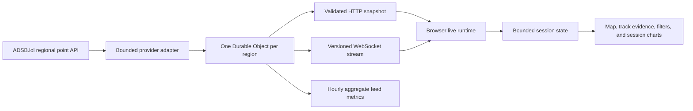

# Live Airspace v3.0

## Current implementation status

The provider contract, ADSB.lol adapter, regional Worker routes, Durable Object coordinator, browser transport, session state, presentation model, and automated unit and Worker integration tests are implemented on the v3 feature branch.

The production browser interface, responsive and accessibility verification, final release evidence, provider-production coordination, and deployment verification remain pending. This document does not describe v3.0 as released.

## What the live view represents

Live Airspace displays public ADS-B, MLAT, and related surveillance observations returned by the configured provider for one fixed Georgia region. Values such as callsign, received position, altitude, ground speed, track, and vertical rate may be missing, delayed, inaccurate, duplicated, or sourced from different surveillance methods.

The application reports those conditions as feed-quality evidence. It does not infer aircraft health, mechanical condition, maintenance status, airworthiness, safety, affiliation, ownership, route, destination, or future position.

## Regional presets

| Region                | Center            | Radius |
| --------------------- | ----------------- | ------ |
| Atlanta               | 33.6407, -84.4277 | 100 nm |
| Savannah / Statesboro | 32.3000, -81.5000 | 100 nm |
| Central Georgia       | 32.6500, -83.6000 | 100 nm |

These presets are server-side configuration. An API caller cannot substitute arbitrary coordinates.

## Data flow



## API routes

| Route                                   | Purpose                                               |
| --------------------------------------- | ----------------------------------------------------- |
| `GET /api/v1/regions`                   | Return the fixed regional catalog                     |
| `GET /api/v1/health`                    | Return application and per-region feed state          |
| `GET /api/v1/airspace/:region/snapshot` | Return one validated current regional snapshot        |
| `GET /api/v1/airspace/:region/stream`   | Upgrade to the read-only versioned WebSocket protocol |

All JSON responses disable caching. Unsupported methods, routes, and regions return structured errors. WebSocket upgrades require the deployment origin or an explicit allowlist entry.

## Polling and failure behavior

- Poll interval with viewers: 10 seconds.
- Provider timeout: 8 seconds.
- One regional provider request may be in flight at a time.
- Snapshot callers share an existing in-flight request.
- Provider Retry-After information contributes to the next permitted request time.
- Three consecutive failures open a 60-second circuit.
- When the final viewer disconnects, the polling alarm is removed.
- Snapshot-only access does not schedule a background alarm.

The browser validates every message. It reconnects with capped exponential backoff, retains the last valid snapshot during recoverable errors, and ages that evidence into stale and offline states when new snapshots stop arriving.

## Data retention and privacy

The Worker does not persist aircraft identifiers, callsigns, registrations, positions, complete snapshots, trails, provider payloads, or request IP addresses in application storage. The latest snapshot exists only in the active Durable Object memory and can disappear during eviction or deployment.

Persisted regional data is limited to:

- retry and circuit-control timestamps and counters;
- the fixed region identity;
- hourly poll, success, failure, rate-limit, invalid-field, aircraft-count, and latency-bucket aggregates;
- the timestamp of the last metric cleanup.

Hourly metrics older than 30 days are removed. Browser trails are separately bounded by points and aircraft count, live only in memory, and reset on refresh or region change.

Application-level invocation logging is disabled in `wrangler.jsonc` to avoid creating an unnecessary request log. Cloudflare remains an infrastructure processor subject to the account configuration and Cloudflare policies, which must be reviewed before production deployment.

## Provider terms and release gate

The checked provider is [ADSB.lol](https://api.adsb.lol/). Its official materials document public API access, dynamic rate limits, and ODbL 1.0 licensing. The live interface and documentation must display provider attribution and an ODbL link.

The provider documentation also asks production users to contact the operator. Before a public v3 production release:

1. Kato must coordinate the intended regional polling pattern with ADSB.lol or select another reviewed provider.
2. The current terms, attribution requirement, endpoint, fields, and rate-limit guidance must be reverified.
3. The exact deployed origin and Worker configuration must pass the release and privacy checks.
4. No availability or service-level guarantee may be claimed without written evidence.

## Local verification

```powershell
pnpm validate
pnpm test:worker
pnpm wrangler deploy --dry-run --outdir .tmp-tests/worker-dry-run
```

Browser, responsive, accessibility, failure-state, and offline-live cases remain release requirements and must pass after the selected interface is implemented.
