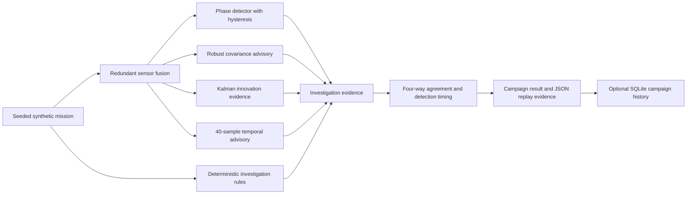

# Temporal fault intelligence

## Scope and status

This document describes the implemented v2.2 candidate modules for seeded temporal scenarios, mission-phase estimation, redundant sensor fusion, deterministic investigation, advisory model inference, campaign evaluation, and SQLite history.

The implementation is synthetic, unclassified, and employer-neutral. It is not designed for real aircraft, operational data, certification, maintenance disposition, or safety decisions. The current application wires the Investigation view, replay, charts, comparison baseline, four-signal evidence, minimized export, model-compatibility display, and campaign run, progress, cancellation, metrics, result, failure, and export states. The July 19 working tree passed the local Chromium desktop, mobile, accessibility, and network-disabled offline checks. Protected CI, Pages, and tagged release evidence remain exact-commit gates.

## Data flow

Deterministic rules own the authoritative indication. The production rule-to-temporal-model comparison can be `both-indicate`, `rules-only`, `model-only`, or `both-nominal`. The selected-sample four-way view separately compares deterministic rules, robust covariance advisory output, Kalman innovation supporting evidence, and temporal advisory output. Disabled, ineligible, warming, abstained, or unsupported signals remain `not-available` rather than being forced to nominal. The summary can be unanimous indicate, unanimous nominal, or mixed, and it records unavailable signals. Neither agreement view transfers authority to a learned model.

## Synthetic mission scenarios

`generateTemporalScenario` creates at least 60 samples at a declared cadence of at least 100 ms. The default is 180 samples at 1,000 ms. The wired Investigation control limits requests to 60 through 2,000 samples, while direct generator calls have no upper bound. A repeated seed and specification produce the same output. Each sample includes truth, nine sensor measurements, phase truth, quality by sensor, fault labels, an ISO timestamp, and `SYNTHETIC_UNCLASSIFIED` metadata.

| Mission generator ID      | Synthetic effect                       | Active target               |
| ------------------------- | -------------------------------------- | --------------------------- |
| `gradual-drift`           | Progressive altitude bias              | Barometric altitude         |
| `noise-growth`            | Growing random variation               | Vibration                   |
| `oscillation`             | Deterministic sinusoidal disturbance   | Inertial vertical rate      |
| `lag`                     | Three-sample delayed response          | Indicated airspeed          |
| `intermittent-dropout`    | Recurring explicit `null` observations | GPS altitude                |
| `stuck-value`             | Held onset value                       | Barometric altitude         |
| `gain-error`              | 18 percent scale error                 | GPS ground speed            |
| `fuel-leak`               | Quantity loss with excess flow         | Fuel quantity and fuel flow |
| `cross-sensor-decoupling` | Equal and opposite biases              | Barometric and GPS altitude |
| `simultaneous-faults`     | Drift, oscillation, and fuel loss      | Multiple channels           |

A nominal scenario has no fault timeline or injected labels. Every injected scenario has an onset index, active end, recovery end, target sensors, and active or recovering lifecycle. The generator labels truth for evaluation, but `analyzeTemporalScenario` does not read those labels when it creates deterministic indications.

The model label is `sensor-lag`, while the mission scenario ID is `lag`. This is an explicit mapping, not an inferred equivalence. Model v1 remains research-evidence-only and uses a separate five-channel generator. Model v2 is the production-integrated advisory path and uses the actual TypeScript mission generator plus the Investigation projection. Its checked values still describe selected 40-sample windows rather than complete mission streams.

## Mission-phase hysteresis

The phase detector is forward-only and confirms a candidate transition for two samples by default. Entry thresholds start a candidate. Wider maintain thresholds let that candidate survive normal boundary noise while it is confirmed.

| Transition         | Entry condition                                                                                   | Maintain condition                                                                  |
| ------------------ | ------------------------------------------------------------------------------------------------- | ----------------------------------------------------------------------------------- |
| Ground to takeoff  | Speed at least 60 kts and vertical rate at least 250 ft/min                                       | Speed at least 50 and vertical rate at least 150                                    |
| Takeoff to climb   | Altitude at least 500 ft and vertical rate at least 350 ft/min                                    | Altitude at least 400 and vertical rate at least 250                                |
| Climb to cruise    | Altitude at least 4,000 ft, speed at least 130 kts, and absolute vertical rate at most 180 ft/min | Altitude at least 3,800, speed at least 120, and absolute vertical rate at most 250 |
| Cruise to descent  | Vertical rate at most -300 ft/min                                                                 | Vertical rate at most -200                                                          |
| Descent to landing | Altitude at most 800 ft and speed at most 120 kts                                                 | Altitude at most 1,000 and speed at most 135                                        |
| Landing to ground  | Altitude at most 40 ft, speed at most 30 kts, and absolute vertical rate at most 100 ft/min       | Altitude at most 60, speed at most 40, and absolute vertical rate at most 150       |

A transition emits `phase-transition.v1` evidence with the stable rule ID `temporal.phase.transition`, entry and hysteresis text, condition-level values, sample and timestamp, and synthetic classification.

## Redundant sensor fusion

`KinematicFusionEstimator` tracks hidden altitude and vertical rate. The prediction step links altitude to rate. Sequential updates consume:

- barometric and GPS altitude;
- inertial and barometric vertical rate.

Missing observations remain visible in `missingSensors`; present values must be finite. Timestamps must increase strictly. Prediction time is capped at 60 seconds, so upstream timing diagnostics must still identify large gaps rather than treating that cap as validation.

Each estimate includes predicted, observed, and posterior state; sensor innovations; innovation variance; normalized innovation; Kalman gain; posterior value; standard deviations; and 95 percent intervals. The stable evidence rule is `temporal.sensor-fusion.innovation`, with a declared three-sigma expected condition. The investigation path converts vertical rate from ft/min to ft/s before estimation and back to ft/min for display evidence.

## Deterministic investigation rules

The current analyzer creates observed-data indications for:

| Rule                                                  | Current condition                                                                                  |
| ----------------------------------------------------- | -------------------------------------------------------------------------------------------------- |
| `investigation.sensor.missing`                        | Any required mission sensor observation is `null`                                                  |
| `investigation.fusion.innovation`                     | Maximum normalized fusion innovation exceeds 3 after initial settling                              |
| `investigation.redundancy.altitude-disagreement`      | Redundant altitude difference exceeds 80 ft                                                        |
| `investigation.redundancy.speed-disagreement`         | Redundant speed difference exceeds 10 kts                                                          |
| `investigation.redundancy.vertical-rate-disagreement` | Redundant vertical-rate difference exceeds 90 ft/min                                               |
| `investigation.vibration.rolling-noise`               | Eight-sample vibration population standard deviation exceeds 0.025 g                               |
| `investigation.sensor.stuck-barometric-altitude`      | Six-sample barometric range is at most 0.5 ft while GPS range is at least 8 ft                     |
| `investigation.fuel.quantity-flow-relationship`       | Five-sample quantity loss exceeds 0.27 percentage points per sample while average flow exceeds 0.9 |

Each indication has a stable ID, rule ID, severity, sample, timestamp, sensor list, observed value, expected condition, evidence fields, and possible hypothesis types. Hypothesis counts help prioritize investigation, but they do not prove root cause.

## Advisory temporal model

The temporal model accepts exactly 40 samples with `airspeed`, `altitude`, `verticalRate`, `fuel`, and `vibration`. Missing values are deterministically forward-filled; an entirely missing channel falls back to zero, and missing fraction remains a feature. Deterministic missing-data rules must remain authoritative because imputation can conceal the operational importance of sustained loss.

The 51 features include, per channel, mean, population standard deviation, half-window shift, root-mean-square differences at offsets 1, 2, and 4, curvature, freeze ratio, and missing fraction. Six cross-channel features cover altitude-rate correlation and lag, airspeed-altitude correlation, fuel slope, and vibration growth.

The standardized feature vector is compared with nominal and ten fault centroids. Artifact-specific support rules can force `unknown`. Output includes the nearest label, final predicted label, normalized top-class similarity, distance, anomaly margin, abstention, anomaly state, normalized class similarities, and the top three fault hypotheses. These distance-derived similarities rank classes; they are not calibrated probabilities.

The registry and score path default user selection to disabled. Eligibility is not consent. The v1 research artifact and v2 production-integrated advisory artifact have separate registry identities and evidence. See [temporal-model-evidence.md](temporal-model-evidence.md) for the exact contracts, hashes, evaluation units, recorded values, and limitations.

## Investigation evidence and charts

`analyzeTemporalScenario` produces aligned points, phase transitions, fusion evidence, rule indications, model warmup and score, production agreement, four-way detector evidence, onset and recovery markers, expected, observed, predicted, and estimated series, uncertainty bands, hypothesis scores, and deterministic and model detection delays. Robust covariance input compatibility is explicit. Kalman evidence includes the largest normalized innovations and up to three top residual sensor channels.

A display-only `InvestigationChartRenderer` module validates aligned arrays, preserves phase and fault evidence during downsampling, supports overlay visibility, disables animation, accepts mouse seeking, and supports Arrow, Page, Home, and End keyboard seeking. It does not read or mutate source telemetry.

The renderer and analysis DTO are wired into the application Investigation view with scenario, seed, and sample-count controls; replay; overlays; evidence lists; model hypotheses; four-signal status; deterministic indications; phase log; and JSON export.

The user can capture or replace a comparison baseline. The display overlays captured and current observed and predicted altitude waveforms only when profile ID, cadence, sample count, and every sample index match. A mismatch is reported explicitly, and the renderer does not interpolate or silently align data.

The normal `investigation-export.v1` JSON contains scenario identity, timeline, phase transitions, indications, markers, hypotheses, and detection results. Generated samples, point traces, and complete series are excluded by default. An explicit checkbox adds those generated source windows and records `exportPolicy.sourceDataIncluded: true`. Campaign exports omit source telemetry rows.

The source is linked to browser tests for the Investigation run, export minimization and explicit inclusion, learned-control state, four-way evidence, waveform compatibility, keyboard replay, responsive layout, accessibility, and network-disabled offline use. These links are implemented coverage, not passing browser evidence. Local normal and single-file compilation has completed, but integrated browser and offline-runtime verification remain release gates.

## Campaign evaluation

`campaign.v1` defines a matrix over profiles, scenarios, and seeds. Scenarios declare phase, expected detection episodes, negative rule opportunities, synthetic duration, and optional generated-fault variation parameters. Builder and evaluator callbacks keep the campaign engine independent of a specific detector.

For each case, the runner records detections, expected matches, misses, unexpected detections, calibration observations, confusion counts, duration, and contained errors. It supports progress callbacks and `AbortSignal` cancellation without committing an aborted in-flight case. The replay manifest preserves ordered case identities and the SHA-256 of the stable campaign specification.

Aggregate evidence includes:

- confusion matrices overall and by profile, phase, and fault;
- episode precision, recall, and F1, using `null` when a denominator is not identifiable;
- scenario coverage;
- false alarms per completed run and per synthetic hour;
- time-to-detection distribution;
- advisory-score reliability summaries, including the currently named Brier score and expected calibration error fields, plus abstention. The source score is a normalized similarity, not a calibrated probability;
- seeded deterministic bootstrap intervals for precision, recall, and F1.

The validated campaign boundary caps a specification at 4 profiles, 64 scenarios, 12 seeds, 372 total cases, and 256 KiB. Serialized results are capped at 10 MiB, and each case is capped at 128 detections and 2,048 calibration observations. The wired default campaign is narrower: one supported generic fixed-wing profile, one nominal case plus three declared severity, duration, and onset-phase variants for each of ten fault families, 1 through 12 unique positive 32-bit seeds, 180 samples per case, and 300 bootstrap iterations. That produces 31 through 372 cases from the application. The three parameter sets are low and short in climb, standard in cruise, and high and long in descent. Other profile IDs or versions fail as contained `UnsupportedTemporalCampaignProfileError` cases because the temporal generator does not implement rotary-wing or other profile truth. Bootstrap iterations in arbitrary specifications are validated from 1 through 10,000.

`campaign-worker.v1` is implemented through an inline worker handler and a browser client. It versions requests, associates responses by request ID, reports progress, supports one active browser request, rejects malformed or stale responses, and exposes cancellation. The temporal executor yields to the worker event loop between cases so queued cancellation messages can be observed. A cancellation response carries a validated partial `CampaignResult` with completed and remaining cases; the browser promise still rejects with `CampaignCancelledError`, which retains that partial result for rendering and export. The temporal executor uses the real mission generator and investigation analyzer, maps the model class `sensor-lag` to generator scenario `lag`, and stores model output as advisory details. The application validates seed input, disables conflicting controls during a run, renders progress and terminal states, shows episode F1, false alarms per run, median detection delay, abstention, confusion, bootstrap interval, synthetic exposure, and replay identity, and exports `campaign.v1` JSON without source telemetry rows.

The wired path passed the local browser and network-disabled offline workflow. Those results apply to the checked working tree and must not be described as protected CI, Pages, or tagged release evidence until GitHub verifies the exact commit.

## SQLite history

`tools/analytics/temporal_campaign.py` adds independent campaign migrations and four evidence tables:

- `campaign_runs` stores status, specification identity, counts, and the serialized result;
- `campaign_cases` stores matrix identity, status, duration, confusion, contained errors, and migration-v2 variation ID, severity scale, duration scale, and onset phase fields. Migration v3 scopes each deterministic case ID to its campaign run so repeated matrices can coexist in history;
- `campaign_detections` stores matched, missing, and unexpected evidence;
- `campaign_metrics` stores campaign, group, scenario, calibration, timing, and bootstrap values.

Foreign keys, uniqueness constraints, checks, and indexes protect relationships. Ingestion is parameterized and idempotent by campaign run ID. The full result remains stored in SQLite for reproducibility, while the selected-run or latest-run history report intentionally omits `result_json` and returns concise status, outcome, metric, and variation summaries. Integrity and summary reports are available. The importer rejects individual result files above 10 MiB, retained result payloads above 64 MiB, and database growth above 128 MiB. It fails explicitly and never silently prunes evidence.

## Pending work

- Complete browser, responsive, keyboard, accessibility, and export execution for the wired Investigation view on the release candidate.
- Ensure every activation path is gated by the displayed registry compatibility result. Low-level scoring does not independently recompute the artifact's file hash.
- Preserve the explicit `lag` to `sensor-lag` mapping and add full-stream, phase-, duration-, and recovery-aware model evaluation before treating selected-window observations as mission-level evidence.
- Verify the wired campaign controls and inline `campaign-worker.v1` client and worker end to end.
- Verify that cancellation remains responsive during the real CPU-bound campaign, not only with injected asynchronous test executors.
- Verify the campaign specification, matrix, per-case evidence, result, retained-payload, and database limits through the exact release-candidate gates before accepting untrusted input.
- Execute the compiled self-contained artifact with networking disabled and verify the Investigation view, inline worker, comparison overlay, and minimized exports.
- Run the complete TypeScript, Python, browser, accessibility, build, and release gates on one exact commit before making a v2.2 release claim.
