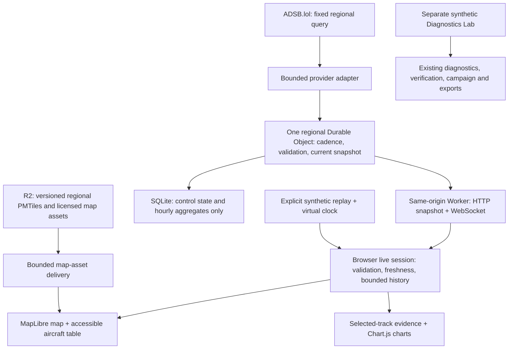

# Live Airspace v3: revised full-stack roadmap

> Historical engineering ledger. The authoritative 2026-08-29 Ultra roadmap is [v3-ultra-roadmap.md](v3-ultra-roadmap.md). Status statements below retain their dated evidence boundaries and may be superseded by the newer roadmap.

Date: 2026-08-28

Historical status at 2026-08-28: The Ultra full-roadmap and M3.3 execution replans were complete without an architecture reset. M1, M2-map, M2-Lab, M3.2 A+B and M3.3 Replay/Evidence retained local acceptance. The local M3.1 shared-service checkpoint covered bounded acknowledged delivery, numeric application admission, guarded local egress paths, safe sequence exhaustion, synthetic publication/restart boundaries, valid near-limit eventual fairness, an actual-workerd reconnect storm, explicit reconnect accounting, an implemented local workerd load harness, and required Live CI configuration including a generated-production Worker dry-run. The first smoke and maximum reports were diagnostic and superseded because a post-run audit found unresolved measurement and sampling defects. M3.4 was locally demonstrated by retained historical candidate `mock-staging-9d75130be95cff81a5647459`: its five zero-retry full-stack cases passed and its bytes remained identical through the candidate-bound receipt and broad regression matrix. Later publication-durability, delivery, reconnect, load-harness, traceability and dry-run changes postdated that candidate. These records did not identify a committed release candidate because the working tree remained dirty. The current 2026-08-29 addenda and authoritative Ultra roadmap supersede this status.

Audited source: `80c1e47b1d3662163f297b67e8a3c86477159231`, branch `feat/live-airspace-v3`.

Scope: this checkpoint combines the accepted local implementation with an Ultra planning and implementation audit of the current UI, history contract, test evidence, provider terms and platform constraints. It records the historical local M3.4 candidate without treating it as proof of later source, a hosted run, a deployable production candidate or a public release. It does not perform an aircraft-observation request, provider coordination, cloud action, hosted CI run, commit, push or publication. The broader v3 implementation goal remains open.

Current React Lab and offline addendum, 2026-08-29: Monitor, Diagnostics, Verification, Investigation, Campaign, and Configuration are six separate React-owned routes on the dirty development tree. `FDW-LUI-016` and `TC-LUI-017` bind the Campaign route, exact deterministic matrix, one-worker lifecycle, terminal evidence, and minimized `campaign-report.v1` boundary. The unified one-file React offline v3 artifact is implemented locally under `FDW-LUI-017` and `TC-LUI-018`; its focused file-protocol gate covers Live-unavailable, Replay, all six Lab workflows, static Evidence, deterministic Investigation and Campaign parity, zero network activity, cleanup, responsive behavior, and accessibility. The complete post-offline current dirty-tree regression is green. This local implementation does not close G0, authorize G1, establish provider evidence under G2, or authorize publication under G3.

Current dirty-tree verification addendum, 2026-08-29: formatting, zero-warning ESLint, all three TypeScript configurations, and strict 202-requirement/297-test/53-area traceability pass. Application coverage passes 2,043 tests across 107 files with 95.02% statements, 91.01% branches, 95.83% functions, and 96.67% lines; 130 Worker tests across seven files and 43 Python tests pass. Browser execution passes 25 of 25 Live/React Lab/Replay/Evidence cases, 49 legacy/accessibility/responsive/offline cases with one intentional duplicate mobile parity skip, live-flow 1 of 1, and the M3 walkthrough 1 of 1. Normal, offline, production-disabled, and mock-staging builds, artifact isolation, local R2 map seeding, and the Worker dry run pass. These results are not frozen, retained, committed-SHA, hosted, provider, deployment, or release evidence.

This roadmap carries forward the approved regional, live-first product and A+B interface choice. It replaces the earlier implementation sequence where that sequence treated the existing foundation as accepted. It does not reduce the requested React migration, real map, replay, Diagnostics Lab, or release scope. The checkpoint below distinguishes completed repairs from remaining requirements.

### Archived delivery sequence, superseded by the Ultra roadmap

Keep this sequence as historical context only. The current execution authority is the [Ultra roadmap](v3-ultra-roadmap.md) and its current execution ledger. Preserve the existing architecture and accepted local product.

1. **Preserve the M3.4 proof and settle the source:** retain the historical candidate receipt, keep the corrected suite selection and ARIA/focus regressions green, then identify the next evidence with one settled committed source revision.
2. **Preserve M3.1:** corrected smoke, maximum, and qualifying 30-minute soak evidence later passed for their recorded source identity and is now historical. Rerun all three on the frozen candidate, then obtain hosted CI evidence when commit and push authority exists.
3. **Measure G1 when authorized:** deploy a newly retained committed-source mock candidate within an owner-approved Cloudflare account, target and budget, with the real provider disabled.
4. **Resolve provider and license terms in parallel:** prepare the decision packet now, but do not contact a provider or enable real access without separate approval.
5. **M4.1 completed locally:** preserve the six React Lab workflows and their verified behavior through the green complete post-offline regression matrix.
6. **M4.2 completed locally:** preserve the proven self-contained offline v3 artifact, its zero-network boundary, and the approved v2 rollback artifact.
7. **Complete M5 next:** harden performance, resilience, privacy, accessibility, observability and v3 release automation, then retain a separately verified production candidate.
8. **Close G2 and G3 separately:** perform an approved bounded real-source smoke, then publish the exact retained production artifact only after explicit cutover approval.

Prepare the provider and hosting decision packet alongside local work. Its bounded mock-staging budget must be settled before G1; real-source terms and the production operating envelope must be settled before their respective live gates. Account waiting does not stop independent local work. Section 8 is a historical ledger; the Ultra roadmap and `v3-execution-ledger.md` are the current schedule.

Quality means observable behavior and reproducible evidence. A higher reasoning setting is useful for review, but does not by itself establish correctness, usability, performance or a deployed live feed.

The Ultra replan established four practical priorities, now updated with execution evidence:

1. Preserve the repaired two-viewer delivery, measured timing, quantization, presentation and disposal work. Obsolete tests, lint and formatting were reconciled, and full validation is restored. Do not redo those repairs.
2. Integrated runtime/presentation, provider/region/epoch ordering, activation cleanup and feed-scoped exact receipt selection now have passing domain, actual Worker and React lifecycle evidence. Keep those guarantees and the accepted Replay/Evidence boundary intact.
3. M1 crosses the actual provider adapter/coordinator and HTTP/WebSocket transport into React. M2 proves actual geographic rendering and the first React Lab workflow. M3.2 now proves the complete local linked investigation across map, charts and text. These checkpoints do not replace the remaining migration, load-test or external-release matrix.
4. Local mock, mock-staging and disabled production builds are implemented and inspected. Their local checks do not authorize staging deployment or provider access. Preserve the completed A+B scope, learning-inclusive estimates and early provider/account/usage decision packet.

## 1. Recommendation and finished product

Live regional aircraft tracking is the strongest next major upgrade for this project. It adds a genuine external-data pipeline, server-side coordination, a useful visual interface, and operational reliability work to the existing analytical depth.

The portfolio value is the complete chain: receive imperfect observations, validate them, distribute one shared regional feed, explain its freshness, support investigation, and prove how the application behaves when data or infrastructure fails.

The finished product has four deliberately separate workspaces:

| Area             | User's job                                                                                            | Required result                                                                                                                                         |
| ---------------- | ----------------------------------------------------------------------------------------------------- | ------------------------------------------------------------------------------------------------------------------------------------------------------- |
| Live Airspace    | See what aircraft have recently been observed in one Georgia region and investigate a selected track. | Real map, synchronized aircraft table, filters, session trails, altitude/speed charts, explicit freshness and failure states.                           |
| Synthetic Replay | Reproduce data gaps, stale observations, ordering faults and provider outage/recovery without Live.   | Seeded fixtures, a virtual clock, explicit synthetic identity, the same map/table/chart evidence path and no network transport.                         |
| Diagnostics Lab  | Reproduce and investigate synthetic telemetry faults.                                                 | Preserve Monitor, Diagnostics, Verification, Investigation, Campaign, Configuration, existing exports, and offline operation.                           |
| Evidence         | Understand the system and evaluate its engineering.                                                   | Architecture, data boundaries, source/license information, exact-release provenance, executed test evidence, limitations, and aggregate service health. |

Public ADS-B/MLAT observations are not engine, fuel, maintenance, or aircraft-health telemetry. Live observations must never enter the synthetic health-rule or advisory-model pipeline. A stale observation is a data-quality condition, not an aircraft emergency.

Use mode-specific notices: Live names its real surveillance source; Lab and replay say synthetic. The existing Lab's global all-synthetic banner must not be inherited by the live page.

The intended release description is a near-real-time regional airspace observation and investigation workbench. Ten-second polling is a target cadence, not a promise that the underlying aircraft observations are ten seconds old or that every aircraft is visible.

### What makes this the right next upgrade

The current project already has substantial synthetic analysis and verification logic. A polished live workflow adds the complementary skills that are less visible today: external-data integration, a shared backend, streaming delivery, geographic rendering, failure recovery, and deployment operations. Keep that existing analytical depth rather than restarting the project.

The main user journey should be explainable in 90 seconds: choose a region, select a recently observed aircraft, inspect its received position and available altitude/speed history, then inspect source age and limitations. A separately selected synthetic replay demonstrates outage recovery reliably; the Lab demonstrates reproducible diagnostic reasoning. No account or live-provider availability should be required to demonstrate the synthetic workflows.

The goal is a focused regional investigation product, not feature parity with a worldwide flight-tracking service. A visual redesign alone would improve presentation, but the complete live pipeline is the stronger full-stack addition. Adding generic AI chat is not on the critical path.

### Preserved decisions

- Regions: Atlanta, Savannah / Statesboro, and Central Georgia, using the existing 100-nautical-mile presets.
- Live Airspace is the normal online entry point. The offline artifact starts in Diagnostics Lab.
- A+B: A's light, evidence-first layout with B's selected-track investigation charts.
- React + TypeScript + Vite for the UI; retain the framework-independent diagnostics and analysis logic.
- MapLibre for the actual map; a self-hosted Protomaps PMTiles regional extract through zoom 12.
- Cloudflare Worker + one SQLite-backed Durable Object per region; R2 Standard for map assets.
- Free-tier-first, bounded usage, no automatic paid upgrade.
- Aircraft history is browser-session-only. No server-side flight history or persistent watchlists.

### Explicitly outside v3

Worldwide tracking, owner/person lookup, military-only filtering, privacy-program identification, destination/route inference, schedules or ticketing data, predicted positions, public aircraft-history exports, user accounts, social features, and aircraft-health claims.

Do not add a second application server, Redis, PostgreSQL, Kafka, or an AI assistant merely to increase the technology count. Reconsider those only for a later requirement that this architecture cannot serve.

## 2. Baseline evidence and current working state

Distinguish historical validation from the current working tree. M2's complete `pnpm validate` checkpoint finished with exit code zero after the geographic map and first React Lab changes. React Live and Lab components, route/session ownership and the shared chart helper are included in coverage. The normal and offline Lab builds passed, at approximately 193.53 kB main-JavaScript gzip and 472.04 kB offline-artifact gzip. Those two artifacts still represent the existing five-workflow Lab, not the completed v3 migration.

Separate Live production and mock-staging builds also passed. Their initial Live entry is approximately 78.25 kB gzip including its shared JavaScript chunk. The map renderer loads separately at 260.83 kB gzip, with a 477.74 kB raw map-worker asset and 10.71 kB gzip map CSS. The React Lab loads separately at 5.21 kB gzip plus an 82.04 kB gzip shared diagnostics/chart chunk. CSS, fonts, map tiles and other assets remain part of the eventual total-transfer report. The large map-chunk warning remains visible; no performance-release gate has been declared complete.

The earlier 514-pass/7-fail, 985-application/25-Worker and 1,104-application/32-Worker checkpoints are historical. M1 now includes actual local workerd eviction with hibernating sockets, not just a reconstructed coordinator harness. Deployed Cloudflare behavior still requires G1.

### Accepted M2 checkpoint, 2026-08-28

- HEAD remains `80c1e47`; implementation and documentation are uncommitted. Existing work was preserved. No commit, push, deployment, provider contact or real-aircraft request was performed.
- Complete validation: **1,314 application tests across 63 files, 52 Worker tests across three files, and 42 Python tests passed**. Formatting, lint, all three TypeScript configurations, traceability and normal/offline builds passed. Coverage: 96.42% statements, 92.92% branches, 96.90% functions and 97.37% lines.
- `pnpm test:live-browser`: **12 cases passed** through the actual local application and Worker services. Seven cover the Live feed, real map, byte-range responses, keyboard/search/filter/region interactions, map failure/retry, actual WebGL context loss and legacy navigation. Five cover the React Lab's actual charts, imports, safe downloads, stale-import rejection, repeated Live/Lab transitions, resource cleanup, Back/skip-link navigation and 390px/320px reflow. Live and Lab have zero serious/critical findings in the executed automated accessibility cases. This is not the full manual accessibility matrix.
- `pnpm test:live-flow`: **one 51.7-second case passed** on an unchanged application source tree. Nominal, valid-empty, stale, provider-unavailable and recovered states pass through the actual adapter and coordinator. The stream remains connected during upstream failure; observations do not become current merely because of that connection; selection and feed epoch survive recovery.
- The legacy Lab golden baseline case passed. Both offline desktop cases passed, including actual `file:` startup with network disabled, zero HTTP(S) requests, Investigation, the 31-case inline campaign worker and deterministic normal/offline parity. This preserves the existing five-workflow artifact. The separate React Monitor tests establish only the early migration proof, not all five React workflows or offline v3.
- M2-map is locally complete. The fixed `georgia-20260828-z12` PMTiles extract contains 122,391,249 bytes and 8,514 addressed tiles. SHA-256: `286238718ff1006ada90f1bbd03958c0f4510a3e01ceee578798e81920bf72a6`. The complete licensed local manifest contains 776 assets totaling 133,533,691 bytes. It is seeded only into local R2 emulation. `/map-assets/` delivery supports exact allowlisted keys, conditional requests and bounded single byte ranges; actual browser responses verify the archive size and hash ETag. Missing map assets or lost WebGL leave the feed/table usable and permit a separate map retry.
- M2-Lab is locally complete. A lazy React Monitor owns its canvas effects and a typed in-memory session. It preserves 85 accepted rows, zero quarantined, nine findings and hash `b3b50781`; handles CSV/JSON, profile selection, limits, invalid/quarantined input, replay and minimized exports. Route exit stops timers, charts and pending imports while retaining settled Lab data, selected profile/cursor and export choice. Explicit clearing and page reload discard the session. Browser probes observed three actual chart resize owners in Lab and zero after leaving, no Lab replay timer in Live and no Live socket in Lab. The first workflow does not construct the old controller.
- Integrated timing/order/lifecycle work is implemented: bounded measured server-time intervals; 15/45/120-second aging without new observations; provider/region/epoch bindings; non-regressing snapshot/health acceptance; stale callback suppression; explicit new-epoch clearing; Strict Mode/page lifecycle cleanup. Clock ticks do not clone all histories.
- Actual Worker tests preserve epoch/sequence through eviction, restore hibernated-socket binding, reject malformed or mismatched attachments on ping and broadcast, accept 100 attached viewers while refusing viewer 101, and exercise a bounded reconnect storm without provider amplification. Later checkpoints add the publication-boundary/restart matrix, safe sequence exhaustion, valid near-limit eventual fairness and the measured local workerd harness. The first smoke/maximum reports are superseded; corrected profiles and the qualifying 30-minute soak remain open.
- React 19.2.8 is installed. Cloudflare Vite serves a separate `live.html` migration entry with hash-safe Live and Lab navigation. Source metadata is verified before starting Live. A direct Lab entry makes no live-data or map request. Synthetic labels are explicit; production defaults disabled. No replay or alternate source is silently substituted for a failed source.
- Both Live build targets passed. `pnpm verify:live-builds` inspected generated configuration, code and source maps: production has no mock service/binding/fixture module, while separately named mock staging includes its deployable synthetic service. No cloud namespace or account resource was created.
- Open work after the current checkpoints: corrected local workerd smoke/maximum profiles; a qualifying 30-minute local soak; hosted Live CI; physical platform proof; account-level controls and the operating-envelope decision; the remaining Diagnostics, Verification, Investigation/Campaign and Configuration React workflows; complete offline v3 artifact and release matrix. Browser history, aggregate expiry, bounded delivery, numeric application admission, local publication/restart ordering, near-limit fairness, reconnect recovery, linked A+B investigation, M3.3 Replay/Evidence and the historical M3.4 retained mock-candidate gate are implemented and accepted locally for their recorded identities. The next committed source and final production candidate still require their own exact evidence.
- A+B is selected. M1 and M2 are local integration milestones, not a public release or proof of production capacity. Provider/account/budget/launch gates remain open.

### P2 cadence, history and retention checkpoint, 2026-08-28

The persisted scheduling, browser-history and independent-retention slices are implemented. Root's complete isolated `pnpm validate` passed **1,411 application tests across 66 files, 107 Worker tests across five files and 42 Python tests**, plus formatting, lint, all three TypeScript configurations, traceability and normal/offline builds. Application coverage is 96.52% statements, 93.08% branches, 96.97% functions and 97.46% lines. The normal Lab and offline artifact remain 193.53 kB and 472.04 kB gzip respectively. Twelve actual Live/Lab browser cases also passed on this application source tree. Full P2 is not accepted by this partial checkpoint.

A first validation attempt ran alongside the browser suite and timed out in two existing CPU-heavy Lab tests, with 1,409 other tests passing. The unchanged isolated rerun passed all 1,411 tests; no test timeout or assertion was loosened. Run CPU-heavy validation and browser suites sequentially on this workstation.

REST refreshes, new socket joins and alarms share one cadence-enforced poll. Attempt deadlines are committed before upstream I/O; a cold coordinator honors persisted cooldowns without saving aircraft payloads. Long and absolute provider retry deadlines, unrepresentable/blocked directives, due-only cache refresh, concurrent callers, genuine eviction and last-viewer cancellation have focused evidence. Provider failures are separated from internal storage, metric and publication exceptions. There is no administrative reset for a deliberately blocked retry yet.

The React notice now displays the server's bounded status message and any retry deadline without promising automatic recovery for paused polling. Its 14 focused UI cases pass. The controlled walkthrough now advances through nominal/empty/stale/unavailable/recovered on actual mock requests, because exact wall-clock phase windows can be skipped by valid attempt-start scheduling. Thirteen mock-provider cases pass, including independent regional sequences. The actual flow passed after all retention changes in 52.4 seconds on a frozen application source tree. Production still excludes this synthetic service.

Both Live build targets and `pnpm verify:live-builds` passed again after all retention changes. The initial Live JavaScript is approximately 80.12 kB gzip including its shared chunk, the lazy React Lab is 5.22 kB gzip plus its unchanged shared diagnostics/chart dependency, and the Worker is 56.97 kB gzip. The map bundle remains 260.83 kB gzip. Production is disabled and mock-free; the separately named mock-staging artifact includes its synthetic service. These are local artifact checks, not deployment or complete transfer/performance acceptance.

`src/live/history.ts` now enforces at most 500 retained aircraft, 120 combined receipt-associated samples per aircraft and 15 minutes of evidence. Position and measurement timestamps remain separate; a state update does not invent a new position, and a position update does not relabel old altitude or speed. Missing, uncertain, conflicting, regressing and interrupted evidence produce explicit incompleteness and segment breaks. Exact duplicate channel observations are not appended.

Expiry continues during feed failure and expired clock synchronization. A nondecreasing retention-only server-time bound and a monotonic residence deadline can remove old evidence but cannot make an observation current. Clock discontinuities clear conservatively. Selected history is evicted last for capacity, never exempt from expiry. Published maps/arrays are reused when unchanged and are not mutated by later pruning. Thirty-four focused history cases and the runtime/session integration tests pass, including the no-new-data outage path. A bounded read-only peer review found no confirmed correctness bug; its requested runtime clearing assertion was added and passed. This is domain acceptance, not completion of the linked A+B charts.

Source-counted storage activity is nine KV rows per completed successful attempt and six per provider failure, before scheduling or cleanup. The subsequent expiry slice below removes duplicate writes for an unchanged alarm. A workerd regression observes nine KV-row updates and one alarm write during a successful scheduled attempt, matching the capacity model. These are application-method counts, not observed Cloudflare billing. At this checkpoint delivery/ACK and crash/load work remained open; later M3.1 slices close logical delivery, local publication boundaries, near-limit fairness and reconnect recovery, and implement the load harness. Corrected smoke/maximum profiles, the qualifying 30-minute soak and physical platform proof remain open.

`pnpm live:capacity` is an executable early estimate, with 14 passing tests. The present continuous three-region successful-poll baseline is 259,200 row writes/day, above the published 100,000 Free allowance before additional callers, cleanup and other workloads. The model labels its source counts, one-continuous-window assumption and excluded costs. Being below that one allowance would not certify a free deployment; actual platform usage and the owner-approved operating envelope remain G1 requirements.

### P2 independent aggregate-expiry implementation, 2026-08-28

The backend now schedules aggregate expiry independently of viewers and provider outcomes. Each canonical hourly metric key supplies its own deadline; no separate durable expiry index or aircraft payload is stored. A metric update and its required alarm commit together. Cleanup removes at most 128 due hourly rows in one transaction with its replacement alarm, preserving newer rows and scheduling any remaining backlog. The shared planner chooses the earliest provider or maintenance obligation and skips unchanged alarm writes.

Buckets become due at their UTC hour start plus 30 days, including equality. An observation added near the end of an hour may therefore be removed up to an hour earlier than 30 days after that individual poll. This is an application retention policy, not a guaranteed physical-erasure deadline: platform scheduling delay, storage unavailability and infrastructure recovery/backups remain operational concerns. Cloudflare documents at-least-once alarms and a finite automatic retry policy. [Alarm behavior](https://developers.cloudflare.com/durable-objects/api/alarms/)

On a cleanup failure, deletion rolls back. A durable 60-second maintenance retry is armed and honored before any further metric-key read; ordinary feed polling can continue on its own eligible deadline. If recovery scheduling also fails, the combined error retains its cause and the application does not rearm an overdue loop. Platform failure handling and operator recovery then remain necessary. No internal maintenance failure is counted as a provider outage.

Attempt reservation now commits the polling alarm before upstream I/O. Socket admission also commits the newly required wakeup before returning the upgrade, including when it joins a REST-first request already in flight. This closes the loss of a ten-second polling obligation before final publication scheduling. Constructor recovery preserves existing alarms/retries and derives missing maintenance from stored keys. A legacy dormant object with no alarm still needs activation: an authorized rollout must bootstrap the three fixed regions, verify their obligations and retain aggregate-only evidence. A code update alone cannot wake such an old object.

Twenty-three focused actual-workerd retention cases pass, including exact boundaries, REST-only success/failure, long provider backoff, blocked polling, a hibernated viewer, last-socket error, a reconstructed disabled coordinator, bounded backlog, transaction rollback and retry recovery across genuine eviction. Seventeen added metric-boundary cases bring that file to 19. The peer's retry-read and poll-wakeup findings have corresponding fixes and regressions, including REST-first viewer admission. Complete post-change validation, the 12-case browser suite, the separate outage-flow and both Live artifact checks passed. This slice is not acceptance of slow-consumer delivery, 100-viewer capacity or the full crash matrix.

### M3.1 bounded-delivery core checkpoint, 2026-08-28

The WebSocket stream now sends strict, versioned delivery batches and requires a matching provider/region/epoch/delivery receipt before that viewer can receive another batch. The browser validates a complete batch before publishing any payload and acknowledges valid duplicates as well as newly applied data. Pongs share the same delivery window; malformed, oversized, stale, cross-socket and excessive controls fail closed. A hibernating socket retains only bounded control metadata, never aircraft payloads or trails.

Each regional coordinator admits at most 100 attached or closing viewers, retains one outstanding batch per viewer and reserves an eight-MiB logical ledger. Shared serialized payloads are prepared once, while each viewer's complete envelope bytes are counted. Slow viewers cannot consume new windows or stop healthy viewers. ACK expiry is multiplexed into the existing durable alarm and is committed before transport send.

An independent read-only review explicitly configured for Ultra reasoning found one late-join accounting defect: the reviewed version reserved connection overhead only for attached viewers. The implementation now reserves all 100 connection slots before any delivery, so a join cannot enlarge a saturated ledger. A new regression reconstructs a fully occupied region, admits every remaining viewer, verifies no batch escapes, releases credit and verifies fair progress. The original code fails that regression; the correction passes it.

Bounded-delivery checkpoint evidence:

- **1,478 application tests across 68 files, 113 Worker tests across six files and 42 Python tests passed**, plus formatting, lint, all three TypeScript configurations, requirements traceability, normal build and offline build. Application coverage is 96.44% statements, 93.07% branches, 97.03% functions and 97.43% lines.
- **178 focused delivery/client/capacity tests passed** on an unchanged source fingerprint. Six actual-workerd delivery cases cover the 100-viewer refusal, a genuine hibernation with an outstanding receipt, alarm changes and cross-socket controls.
- **12 actual Live/Lab browser cases passed** with strict delivery decoding and browser-generated receipts. The **62-second** provider-outage/recovery walkthrough also passed without changing feed identity or treating transport connectivity as fresh evidence.
- Disabled-production and named mock-staging Live artifacts both built after the protocol change. Artifact inspection passed: production contains no mock service or fixture, while mock staging contains its deployable synthetic service. No deployment occurred.
- The executable capacity model now separates ACKs, pings, pong delivery, connections, alarm changes, storage operations and unknown duration. It reserves all possible connection slots in the regional ledger. This is logical accounting, not a measurement of heap, transport buffers, Cloudflare metering or account entitlement.
- The verification recorder also sees generated coverage/build/workerd artifacts and therefore reports output-tree changes. A separate content fingerprint over all 367 Git tracked or untracked nonignored files remained unchanged across the full validation. The browser runs followed under the same root-owned write freeze.

This is local acceptance of the delivery core, not all of M3.1. The following checkpoint adds numeric route/control/map admission, guarded local native-fetch paths and the required Live CI definition. Process-wide egress claims, hosted CI evidence, physical memory/load behavior, actual platform metering, provider terms and the owner-approved operating envelope remain open. The published Free-tier write and request figures do not establish that three continuously active 100-viewer regions are free.

### M3.1 request-admission and local-CI checkpoint, 2026-08-28

Fixed numeric policy now bounds total API/map attempts, preflight, catalog, amplified three-region health calls, snapshots, stream handshakes, ranged map operations/bytes and open map-response streams before expensive downstream work. The counters use fixed route/region keys, contain no aircraft records or persistent client identity, and reset with the Worker isolate. Health concurrency remains held until all fanout branches settle, including partial failure. Snapshot bytes are charged against a maximum-response budget, and large map objects require an admitted bounded range.

Socket controls now have a bounded per-socket window and a regional active-runtime token bucket in addition to the existing maximum frame size and one-outstanding-delivery rule. Exact-boundary, over-limit, recovery and sustained-rate tests cover HTTP route classes, map operations and socket controls. Invalid ranges and unsupported conditions make zero R2 calls; map-response concurrency remains held through completion or cancellation. Rejected health, snapshot and upgrade work does not reach the regional object.

The local Vite/workerd topology uses guarded entrypoints that replace native `fetch` and deliberately probe the Worker, regional object and synthetic mock provider. Production and mock-staging build inspection rejects guard markers and paths. This demonstrates the exercised native-fetch paths in the local workerd processes, not a process-wide TCP or WebSocket firewall and not a Cloudflare account control.

`.github/workflows/ci.yml` now defines a required Windows `live-assurance` job for `feat/live-airspace-v3`. It pins actions, caches only integrity-keyed source map inputs, freshly seeds local R2 emulation, installs Chromium, runs both Live builds and their isolation verifier, executes the generated-production Worker dry-run before retention, executes the Live browser and 62-second flow suites sequentially, runs the capacity model and uploads evidence. The job is in the required aggregator and cannot deploy. It remains locally configured and uncommitted, so no hosted run is claimed.

An independent Ultra post-implementation review identified three consequential gaps in the first implementation: early release of the health concurrency lease on partial fanout failure, incorrect range precedence over `If-Match`/`If-None-Match`, and acceptance wording that exceeded the executed matrices. All three are corrected with direct regressions. Publication durability and safe sequence exhaustion are also covered locally. The load harness is implemented, but corrected smoke/maximum executions and the qualifying 30-minute soak remain local M3.1 blockers. Hosted CI remains unexecuted, while physical capacity, actual metering and the owner-approved operating envelope remain G1 work.

Final post-review local evidence:

- **1,488 application tests across 69 files, 120 Worker tests across six files and 42 Python tests passed**. Formatting, lint, all three TypeScript configurations, requirements traceability, normal build and offline build passed. Application coverage remains 96.44% statements, 93.07% branches, 97.03% functions and 97.43% lines.
- Disabled-production Live and named mock-staging artifacts built and passed isolation inspection. The executable capacity model passed as a calculation while correctly reporting that unrestricted continuous three-region success exceeds the published Free Durable Object write allowance.
- **12 actual Live/Lab browser cases passed in 51.3 seconds**. The separate synthetic-provider outage/recovery flow passed in **58.1 seconds** without changing provenance or treating connectivity as fresh observation evidence.
- A content fingerprint over all 373 Git tracked or untracked nonignored files remained unchanged across the complete final command matrix. Generated build, coverage and workerd outputs changed as expected and are not deployment or release evidence.

Key executed commands:

```powershell
pnpm validate
pnpm test:live-browser
pnpm test:live-flow
pnpm build:live
pnpm build:mock-staging
pnpm verify:live-builds
pnpm live:capacity
pnpm exec playwright test tests/browser/offline.spec.ts --project desktop-chromium --workers=1
pnpm exec playwright test tests/browser/workbench.spec.ts --project desktop-chromium --grep TC-UI-001 --workers=1
```

Preserve the passing M1/M2 behavior while completing M3/M4. Repeat relevant checks after subsequent changes; no dated checkpoint certifies later edits. Full deployed-platform, provider and release acceptance remains separate.

### M3.1 diagnostic local workerd load reports, 2026-08-29

The load harness now runs the generated mock-staging Worker in local Miniflare/workerd over loopback WebSockets, replacing only the declared synthetic provider service with a deterministic in-process fixed-region function and blocking unexpected external fetches. It validates the generated Worker entry, assets binding, Durable Object, R2 binding, service declaration, SQLite migration, CPU and subrequest limits before measurement. Every report binds the Worker bundle, generated configuration, harness, report model, lockfile, synthetic corpus, exact scenario and full dirty-tree source content before and after execution.

Two exact diagnostic reports self-reported passing under the then-current gates:

- `test-results/live-load/smoke.json`, SHA-256 `f5878506fe806f860d418e11c2443b63de41003567faacd4761d42f41b6ebc05`, recorded the 15-second 500-record one-hub capacity and three-hub transport cases. The one-hub case offered 102 connections, admitted the initial 100 plus one replacement after stalled-slot expiry, bounded viewer 101 with `VIEWER_CAPACITY`, matched 200 of 200 ordered ACK probes and made two provider calls both before and after reconnect. The three-hub case admitted 30 of 30 viewers and matched 60 of 60 probes.
- `test-results/live-load/maximum.json`, SHA-256 `7d0e3a40a836b2211998666c8da64215811fe1018e59b9727dd180750a545b9a`, recorded the 30-second 2,000-record versions of both topologies. The one-hub case admitted 101 of 102 offered connections, matched 497 of 497 probes, retained exact 2,000-record snapshots up to 1,199,596 bytes and preserved two provider calls across reconnect. The three-hub case admitted 30 of 30 viewers and matched 91 of 91 probes with exact 2,000-record snapshots.

Both reports captured HEAD `80c1e47b1d3662163f297b67e8a3c86477159231` plus dirty-tree source-content SHA-256 `ff4f2fdfca724028e5afe0295809440812efc4732fccd6cf20840f6acf81f189`, verified that identity remained unchanged during execution and exercised Worker bundle SHA-256 `18e84c4cad96686e129d689de83471821871b1c235f8333dd5736eff18765c93`. Their own gate arrays recorded no failures, but a post-run audit superseded acceptance: cumulative-delay Windows PowerShell/CIM sampling caused projected sample incompleteness; cadence offsets included pre-measurement setup calls; counters froze before the end-sequence watermark drained; and post-boundary traffic contaminated global ACK/delivery gates. Corrected reruns must address every defect before either profile can close `TC-EDG-013`.

The corrected design moves capacity, stalled-expiry and replacement admission before the fixed-duration measurement, observes reconnect behavior through exactly one next provider publication, captures a drained start watermark atomically, and drains the frozen end watermark before scoping throughput, fanout and causally linked ACK proofs. Every provider gap has both a lower and upper tolerance. Post-boundary sequences are distinct from late receipts for an in-window sequence. Workerd discovery executes once; a persistent targeted process reader then samples on absolute deadlines with explicit error/timing states and an exact final boundary sample. Deterministic fault tests cover start collisions, delayed/skipped samples, late in-window delivery/ACK/probe drain, unrelated setup probes, post-boundary traffic and ACK freeze-before-drain. Acceptance remains report-driven: a corrected profile counts only when every gate passes and the full source/artifact identities remain unchanged during execution.

The intended memory scopes remain separate. Driver RSS includes the Node load driver and in-process Miniflare orchestration host; sampled workerd RSS is operating-system process memory, not per-Durable-Object heap and not Cloudflare isolate memory. No qualifying 30-minute report is accepted at this checkpoint. After corrected smoke and maximum executions, M3.1 still requires at least 30 real minutes, the exact scheduled RSS sample set, stable workerd process identity and the declared post-warmup plateau limits. Hosted GitHub Actions, physical Cloudflare staging, provider approval, deployment, billing, production capacity and public release remain unproven.

`FDW-EDG-012` and `TC-EDG-013` now trace this boundary. Strict structural traceability reports 196 requirements mapped to 291 declared tests across 47 areas. The mapping proves catalog completeness only; it does not convert the diagnostic reports into accepted execution evidence.

The actual Live and React Lab desktop/mobile screenshots were inspected after these browser runs. Important integration corrections included separating public map URLs from Vite's source imports, replacing rather than concatenating R2 binding arrays, containing actual WebGL context loss, retaining the Lab session outside route mounts, restoring chart cursor after profile reanalysis, and handling hashless Back navigation. The 320px chart-reflow assertion waits for the real ResizeObserver update; it does not hide overflow. No new visual direction was selected.

### Latest independent Ultra review, 2026-08-28

A fresh read-only peer was explicitly configured with `reasoning_effort: ultra` for the user's repeated replan request. It independently retained the architecture, full scope and approved A+B direction. Five concrete corrections are incorporated:

1. Assign closure of the known free-tier conflict, not just another capacity estimate. M3.1 must produce a source-counted operating-envelope decision and enforced exhaustion behavior, with a separately approved mock-only budget before G1 and measured production limits before live enablement.
2. Bound aggregate outstanding delivery bytes as well as socket count. One near-2-MiB delivery to each of 100 sockets permits roughly 200 MiB of logical unacknowledged data. That arithmetic is not a heap measurement. Add regional credit, fair service and all-viewers-stalled tests, then measure actual memory separately.
3. Specify request-abuse tests for HTTP snapshots, three-region health fan-out, upgrades/reconnects, map reads and socket controls. Shared upstream cadence and origin checks do not bound metered application requests.
4. Make the completed M3 investigation/replay/Evidence walkthrough an early portfolio artifact. Keep the existing Lab usable while finishing the remaining React/offline scope. This does not authorize an earlier public release or remove any v3 requirement.
5. Identify dirty-tree checkpoints by source content, fixtures, map identity and executed commands. The base commit alone does not identify the uncommitted implementation. Do not attach old test counts to a new fingerprint and imply they were rerun.

The prior corrections remain: 100-viewer admission and ACK-aware capacity, separate 500-aircraft responsiveness and 2,000-record safety cases, early Live-specific CI, and preservation of completed timing/map/history/retention work. The peer inspected the full roadmap and narrow source paths; it changed no files and ran no tests. The main task checked source, saved desktop/mobile screenshots and current primary provider/platform documentation. The test/build counts above remain prior executed checkpoints, not new results from this planning-only pass.

The named cross-model bridge was unavailable, so the review used a native Codex peer. Requesting Ultra for that peer does not change or independently verify the root task's UI effort setting. Quality acceptance depends on executed evidence, not the effort label. No further architecture review is a prerequisite for the next implementation slice.

### Accepted local M3.2 A+B checkpoint, 2026-08-28

M3.2 is locally complete on the current uncommitted working tree. One feed-scoped receipt key now links a selected observation across the exact trail point, straight segmented trail, altitude chart, ground-speed chart and textual receipt table. Latest mode advances; exact mode stays pinned without falling back, even when its receipt reaches final 15-minute expiry. Selection never retains an expired sample or combines independently timed position and measurement evidence.

The light-first A+B interface now uses semantic source order `map -> investigation -> table`. Desktop keeps the dominant map and observation table on the left with a bounded investigation rail on the right. Mobile stacks naturally without a fixed overlay. Search, altitude, ground-state, position-presence and freshness filters are complete. Identifier, altitude, speed and freshness sorting is stable in both directions. All three Georgia regions execute the selected-track journey. Map or WebGL failure leaves charts and textual evidence usable.

Final local evidence on the formatted source:

- **1,519 application tests across 72 files and 120 Worker tests across six files passed.** The Worker's intentionally injected storage, metrics and publication failures print controlled exception diagnostics while their assertions and suite exit successfully.
- **205 focused M3.2 tests across 13 files passed**, covering stable receipt identity, 15-minute and partial-channel expiry, no-fallback exact selection, channel-specific gaps, map hit testing, chart ownership/failure/retry, keyboard traversal, complete controls and React lifecycle behavior.
- **15 actual Live/Lab browser cases passed in 59.0 seconds.** They cover the real local Worker, MapLibre and Chart.js paths, all three regions, linked trail/chart/table selection, full controls, keyboard focus and announcements, zero serious or critical Axe findings, 390/320 CSS-pixel reflow, 200 percent text sizing, map loss, actual WebGL loss and Live/Lab cleanup.
- The separate actual synthetic-provider outage/recovery flow passed in **53.0 seconds**. Valid empty, stale, unavailable and recovered states preserve provenance, exact receipt selection and truthful observation age.
- **30 legacy workbench browser cases passed** across desktop and mobile, preserving Diagnostics, Verification, Investigation/Campaign, Configuration and export reachability while the React migration remains incomplete.
- Formatting, ESLint, all three TypeScript configurations, structural and existing-path traceability, disabled-production/mock-staging isolation, the normal build and the Live build passed. The large legacy and MapLibre chunk warnings remain visible and are not a closed performance gate.
- Desktop, mobile, linked-receipt and upstream-unavailable screenshots were inspected. The selected evidence, charts, gaps, source limits and table remain readable without HUD, cockpit or neon styling.

Traceability now names the test files that actually execute. `TC-LUI-001..005` and the explicit session/surveillance boundary cases `TC-LUI-007..008` are linked. `TC-LUI-006` remains pending because offline v3 must still preserve the complete React Lab, label Live unavailable and prove zero provider, tile, analytics, CDN and telemetry-upload requests.

This checkpoint is not provider approval, real-aircraft evidence, hosted CI, physical platform capacity, deployment or publication. No real aircraft endpoint was called. No cloud resource, account, billing setting, email, commit, push or public release was changed.

### Original defect register: historical findings, preserved regressions

These findings describe the audited base commit, not nine currently open defects. The current status immediately after the table controls what remains.

| ID  | Finding at the audited commit                                                                                                                                                 | Required correction and proof                                                                                                                              |
| --- | ----------------------------------------------------------------------------------------------------------------------------------------------------------------------------- | ---------------------------------------------------------------------------------------------------------------------------------------------------------- |
| F01 | 100 sequential viewer joins at one simulated time caused 100 upstream requests. Duplicate alarms and reconstruction also bypassed cadence.                                    | Persist the next eligible attempt deadline and share it across every entry path. Test staggered clients, HTTP/WS mixtures, duplicate alarms, and restarts. |
| F02 | A five-minute-old provider payload was labeled live/current; a position remained active after another 121 seconds.                                                            | Age provider, contact, and position timestamps independently of receipt time. Test the exact 15/45/120-second boundaries as time advances.                 |
| F03 | Invalid optional fields, coordinates, missing required fields/counters, and 2,001 aircraft passed protocol validation. One accepted callsign value then crashed presentation. | Make runtime parsers and published schemas agree on every field, enum, bound, and count. Reject before mutating session state.                             |
| F04 | Snapshot-only callers received the original cached snapshot an hour later without a refresh.                                                                                  | Refresh on demand when eligible; serve older evidence only with explicit age/status. Do not start an idle background feed.                                 |
| F05 | Trails used contact time rather than position time and retained 180 points spanning 1,790 seconds, without time expiry.                                                       | Deduplicate genuine position observations; cap at 120 points and 15 minutes; prune even without incoming snapshots.                                        |
| F06 | A 300-second Retry-After became 60 seconds; HTTP-date delays were ignored; retry jitter was absent.                                                                           | Honor both header forms and never retry earlier than the provider deadline. Persist the deadline across restart.                                           |
| F07 | Response limits were checked after unbounded body buffering.                                                                                                                  | Read with a streaming byte budget; cancel overflow and include body consumption in the timeout.                                                            |
| F08 | Aggregate metrics expired only after successful polling, so idle regions and sustained failures retained old rows.                                                            | Separate retention maintenance from provider polling and purge on all activation paths.                                                                    |
| F09 | A late invalid Atlanta bootstrap response added an error to the new Savannah session.                                                                                         | Guard success, parsing, error, progress, and finally paths with the current session generation; abort superseded work.                                     |

Primary repair locations: `src/live/protocol.ts`, `providers/adsbLol.ts`, `session.ts`, `presentation.ts`, `client.ts`, `runtime.ts`, `worker/regionalFeedHub.ts`, `worker/metrics.ts`, and the related schemas/tests.

M1/M2 have local evidence for F02/F03/F07/F09 and real geographic assets. The later P2/M3.1 checkpoints cover F01/F04/F06 cadence/retry and local publication boundaries, F05 bounded history, F08 independent aggregate expiry, 100/101 admission, logical stalled-viewer bounds, valid near-limit fairness and reconnect recovery. Preserve those implementations and regressions. Remaining acceptance concerns measured maximum-workload behavior, complete React Lab, a new committed-source retained candidate, offline v3 and release tooling. None of the completed defects should be reimplemented merely because this historical table remains in the plan.

These findings explain why high coverage alone is not a release gate.

## 3. Full-stack architecture



The regional coordinator is a small server-side object shared by everyone viewing that region. It prevents each browser from independently polling the provider. The application uses one deployment and three configured regional coordinators, not one backend per person.

### Responsibilities and boundaries

| Layer                   | Responsibility                                                                                                          | Must not do                                                                |
| ----------------------- | ----------------------------------------------------------------------------------------------------------------------- | -------------------------------------------------------------------------- |
| React shell             | Navigation, route state, accessibility, error boundaries, lazy loading.                                                 | Own provider credentials or infer aircraft health.                         |
| Live domain             | Typed contracts, validation, timestamps, filters, session history, replay clock.                                        | Depend on React or persist aircraft records.                               |
| Worker                  | Serve assets, validate routes/origins, expose bounded public read APIs and deployment metadata.                         | Accept arbitrary upstream URLs, coordinates, or unbounded map object keys. |
| Regional Durable Object | Shared cadence, poll lease, retry/circuit control, hibernatable sockets, current in-memory snapshot, aggregate metrics. | Store raw observations or promise exactly-once external delivery.          |
| R2                      | Immutable regional map archive and required licensed style assets.                                                      | Store aircraft snapshots or become an unrestricted file proxy.             |
| Diagnostics Lab         | Existing synthetic analysis and in-memory workflow state.                                                               | Consume Live Airspace observations as diagnostic input.                    |

Keep the existing repository and package manager. Add only the dependencies needed for the approved React/MapLibre/PMTiles UI, with pinned versions and license/compatibility review. Reuse Chart.js and the locally bundled Inter fonts.

Use a small typed in-memory store with stable subscriptions for live state. Avoid cloning every aircraft's full history on each tick or coupling every incoming message to a full application render.

UI ownership: retain the existing `src/features/workbench/` shell/navigation, `src/features/live/` Live views and `src/features/lab/` Lab state/views; add `src/features/evidence/` for Evidence. Do not move the implemented shell merely to match an earlier proposed folder name. Existing domain modules remain outside these feature views.

### API surface

| Route                                   | Behavior                                                                                                                   |
| --------------------------------------- | -------------------------------------------------------------------------------------------------------------------------- |
| `GET /api/v1/regions`                   | Fixed region catalog and declared capabilities; no aircraft data.                                                          |
| `GET /api/v1/health`                    | Bounded aggregate service state, live-enabled flag, app version and release SHA; never initiates a provider poll.          |
| `GET /api/v1/airspace/:region/snapshot` | Validated snapshot, source timestamps, sequence/epoch and explicit freshness; on-demand refresh obeys the shared deadline. |
| `GET /api/v1/airspace/:region/stream`   | Read-only WebSocket with hello, snapshot, health, error and bounded keepalive messages.                                    |
| Versioned map-asset route               | Only checked-in allowlisted map assets, with tested range semantics and immutable asset identity.                          |

All aircraft/health/error JSON uses `Cache-Control: no-store`. With no valid snapshot available, return a structured unavailable response and retry guidance. A retained snapshot is not relabeled as new.

Prefer the existing versioned WebSocket approach over introducing SSE as a second transport. It already fits the regional fan-out architecture. Bootstrap HTTP and WebSocket delivery must use the same acceptance rules so races cannot replace a newer snapshot.

## 4. Contracts, time, and failure rules

### Source truth

Keep `airspace.v1` separate from the existing synthetic `stream.v1` contract. Reconcile TypeScript, JSON schemas, runtime parsing, fixtures, and documentation together before the unreleased live contract is finalized.

Every snapshot needs provider identity, region, feed epoch, monotonic sequence within that epoch, provider snapshot time, server receipt/validation time, normalized records, and validation counts.

Keep snapshot observation/receipt timestamps immutable. Every HTTP or WebSocket delivery adds a separate current server-time envelope; a cached resend does not change the snapshot's identity or pretend it was newly observed.

- Use an opaque aircraft identity, not callsign, as the record key. Callsigns can be missing or change.
- Validate finite numbers, coordinate ranges, bounded strings, allowed enums, timestamps, record counts, and validation-count consistency.
- Unknown values remain unknown. Missing altitude is not zero; missing ground status is not automatically airborne.
- Distinguish barometric/geometric altitude, ground speed/airspeed, and reported ground track/heading.
- Preserve source method and timestamp limitations. A latest-contact timestamp is not proof that every field was measured at precisely that instant.
- Default bounds: 2 MiB provider/transport message budget, 2,000 aircraft per snapshot, explicit text-field bounds, and early cancellation on overflow.
- Do not accept geographically invalid positions or use an untrusted record to expand the fixed region.

Specify two validation layers. JSON Schema and the runtime parser must agree on structural rules such as types, required fields, ranges, lengths, enums, and record limits. The runtime additionally enforces cross-record and temporal rules that standard JSON Schema does not express: unique aircraft identities, consistent validation totals, session ordering, and trustworthy time. Test these semantic rules separately instead of claiming that structural schema validation proves them.

Keep provider normalization distinct from the browser's wire boundary. Missing optional provider fields may become explicitly unknown values with quality/validation counts; an unusable identity rejects its record. An invalid wire message is rejected before any session mutation, retaining the last valid evidence. Preserve the implemented field policy and timestamp units; recheck the provider's own contract if its adapter or source changes.

### Accepted field policies to preserve

These are the normative policies for the unreleased contract. Field normalization, measured time envelopes and the actual backend-to-React delivery path have the local checkpoint evidence above. Preserve them while extending the completed acknowledgment envelope and linked history UI. The local publication-boundary matrix, valid near-limit fairness and reconnect recovery are now implemented; corrected smoke/maximum load, the 30-minute soak and physical platform proof remain open. The basic time model is not a missing implementation.

| Boundary                 | Required policy                                                                                                                                                                                               | Regression evidence                                                                                                                    |
| ------------------------ | ------------------------------------------------------------------------------------------------------------------------------------------------------------------------------------------------------------- | -------------------------------------------------------------------------------------------------------------------------------------- |
| Provider clock           | ADSB.lol `/v2` `now` is Unix milliseconds. Preserve that interpretation; do not multiply it by 1,000 or guess units by magnitude. Reject unusable timestamp arithmetic.                                       | Explicit provider/receipt/contact/position timestamps, invalid dates and excessively large ages.                                       |
| Contact and position age | `seen` and `seen_pos` are seconds before provider `now`. Receipt-relative ages also include provider/cache/network delay; later browser ages use the bounded time reference below.                            | Provider 12:00:08, receipt 12:00:10, `seen=2`, `seen_pos=3` produces contact 12:00:06, position 12:00:05 and receipt ages 4/5 seconds. |
| Complete position        | Expose usable coordinates, position timestamp and position age together only when the complete tuple is valid. Missing `seen_pos` is not zero and must not fall back to `seen`.                               | Missing/null/negative/non-numeric position age remains contact-only; valid zero coordinates and zero ages remain valid.                |
| Ground state             | Retain required `onGround: boolean \| null`: true only for explicit ground evidence, false only for explicit current airborne evidence, null otherwise. Numeric altitude alone does not prove airborne state. | Ground sentinel, numeric/zero altitude, missing/null/invalid altitude and explicit unknown UI/filter behavior.                         |
| Vertical measurements    | Keep barometric/geometric altitude separate and retain `verticalRateBasis` alongside the selected rate; prefer a valid barometric rate, otherwise geometric. Zero is a valid rate.                            | Barometric zero plus geometric 300 preserves zero and its basis; both absent stays unavailable.                                        |
| Wire serialization       | Validate dense arrays and the actual serialized output. Programmatic hooks must not produce a wire message different from the one accepted by validation.                                                     | Sparse-array and `toJSON` reproductions fail safely; every accepted serializer output parses successfully within the byte limit.       |

The provider-field check traced the official [v2 wrapper](https://github.com/adsblol/api/blob/main/src/adsb_api/utils/api_v2.py) through its [ReAPI client](https://github.com/adsblol/api/blob/main/src/adsb_api/utils/reapi.py), which requests `jv2`. The provider-linked [readsb reference](https://github.com/wiedehopf/readsb/blob/dev/README-json.md) distinguishes its millisecond format and observation ages. The [source serialization](https://github.com/wiedehopf/readsb/blob/dev/json_out.c) also shows why numeric altitude cannot establish a valid airborne flag. Do not promote rough or nested historical positions into current measured coordinates.

The nullable ground state and paired rate basis are represented in the TypeScript contract, schema/parser, normalization, fixtures and presentation tests. Keep these boundaries aligned when extending the stream protocol or UI. Numeric altitude must never be promoted to confirmed airborne status. Preserve source and receipt timestamps independently from the current server delivery timestamp, and retain agreement tests between the declared age and its underlying timestamps.

The browser binds messages to the current provider, region, epoch, and client generation. Sequence resets require an explicit new-epoch handshake and history reset. Hibernation alone must not reset ordering. Health messages must not overwrite newer state using an older timestamp or snapshot reference.

### Freshness is independent of connection status

Track three separate dimensions:

1. Mode: live, synthetic replay, or offline Lab.
2. Transport: connecting, open, reconnecting, offline, stopped.
3. Evidence: current, delayed, stale, missing, or time-uncertain.

An open socket is not proof of fresh aircraft data. A reconnecting socket may still have recent, usable observations.

| Position age                           | Display rule                                                                                                  |
| -------------------------------------- | ------------------------------------------------------------------------------------------------------------- |
| Up to and including 15 seconds         | Current observation.                                                                                          |
| More than 15 through 45 seconds        | Delayed; show age and a non-color cue.                                                                        |
| More than 45 but less than 120 seconds | Stale; visually de-emphasize and do not count as current.                                                     |
| 120 seconds or more                    | Remove from the active map. Historical session evidence may remain clearly labeled until its retention limit. |
| Missing/untrustworthy position time    | No current marker; retain a position-unavailable row while contact evidence remains within the active window. |

Calculate ages from validated source timestamps and a bounded server-time estimate, then advance them with a monotonic browser clock. Do not depend on the user's wall-clock setting. Re-evaluate ages without waiting for a new payload. Treat provider clock regression or materially future-dated data as uncertain, not freshly received truth.

Delivery-time contract:

- A bootstrap response, connection hello, and timestamped ping/pong include a server delivery timestamp created for that response.
- Record the corresponding request/send and receive times with the browser's monotonic clock. If those are `m0` and `m1`, and the server timestamp is `S`, use the conservative server-minus-browser interval `[S - m1 - q, S - m0 + q]`, with `q = 1 ms` for the server timestamp's millisecond resolution. The allowance belongs in the interval itself and in candidate-versus-previous interval-overlap checks, not only in a comparison tolerance. It is separate from the five-second source-clock policy below.
- Use that interval to calculate an observation-age interval at receipt and on later ticks. The conservative upper age controls freshness/expiry; the interface labels it as an age estimate and exposes latency uncertainty.
- A pushed WebSocket snapshot uses the latest valid offset interval, not its own arrival time as a new observation time. Refresh the interval through the 30-second timestamped keepalive. Expire it after 60 seconds, a clock discontinuity, device sleep, or a contradictory server timestamp; without a valid reference, data is time-uncertain rather than current.
- Record the short-window monotonic-clock assumption, full round-trip bound and one-millisecond quantization allowance in the data card; this is not a certified timing guarantee. Preserve the passing fractional-exchange and freshness-boundary regressions. Do not substitute an assumed half-round-trip delay or an unbounded stale anchor.
- Test a snapshot already one minute old at delivery that arrives ten seconds later while the browser wall clock is wrong. It remains stale, with the conservative age including the additional transit bound.

Proposed clock-skew tolerance is five seconds, tested explicitly. Future-dated observations inside that tolerance may appear only as time-uncertain table/detail evidence, never as current positions. Larger future offsets reject the affected timestamp/position. Do not clamp a future observation to zero age and silently make it current.

Track absence or age must not be labeled landed, crashed, diverted, or an emergency. When an aircraft disappears, any retained detail says last observed and shows its age.

### Session evidence

- Maintain at most 500 aircraft histories, each capped at 120 samples and 15 minutes, whichever limit is reached first.
- Position trails are timestamped/deduplicated using position observation time, not contact time.
- Altitude/speed series use the available observation timestamp and disclose its field-level limitations. Keep position time and state/contact time distinct. Linked selection shows each available timestamp and any offset; absent matching measurements remain unavailable instead of implying simultaneous sampling.
- Prune on clock ticks, new snapshots, region changes, and session disposal, including histories for departed aircraft.
- Use a deterministic eviction policy with selected-track priority; show when a history is incomplete.
- Break chart/trail segments across missing data, regressed time, or expired gaps. Do not fill missing measurements with zero.
- Preserve only actual observations. No forward prediction, route extrapolation, or invented smooth movement.
- Region or mode changes start a new live-history session. Navigation away from Live stops its feed and clears aircraft history.
- No localStorage, IndexedDB, service-worker cache, analytics payload, or export containing live aircraft observations. Non-sensitive UI preferences may persist.

### Polling and recovery

All entry points call one cadence-enforced operation:

1. Validate region and live-enabled state; purge expired aggregates.
2. Join an existing in-flight poll if present.
3. Check persisted cadence, retry, and circuit deadlines. A new viewer does not override them.
4. Durably reserve the next permitted attempt before awaiting the upstream request.
5. Fetch and consume the body within eight seconds and the byte budget.
6. Validate completely, then durably commit its epoch/sequence and required ordering/control metadata before any HTTP or WebSocket publication.
7. Schedule the next eligible feed poll only if viewers remain.

The nominal minimum interval between attempt starts is ten seconds. Failure delays start at 20/40/60 seconds with positive jitter. Three consecutive failures open a nominal 60-second circuit. A longer provider Retry-After always wins, including HTTP-date headers. Do not cap it down to 60 seconds.

The next eligible attempt is the maximum of: the previous attempt-start plus ten seconds; the provider's retry deadline; failure-completion time plus backoff and positive jitter; and the circuit deadline. Numeric Retry-After starts at response-header receipt, while HTTP-date Retry-After is an absolute deadline. Persist the resulting control state.

Sequence gaps after a crash are acceptable; sequence reuse or publication before its durable commit is not. Test crashes before/after the attempt reservation, after fetch but before the publication commit, after commit but before broadcast, and during partial fan-out. If ordering cannot be committed, do not publish that snapshot as accepted.

A cold coordinator may have no cached aircraft data while a persisted deadline remains in the future. It must report waiting/unavailable and honor that deadline, not bypass cadence to populate memory.

Critical poll-control storage failure fails closed before another upstream attempt. An aggregate-metrics write failure is a service-observability failure, not proof that successfully validated provider data failed. Expose those failures separately and test recovery without duplicate polls or misleading provider-failure counts.

Cloudflare alarms can execute more than once and each object has only one scheduled alarm. Multiplex feed polling and aggregate-expiry maintenance through the earliest required deadline. A zero-viewer region stops provider polling but may retain a maintenance alarm. [Cloudflare alarm behavior](https://developers.cloudflare.com/durable-objects/api/alarms/)

Use the WebSocket hibernation API, reconstruct control state and socket attachments, and keep snapshots ephemeral. Test genuine runtime eviction separately from stubbed reconstruction. The runtime can discard in-memory state during hibernation. [Durable Object lifecycle](https://developers.cloudflare.com/durable-objects/concepts/durable-object-lifecycle/)

Proposed browser defaults: ten-second bootstrap-response/hello deadline, a 30-second timestamped keepalive, ten-second pong deadline, and capped reconnect backoff with jitter. Timestamped responses establish the age reference and their wakeup cost belongs in the capacity model; a static automatic pong cannot substitute for server-time synchronization. Guard all late callbacks; pause/disconnect when the page is hidden, then resynchronize on return. After device sleep or visibility restoration, do not restore a current badge before fresh server synchronization.

The handshake deadline is not a first-snapshot deadline. A valid hello plus waiting, disabled, or unavailable health establishes the connection even if no aircraft snapshot exists. A cold coordinator honoring a persisted 300-second retry deadline remains connected and displays the wait; it must not cause a ten-second reconnect loop or an early provider retry.

### Bounded delivery contract: implemented local checkpoint

The hub now admits at most 100 viewers, uses one explicit application acknowledgment window per viewer and charges complete envelopes against an eight-MiB regional logical ledger. The installed Workers interface and documented `send()` API do not supply an application drain callback or declared `bufferedAmount` contract, so the implementation never treats a successful send as proof of receipt. [Workers WebSocket API](https://developers.cloudflare.com/workers/runtime-apis/websockets/#send)

1. At most 100 attached sockets are admitted per region. Viewer 101 receives a bounded 503 response. Closing sockets remain charged conservatively until detached but receive no new data. This is a per-region capacity rule, not authentication or an account-wide spending cap.
2. The unreleased stream contract, schema, parser, client and Worker share an unpredictable delivery ID and provider/region/feed-epoch binding. One unacknowledged delivery is allowed per socket. The declared byte limit covers the entire serialized envelope, including metadata, and regional logical-byte credit is reserved before each send. The eight-MiB regional ledger is an initial tested application policy, not a claim about actual platform memory.
3. Pending updates coalesce to the newest bounded state. Viewers share one prepared current snapshot instead of accumulating per-viewer aircraft histories. When regional credit is exhausted, bounded metadata and round-robin ordering provide eventual service as credit returns; the valid near-limit regression proves that a repeatedly fast viewer cannot starve older ready viewers. Control traffic is bounded separately.
4. The ten-second delivery-acknowledgment timeout shares the earliest required alarm with provider and aggregate maintenance. An ACK timeout does not advance the provider's next permitted attempt, and no per-socket timer prevents hibernation.
5. Hibernation attachments preserve only binding, delivery token/deadline/encoded-byte count and bounded scheduling/control metadata. Genuine-eviction tests reconstruct regional credit conservatively; stale, cross-socket or unsent receipts cannot free another window, and no aircraft payload enters durable attachments or application storage.
6. Only messages validated for the active connection and feed release credit. Valid duplicate observations still release their receipt without republishing state. Wrong-binding, stale-token and cross-socket acknowledgments do not release another delivery. Invalid or flooding controls are bounded and closed.
7. ACKs prove application receipt, not rendering or trustworthy time. They never refresh the clock reference or observation age. Timestamped pong sampling retains request-ID correlation and uses the server time at actual send.
8. Local evidence covers 100 accepted/101 rejected, 99 progressing with one stalled viewer, all-viewers-stalled bounds, valid near-limit mixed-size eventual fairness, byte exhaustion/recovery, bounded coalescing, control floods, reconnect recovery, long-backoff ACK expiry, hibernation, the publication restart matrix and safe sequence exhaustion. The local load harness exists, but its first smoke and maximum reports are superseded and the 30-minute soak is unexecuted. None of these tests proves Cloudflare's internal transport buffers or physical memory; platform fan-out/memory proof remains G1.

Cloudflare documents a 128 MB memory limit per isolate, shared across concurrent work, not a separate allocation for every socket. Logical outstanding bytes, retained JavaScript objects, temporary serialization copies and internal transport memory are different quantities. Test one and three active regional hubs, retain headroom and report what was actually measurable. Do not assert that the proposed 8 MiB regional credit alone proves memory safety. [Workers memory limit](https://developers.cloudflare.com/workers/platform/limits/#memory)

`tools/live/capacityModel.ts` now counts delivered batches, ACKs, timestamped pings/pongs, connection attempts, accepted and rejected reconnects, early alarms and storage activity separately. Active handler duration and physical memory remain unknown until measured. The model does not count an ACK as a provider request or assume it is free platform work.

## 5. A+B interface and map delivery

### Product design brief

Primary audience: a technical reviewer or curious user who should understand the live pipeline quickly and investigate one aircraft without reading a manual.

The earlier v2.2 candidate screenshots established the original import-controls/summary-card hierarchy; they were never exact-tag v3 evidence. The current saved Live desktop and 390px mobile screenshots were also inspected for this refresh. The light-first preview now prioritizes a genuine regional map, synchronized observation table, source age, selected measurements, linked trails and altitude/ground-speed charts. Preserve that completed A+B investigation, the locally accepted Replay/Evidence experience and their accessible mobile source order while completing release acceptance without reopening the approved visual direction.

Domain concepts: region, received observation, position age, source method, ground track, session trail, selected time window, missing evidence, and upstream availability.

Hierarchy: region and feed state, dominant map, selected-track evidence, linked charts, then the searchable aircraft table and detailed source information.

Use a light neutral canvas, readable Inter text, tabular values, restrained blue for selection, and distinct semantic warning/error colors. Status always has words or symbols as well as color. Monospace belongs on identifiers and timestamps, not every heading.

Signature interaction: select a trail/chart observation and inspect the same received position, timestamp, and available measurements together. It links the map to evidence without implying more precision than the source provides.

Reject decorative radar/HUD styling, four equal KPI cards, and dark-only tiny-label panels. Replace them with genuine geographic context, an integrated evidence/status strip, and readable progressive disclosure.

The design-engine results suggested mismatched marketing layouts and decorative motion. Those suggestions were not adopted. The selected A+B concepts and product-UI principles govern the implementation.

### Required interactions

- MapLibre geographic map, fixed-region control, reset-view action, attribution and visible coverage boundary.
- Aircraft symbols rotate by reported ground track; missing direction has a neutral representation.
- Callsign/identifier search; altitude, airborne/ground/unknown, freshness and positioned-only filters.
- Deterministic sortable aircraft table. Map selection and table selection stay synchronized without stealing focus on every update.
- Selected-track panel: identifier, available type, source, altitude with reference, ground speed, vertical rate, ground track, position/contact age, session-history limits.
- Linked altitude and ground-speed charts with units, timestamps, gaps, keyboard-accessible selection and text/table alternatives.
- Explicit loading, empty region, no filter matches, delayed, stale, reconnecting, offline, map-unavailable, protocol-error, provider-error, disabled-live and replay states.
- Mobile: map plus an accessible selected-track sheet, with a full list alternative. Closing the sheet restores focus.
- Reduced-motion support, keyboard navigation, visible focus, live announcements limited to meaningful changes, and usable 200% zoom/reflow.

Also test the surrounding interface at 320 CSS pixels and the equivalent 1280-pixel viewport at 400% zoom. A 640-pixel/200% test alone does not establish reflow. Any necessary two-dimensional scrolling stays inside the map or data table; navigation, notices, filters and selected-track controls must remain usable without whole-page horizontal scrolling. [WCAG reflow requirement](https://www.w3.org/WAI/WCAG22/Understanding/reflow.html)

Do not use hundreds of separately animated DOM markers. Prefer a small number of MapLibre GeoJSON/symbol layers, stable IDs, and incremental selected-track updates. If WebGL or tiles fail, keep the table, measurements, charts and freshness evidence functional.

### Real map assets, not a mock map

Create a reproducible regional PMTiles extract covering the union of the three region bounds and needed border context, capped at zoom 12. Record source date, bounds, generator version, archive size, SHA-256 and licenses. Extract only the required region rather than downloading a planet file. Protomaps documents bounded extraction and archive verification. [PMTiles CLI](https://docs.protomaps.com/pmtiles/cli)

Self-host the archive, styles, glyphs and sprites with their applicable notices. Do not depend on development/demo tile endpoints in production. Protomaps discourages hotlinking its download URLs and requires OpenStreetMap attribution for its basemap. [Basemap distribution](https://docs.protomaps.com/basemaps/downloads)

Default delivery proposal: an allowlisted, same-origin Worker route backed by R2 Standard, with tested byte ranges, Content-Range, ETag, conditional reads and immutable versioned keys. Add that route to Worker-first routing. A production custom-domain R2 delivery path is an alternative only if the account/domain setup and measured request budget justify it.

Register the PMTiles protocol once per application lifecycle and clean up map instances/listeners correctly. The format can be consumed directly by MapLibre. [PMTiles integration](https://docs.protomaps.com/pmtiles/maplibre)

Do not claim a bounded regional archive is a worldwide map. Limit navigation appropriately or clearly mark unavailable basemap coverage.

## 6. Explicit replay and complete Lab migration

### Replay

Provide seeded, wholly synthetic airspace fixtures with realistic schema shapes. Declare synthetic provenance and a reserved identifier namespace such as `demo:<scenario>:<number>`, with a synthetic identity discriminator. Live transport validation must reject that branch; the explicitly selected replay loader accepts it. Share numeric, timestamp, shape and size validation without weakening live-provider identity checks. Do not fabricate ICAO-shaped identifiers and claim they cannot match real aircraft.

Include nominal traffic, missing positions, sparse fields, delayed/stale observations, out-of-order data, provider outages and recovery.

Replay uses a virtual clock so play, pause, seek and speed changes reproduce the same result. It passes through the same validated session/presentation path but is always labeled Synthetic replay.

Never replace a failed live feed with replay automatically. Offer a clearly labeled action to enter replay; clear the previous mode's state before switching.

The self-contained offline artifact must make zero HTTP(S) requests, even during initial startup. It starts in Lab and must offer explicit synthetic airspace replay with bundled lightweight geographic context. Full regional PMTiles remain an online asset; do not embed a large archive or accidentally fetch map fonts/tiles from file mode.

### Ultra M3.3 execution contract

Status: locally accepted on the uncommitted working tree. Focused domain/UI checks, the dedicated browser matrix, desktop/mobile walkthrough, complete validation, exact traceability reconciliation, both Live builds and artifact-isolation checks passed. The validation receipt caveat is recorded below. This section remains the regression contract, not a release claim.

The central architecture rule is that Replay shares normalized session and presentation behavior with Live, but never shares Live ingress trust or transport ownership:

```text
Bundled replay manifest
  -> replay-only validation and reserved synthetic identity
  -> virtual clock and deterministic replay runtime
  -> normalized airspace session and bounded history
  -> shared filters, map, selected receipt, charts and textual evidence

Live provider
  -> live-only wire validation
  -> HTTP/WebSocket runtime
  -> the same normalized airspace session and presentation projections
```

Do not adapt `LiveAirspaceRuntime`, the mock-provider Worker or the Diagnostics Lab timer into the replay engine. The Live runtime owns service discovery, a measured server clock, freshness ticks and a network client. The mock provider is a wall-clock-driven integration source. The Lab timer advances telemetry samples. None of those contracts can provide deterministic backward seek for synthetic airspace.

#### Non-negotiable replay semantics

1. **Separate trust policies:** extract source-neutral field, numeric, timestamp, shape, count and size checks from the Live protocol behind an identity policy. Live accepts only its declared surveillance identities. Replay accepts only explicit `synthetic: true` records in the reserved `demo:<scenario>:<number>` namespace. Live protocol and schema regressions must prove that every replay-only branch remains invalid on the wire.
2. **Seek by rebuild:** the existing ordering and history stores are intentionally forward-only. Every arbitrary seek creates a fresh normalized session and reapplies validated scenario events from the start through the target virtual time. Never rewind a live session in place or feed it decreasing sequences.
3. **Time-derived playback:** calculate virtual time from an anchor position plus elapsed monotonic scheduler time multiplied by the selected rate. Do not advance one frame per timer callback. Scheduler delay may change when the UI paints, but it may not change state at a given virtual timestamp.
4. **Equal-time determinism:** normal playback, pause and resume, direct forward seek and backward-seek rebuild must produce the same snapshot, history, gaps, health, selected evidence policy and event transcript for the same manifest, seed and virtual time.
5. **Explicit mode entry:** `#replay` is a deliberate route. Live failure may offer a labeled link but cannot navigate, load fixtures, alter the source banner or replace Live data automatically.
6. **No Live transport:** Replay opens no WebSocket and performs no provider, airspace API, region catalog, health, analytics or external-document request. The online workspace may request only the same allowlisted same-origin map assets as Live. M4.2 separately replaces those assets with bundled lightweight context and proves zero HTTP(S) requests for the offline artifact.
7. **Truthful lifecycle:** entering Replay fully unmounts Live before replay activity starts. Leaving Replay stops its timer and map effects. Returning to Live creates a fresh runtime that withholds current status until new synchronization. A scenario change clears replay history, selection and event state. A route exit may retain the paused replay position in its dedicated in-memory owner, but it may not retain active work.

#### Required bundled scenarios

Use small versioned manifests, stable integer seeds and a canonical SHA-256 fixture digest. Each event has a declared virtual offset and stable event index. Required coverage is:

- nominal regional movement with multiple receipts;
- missing positions and positionless aircraft retained in the table;
- sparse nullable fields and independently missing altitude or ground speed;
- delayed observations that cross current, delayed, stale and expired presentation boundaries;
- duplicate and out-of-order delivery attempts whose rejection is visible in the transcript;
- upstream degradation, outage, retained last-valid evidence and recovery;
- at least one selected aircraft that persists through recovery, plus one that expires during the gap.

The signature Replay UI is a compact event strip connected to the same selected receipt, trail and chart evidence as the A+B investigation. It is not a decorative radar timeline. Selecting an event seeks to its virtual time and exposes the accepted or rejected state transition in text.

#### Dependency-ordered implementation slices

| Slice                           | Implementation                                                                                                                                                                                                 | Primary ownership                                                                                                              | Exit evidence                                                                                                                                                                                         |
| ------------------------------- | -------------------------------------------------------------------------------------------------------------------------------------------------------------------------------------------------------------- | ------------------------------------------------------------------------------------------------------------------------------ | ----------------------------------------------------------------------------------------------------------------------------------------------------------------------------------------------------- |
| M3.3-A: requirements first      | Add stable replay, Evidence and portfolio-walkthrough requirements and cases before implementation. A structural mapping is not a pass result.                                                                 | `requirements/requirements.md`, `requirements/test-cases.md`, `requirements/traceability.json`, `requirements/traceability.md` | New IDs map to real planned source paths; existing `TC-LUI-006` remains pending for offline v3.                                                                                                       |
| M3.3-B: validation boundary     | Extract reusable bounded field validation with explicit Live and Replay identity policies. Keep the public Live schema unchanged and reject synthetic records in every Live parser path.                       | `src/live/protocol.ts`, a small shared validator, new `src/replay/validation.ts`, schema regressions                           | Existing Live protocol suite stays green; unknown fields, forged digests, excessive fixtures, invalid timestamps, nonfinite numbers, duplicate identities and synthetic Live ingress all fail closed. |
| M3.3-C: manifests and scenarios | Define `airspace-replay.v1`, seeded scenario generation, stable provenance and canonical fixture digest. Convert validated replay events into normalized snapshot/health inputs only after parsing.            | New `src/replay/types.ts`, `src/replay/scenarios.ts`, replay fixtures                                                          | Same seed produces byte-identical canonical evidence; every required scenario and boundary has a focused test.                                                                                        |
| M3.3-D: virtual clock           | Implement play, pause, seek, 1x, 2x and 4x speed, clamping, end behavior and idempotent disposal using injected monotonic time and scheduling.                                                                 | New `src/replay/clock.ts`                                                                                                      | Timer jitter and catch-up do not alter equal-time state; one timer maximum; no callback can publish after stop.                                                                                       |
| M3.3-E: replay runtime          | Own one virtual clock and one normalized airspace session. Apply crossed events in stable offset/index order and rebuild from event zero on seek.                                                              | New `src/replay/runtime.ts`, dedicated replay owner                                                                            | Playback versus direct seek is identical; backward seek is fresh; outage/recovery uses zero fetches; stale generations cannot republish.                                                              |
| M3.3-F: shared A+B presentation | Make the existing investigation surface accept mode-specific headings, controls and notices without duplicating map, filters, selected-track evidence, charts or table logic.                                  | `src/features/live/AirspaceView.tsx`, new `src/features/replay/`                                                               | Replay never says Connected to a provider, never offers Reconnect and always displays Synthetic replay plus scenario/seed/virtual-time identity.                                                      |
| M3.3-G: four-workspace shell    | Expand routing to Live, Synthetic Replay, Diagnostics Lab and Evidence. Put the shared header outside route-specific error boundaries, lazy-load nondefault workspaces and provide stable skip targets/titles. | `src/features/workbench/WorkspaceRouter.tsx`, `WorkbenchHeader.tsx`, shell CSS                                                 | Deep links, Back, error recovery, fixed navigation order, focus, 390 px and 320 px reflow pass. Live sockets, replay timers and Lab activity never leak across workspaces.                            |
| M3.3-H: Evidence                | Move the long inline source section into a concise proof workspace with build/source/schema/map identity, evidence chain, licenses, privacy, limitations and an honest gate ledger.                            | New `src/features/evidence/`, bounded map-summary/build identity modules, `src/live/service.ts`                                | Static evidence works without health. One explicit bounded same-origin health check may report aggregate regional state, never starts provider polling and aborts on exit.                            |
| M3.3-I: executed acceptance     | Run focused domain/UI cases, the four-workspace browser matrix, the 90-second demo, full validation, both Live builds and artifact isolation on frozen source.                                                 | `tests/replay`, `tests/evidence`, `tests/ui`, `tests/live-browser`, build verifier                                             | Actual receipts identify base commit, dirty source-content fingerprint, fixture digest/seed, map manifest, commands, outcomes and artifact hashes.                                                    |

M3.3 is locally accepted. The focused replay/Evidence/UI suites, 19-case actual-browser matrix, controlled Live flow, desktop/mobile M3 walkthrough, complete application/Worker/Python validation, both Live targets and artifact-isolation verifier passed. The complete validation receipts report `source_changed_during_check` because the command regenerates ignored offline and temporal outputs; the second receipt retained the same Git status fingerprint before and after execution. At this checkpoint, exact retained-candidate identity, SBOM/checksums and public-source-map proof remained assigned to M3.4; the later historical candidate described below locally demonstrated that separate gate.

#### Stable requirements and cases to add during M3.3-A

Reserve these exact requirement IDs:

- `FDW-RPL-001`: versioned, seeded and bounded synthetic airspace fixtures use the reserved namespace and explicit synthetic provenance; Live rejects them.
- `FDW-RPL-002`: play, pause, seek and declared speeds use a virtual clock and reproduce equal state at equal virtual time.
- `FDW-RPL-003`: Replay traverses the normalized session, bounded history and shared presentation path without opening a Live transport.
- `FDW-RPL-004`: Live and Replay are explicit isolated modes; transitions dispose prior activity and Live failure never activates Replay.
- `FDW-EVI-001`: Evidence is a distinct accessible shell route with deep-link, Back, skip-link and responsive behavior.
- `FDW-EVI-002`: Evidence reports architecture/data boundaries, provider and map attribution, limitations, aggregate-only service state and exact app/schema/map/release identities.
- `FDW-EVI-003`: development, historical, linked, executed, pending and released states remain distinguishable; `3.0.0-dev` and `local-unreleased` cannot appear as a released v3.
- `FDW-EVI-004`: Evidence remains useful when health is unavailable and makes no aircraft, tile, provider, analytics or external-document request. Its optional bounded health read cannot initiate a provider poll.

Reserve these exact acceptance IDs:

- `TC-RPL-001`: fixture schema, bounds, seed, namespace, discriminator, digest and Live-parser rejection.
- `TC-RPL-002`: deterministic play, pause, resume, speed and forward/backward seek.
- `TC-RPL-003`: all required data-quality and outage/recovery scenarios traverse the shared normalized path.
- `TC-RPL-004`: Live/Replay/Lab/Evidence transitions close sockets, timers and stale callbacks; Live failure never auto-falls back.
- `TC-RPL-005`: replay controls, event strip, map, charts, text evidence, keyboard, focus, reduced motion, mobile/reflow and automated accessibility.
- `TC-EVI-001`: Evidence deep link, title, shell navigation, Back, skip target and no Live mount/socket.
- `TC-EVI-002`: exact source/license/map/schema/app/release/limitations/privacy/build-state rendering.
- `TC-EVI-003`: aggregate health is bounded and poll-free; its failure preserves static evidence and says unavailable.
- `TC-EVI-004`: keyboard, zoom, mobile/reflow and automated accessibility for Evidence.
- `TC-M3-001`: executed desktop/mobile portfolio walkthrough covering Live investigation, stale versus connected state, deliberate Replay outage/recovery, map fallback, Evidence and Lab transition.

#### Evidence information architecture and truth model

Evidence is a proof page, not a second status dashboard. Its order is:

1. an unreleased-development or exact-release banner;
2. a semantic evidence chain: declared source, bounded validation, regional coordinator, session evidence, map/table/charts;
3. a compact identity list for build target/mode, application version, release identity, `airspace.v1`, map ID and map archive SHA-256;
4. an optional user-initiated aggregate health check, one fixed-region row at a time;
5. source, map and font attribution plus licensing obligations;
6. session privacy, aggregate retention and surveillance limitations;
7. a gate ledger that separates implemented source, executed exact evidence and pending external/release proof.

Bundle a small checked summary of `maps/manifest.json`; do not import its complete 776-file list into the client. Bundle candidate build identity so Evidence remains useful offline. When online service metadata is checked, compare it to the bundled identity and label any mismatch rather than silently replacing one value. Never hardcode historical roadmap test counts as current status.

Local M3.3 closes only after its domain, UI, lifecycle, accessibility, traceability, build-isolation and executed-demo evidence passes on one frozen source identity. It does not close hosted CI, physical platform/load proof, the operating envelope, Cloudflare staging, provider coordination, a real-aircraft smoke, offline v3, the remaining Lab migration, exact release provenance, commit/push/deployment, portfolio publication or public cutover.

### M3.4 exact entry, rollback and immutable artifact gate

Status: locally demonstrated by historical candidate `mock-staging-9d75130be95cff81a5647459`. Its source record identifies HEAD `80c1e47b1d3662163f297b67e8a3c86477159231` plus dirty-tree content SHA-256 `b1c03e2ba1243b87d2ab876b7e8310a5d99fe63db742497ce496ef1246c7394d`. The retained artifact contains 820 files and 137,176,061 bytes with SHA-256 `b571dcbc388167181545c27ada038ce671efddbf66c3e56d9c6b216c022296cb`.

Five zero-retry Playwright cases passed against that retained runtime. They proved the byte-identical v3 root and four-workspace history behavior, exact approved v2.2.0 rollback bytes, mock Worker/API/WebSocket/Durable Object provenance, retained map range delivery, missing-route failure and public source-map exclusion. Candidate verification passed before execution, after execution and after the candidate-bound receipt was created. No build occurred during retention or acceptance, no real provider was contacted, and no deployment occurred.

The ordinary Live suite first exposed that its configuration collected the candidate-only M3.4 spec, then exposed an ARIA/focus regression after that selection defect was removed. Both were corrected before this candidate was retained. The final ordinary suite executed 19 cases with 19 passes, and the candidate remained byte-identical through the later broad local regression matrix. Publication durability, mixed-delivery and fairness recovery, reconnect/accounting, traceability and Worker dry-run changes now postdate it, so the evidence remains bound to its recorded candidate and historical working-tree identity. It does not certify the current checkout, a committed SHA, hosted CI, Cloudflare behavior, provider approval or release readiness.

The build split is corrected locally: Live builds emit the four-workspace v3 shell at `index.html` and `live.html`, the offline build emits the unchanged legacy workbench as its root, and the approved v2 release is vendored separately for rollback. Preserve the following as the regression contract for every later mock or production candidate and before any G1 evidence is accepted:

1. Freeze one mock-staging source state and build its client, main Worker and mock-provider Worker exactly once. Verify build isolation and run the generated-production Worker dry-run, then generate the SBOM before retention. Do not rebuild any component after retention begins.
2. Retain the exact client, both Workers, complete map payload, approved v2 rollback artifact, replay identity, provenance, SBOM and canonical SHA-256 inventory in one immutable candidate directory. Reject missing, extra, changed or symlinked payload files.
3. Serve only that retained candidate in a local full-stack runtime with the main Worker, mock-provider service binding, Durable Object and R2 map storage. Seed R2 only from the retained map bytes. Block external egress and do not reach a real aircraft provider.
4. Against that retained runtime, prove `/` and `#live`, `#replay`, `#lab`, `#evidence`; direct navigation, reload, Back and Forward; the exact v2 rollback HTML and script hashes; API, WebSocket and Durable Object behavior; map range requests; strict unknown-route and missing-asset 404s; inaccessible source maps; and zero unintended egress. Use zero browser retries.
5. Reverify the retained candidate byte-for-byte after the browser run, bind a machine-readable Playwright/JUnit receipt to its candidate and map identities, then reverify again. A passing development server or a receipt for a different bundle does not close the gate.
6. Wire CI in the same order: build once, verify build isolation, run the generated-production Worker dry-run, generate SBOM, retain, verify, run full-stack acceptance, reverify, record the receipt, reverify and upload the complete candidate plus evidence. Reject missing hidden files. No build may occur after retention in that job.
7. Keep publication fail-closed: Pages and v3 release workflows may inspect an approved candidate but cannot deploy until G3. The v2 release path must reject v3 roots, and the v3 path must reject legacy-only roots.

`FDW-LUI-008..011` and `TC-LUI-009..012` split exact root, rollback identity, immutable retained-candidate behavior and automation firebreaks into separately traceable boundaries. The historical mock candidate locally demonstrated the artifact-dependent cases, and the local workflow-policy checks cover configuration only. M4 local work and provider/license review can proceed in parallel, but a new committed-source G1 candidate and every production candidate must repeat the applicable gate. No hosted, deployed or public-release claim can inherit the historical local result.

### Lab migration sequence

The existing roughly 2,300-line controller owns global DOM queries, eagerly constructs five charts and a campaign worker, and has no complete disposal path. Its rendering touches hidden panels. A raw-HTML island or iframe is only an interim bridge, not the completed React migration.

1. Extract a typed in-memory Lab session containing uploaded run, captured baseline/candidate, filters, replay position, Investigation state, model opt-ins and export policy.
2. Separate disposable effects: charts, timers, streams, workers, announcements and asynchronous operations.
3. Introduce a lazy Lab route. Construct resources only after the owning DOM/ref exists. Cancel/guard initialization if the route leaves.
4. Migrate Monitor, Diagnostics, Verification, Investigation, Campaign, and Configuration view-by-view to React-owned rendering/events. Keep imperative canvas drawing behind refs/effects.
5. Remove the corresponding global DOM ownership as each view migrates. Scope any interim legacy CSS.
6. Preserve session data when navigating within or away from Lab, but stop background activity. Do not persist uploaded records.

Cleanup must be idempotent under mount/unmount/remount and React Strict Mode. Browser-demo hard disposal must clear delayed deliveries even after natural completion. Campaign cancellation must retain its validated partial-result behavior; final disposal must prevent later progress/error/finally callbacks from touching a removed view.

Preserve the verified baseline semantics: 85 accepted rows, zero quarantined, nine findings, identity prefix `b3b50781`; fault-injection navigation; candidate/baseline comparison; advisory models off by default; source records excluded from exports unless selected; waveform compatibility; campaign results and cancellation.

Update browser/a11y helpers to enter Lab explicitly. Keep shell navigation distinct from the Lab tablist. Preserve first-Tab skip behavior and use offline-safe routing without a hash-router/skip-link collision.

Normal Worker deployment uses its own base-path configuration; preserve the existing GitHub Pages subpath build and file-compatible offline artifact. Do not overwrite the existing v2 public deployment as an intermediate migration step. Reverify its current status and retain its release artifacts before cutover.

## 7. Security, privacy, provider and cost gates

### Data and security

Keep persistence limited to feed epoch/sequence, retry/circuit deadlines, fixed region identity, aggregate counters and latency buckets. No aircraft identifiers, callsigns, registrations, coordinates, raw payloads, trails or request IPs in application storage/logs.

Target 30-day aggregate retention: schedule the next expiry independently of viewer activity, purge on activation and failures, and never return expired rows. Test deletion under idle and failed-feed conditions. Document scheduler delays rather than promising an absolute real-time physical-deletion guarantee.

Keep invocation/body logging off by default. Cloudflare is still an infrastructure processor; review account-level telemetry and retention separately. A no-application-logging policy is not a claim that the platform processes no request metadata.

Treat provider fields as untrusted text. Enforce schema limits before rendering, exact origins for WebSocket upgrade, fixed routes, bounded connections, request abuse controls, timeouts, safe error messages and a restrictive CSP compatible with the actual map/worker build. CORS alone is not authentication or abuse prevention.

Add a server-side live kill switch checked by connect, snapshot and alarm paths. It stops live provider access and exposes an explicit disabled state while static UI, replay and Lab remain usable. Disabling live must not delete user Lab state.

Use synthetic fixtures for CI screenshots, browser traces and public demos. Real-provider smoke tests may record timestamps, counts, age/latency aggregates, result status and release identity, not aircraft payloads. G2 uses a separate aggregate-only harness with Playwright traces, HAR, failure screenshots, console bodies and response-body retention disabled or sanitized. No aircraft identifier, callsign, position, raw payload, client IP or browser trail may enter a retained log or test artifact.

All load, reconnect-storm and fault-injection tests use a controlled mock upstream, including tests deployed to Cloudflare staging. Do not stress-test the community provider. A separate real-provider smoke uses one region and a small, bounded request count after coordination.

### Request admission and overload: implemented local M3.1 control

The health route asks all three regional objects for status on every admitted request. Snapshot and upgrade requests also reach a regional object. A shared provider poll does not make those HTTP invocations, control handlers or map reads free. Fixed request controls therefore run before expensive downstream work, not only around provider fetches.

The checked-in numeric policy records route/control budgets, counting scope, refill behavior, concurrency bounds and bounded overload responses. The denied-egress synthetic matrix covers:

- Snapshot floods, including cached responses: bound admitted work and body bytes without bypassing cadence or allocating a response-history queue.
- Health floods: measure and bound the three-object amplification; rejected requests must not invoke downstream regional health calls.
- Upgrade/reconnect bursts: test the socket cap, closing sockets, refusal/retry behavior and sustained churn, not just 100 stable connections.
- Correctly shaped and malformed control floods: bound size and rate, close abusive sockets and preserve healthy-client progress. A valid-looking ACK is not unlimited permission to consume CPU.
- Map bursts and invalid range/key requests: reject invalid work before storage access and count admitted range operations in the usage model. A map overload must not corrupt the aircraft session.
- Missing, foreign and spoofed origins: enforce browser-origin policy while recognizing that a non-browser client can forge an Origin header. Origin validation is not authentication.

Each numeric class has below-limit, exact-boundary, over-limit, recovery and sustained traffic at ten times the configured admitted rate. Map streaming also proves concurrency release on completion and cancellation; socket overload proves that a later healthy client can progress. Tests record admitted/rejected work, downstream invocations and recovery without persistent request IPs or aircraft records. The chosen budgets and any counter-storage overhead are inputs to the capacity model, not a separate unpriced system.

Application admission cannot prevent every request from reaching Cloudflare or eliminate all denial-of-service/quota risk. Document the actual counter scope and reset behavior, and verify any account-level edge controls only when the account is authorized. Do not market application limits or billing alerts as a guaranteed account-wide spending cap.

### Provider gate

ADSB.lol remains the initial technical candidate. Its current public contract is a REST polling API, not a documented WebSocket or SSE feed. It supports regional point queries, uses dynamic rather than guaranteed numeric rate limits, asks production users to contact the operator and notes that API-key requirements may change. The current API application source declares the API and public data under ODbL 1.0. Treat the license label as established by that source while keeping the exact attribution, share-alike, browser-redistribution, produced-work and derived-database compliance steps open for written provider coordination and release review. The public API repository and license materials were rechecked on 2026-08-28; no production coordination or account entitlement was verified. [Current API repository](https://github.com/adsblol/api/), [current API license declaration](https://github.com/adsblol/api/blob/main/src/adsb_api/app.py), [privacy and license page](https://www.adsb.lol/privacy-license/)

Its repository describes dynamic rate limits, not a guaranteed numerical quota. The ten-second regional cadence is our proposed bounded usage pattern, not an entitlement from the provider. [Provider rate-limit guidance](https://github.com/adsblol/api)

Begin the provider/license go-or-no-go immediately after M3.3 while M4 continues. Before production, complete owner-approved provider coordination, recheck current terms/fields/limits and visible attribution, and record the outcome. The written result must cover cadence, Cloudflare egress, browser redistribution, attribution, retention and derived-database obligations. This is not a claim that contact has occurred or permission has been granted. Do not send mail or accept terms during a planning pass.

Keep code licensing distinct from data licensing. Review attribution and any redistribution/derived-database obligations against the actual delivered data surfaces before publication; do not assume the repository's MIT license covers provider/map data. [ODbL summary](https://opendatacommons.org/licenses/odbl/summary/)

OpenSky is not a silent fallback. Its current terms require prior written agreement for operational live-product REST use and its browser redistribution/storage terms need explicit licensing. Its anonymous, standard and active-feeder daily credit tiers also do not support a continuous ten-second poll without a separately licensed allowance. Keep the adapter disabled unless a written agreement covers Cloudflare egress, quota, browser delivery, attribution and retention. [OpenSky API credits](https://openskynetwork.github.io/opensky-api/rest.html#api-credits), [OpenSky terms](https://opensky-network.org/about/terms-of-use)

Airplanes.live is not a production plan. Its former public API guide currently returns 404 and its official API repository was archived in April 2026. Service-status evidence alone does not establish permission, quotas, licensing, storage or redistribution rights. Reconsider it only after current written documentation and permission are available. [Archived official repository](https://github.com/airplanes-live/api-archive), [official status repository](https://github.com/airplanes-live/status)

The provider decision is therefore ADSB.lol-first, provider-neutral, locally demonstrable and production-gated. Until written provider and license gates close, the highest-quality honest deliverable is the complete synthetic integration and replay product with production adapters present but disabled. A live failure or a licensing disablement must show an unavailable state; it must never silently switch to synthetic data.

### Cost model and limits

At one request per ten seconds, one continuously viewed region makes at most 8,640 scheduled provider attempts per day; three make at most 25,920. Viewer count must not multiply that number. These are calculated maxima, not measured traffic or provider-approved quotas.

Current published free allowances include Workers' 100,000 requests/day and 10 ms HTTP CPU limit; Durable Objects have separate request, duration and storage limits. The checked-in `cpu_ms: 10` is a configured ceiling, not proof that the workload fits it. Verify account-compatible deployment settings and measure actual execution. [Workers limits](https://developers.cloudflare.com/workers/platform/limits/)

Durable Objects currently include 100,000 requests/day, 13,000 GB-s/day and 100,000 SQLite row writes/day on Free. Eligible idle objects do not incur duration charges merely while waiting to hibernate; active handlers and pending work matter. Measure billed duration, storage writes and keepalive/request overhead rather than assuming WebSocket hibernation makes the service free. [Durable Object pricing](https://developers.cloudflare.com/durable-objects/platform/pricing/)

R2 Standard currently includes 10 GB-month, one million Class A operations and ten million Class B operations monthly, with free egress. Range requests and Worker delivery can still consume metered operations. [R2 pricing](https://developers.cloudflare.com/r2/pricing/)

The executable capacity check now includes bounded delivery, ACK/ping/pong traffic and explicit reconnect attempts, accepts and rejects. The published 100,000-row-write allowance divided by 25,920 daily attempts gives only about 3.86 billed row writes per attempt for three continuously active regions, before maintenance, indexes or other workloads. This calculated ceiling is not a per-poll allocation or permission to consume the whole allowance. Count write amplification and measure active duration, then seek a small controlled platform measurement when authorized account access permits. Actual billed measurements remain mandatory before live enablement.

Make that estimate executable. Count alarm writes and hidden key-value storage writes, not just application SQL statements. A hypothetical four-write successful poll would consume `25,920 * 4 = 103,680` writes/day, already above the stated allowance. This is a design-risk calculation, not a measurement of the current code. Consolidate state where correctness allows; never remove durable ordering or expiry controls to meet a quota. [Storage metering rules](https://developers.cloudflare.com/durable-objects/platform/pricing/)

The shared-cadence implementation currently has a higher source-counted baseline: nine KV rows plus one alarm write per successful scheduled attempt. The local workerd method-count regression matches that baseline and verifies duplicate callers do not rewrite an unchanged alarm. At continuous ten-second success cadence, the baseline implies approximately 86,400 row writes/day for one region or 259,200 for three, before initialization, early alarms, cleanup, failure recovery and other workloads. This calculation is not platform billing evidence, but it rules out claiming that the present three-region continuous design fits the published Free write allowance. Complete write consolidation or obtain an explicit operating-envelope/budget decision before enabling live. Preserve every durability and privacy requirement while optimizing the storage path.

The planning-only refresh reran `pnpm live:capacity` and reproduced that baseline. The model now includes coalescing inputs, ACKs, keepalives, pongs, connection attempts, accepted/rejected reconnects, ACK-alarm changes and source-counted storage work. One ACK for each ten-second snapshot would add 864,000 incoming application messages per continuously connected 100-viewer region per day, or 2,592,000 across three, before keepalives and separately acknowledged control deliveries. These remain calculated traffic scenarios, not measured throughput, active duration, physical memory or billing.

Separate a tested peak of 100 simultaneous viewers per region from a claim that this load can run continuously at no cost. Model region-active hours, viewer connection-hours, incoming keepalives, poll latency, serialization/fan-out time, map requests, and daily storage operations. The release records the measured operating envelope and owner-approved budget. If they conflict with the target, stop public enablement for an explicit decision while local mock/replay/Lab work continues.

Before public enablement:

- Measure one and three active regions, 1/10/100 viewers, reconnect bursts, tile cold starts, normal provider latency and timeout/backoff periods.
- Include the 2 MiB/2,000-record safety boundary, restart recovery and a 30-minute controlled soak; record p95/p99 CPU, memory, request count, WebSocket messages, row writes, GB-s, R2 operations and platform errors.
- Include snapshot requests, health checks, WebSocket keepalives, alarm invocations, SQL/control writes, map requests and other account workloads.
- Minimize heartbeat wakeups, avoid per-browser health polling when the stream already supplies health, and stop hidden-tab feeds.
- Set explicit viewer/request limits and budget-warning thresholds with a documented live-disable procedure.
- Treat usage alerts as advisory, not a guaranteed spending cap.
- Require 25 to 30 percent measured operating headroom and prove that the live kill switch closes existing sockets, stops provider alarms promptly and leaves Replay/Lab usable.
- If the free allowance cannot support the declared envelope, present the measured capacity/budget tradeoff. Do not silently reduce freshness requirements or activate a paid subscription.

Cloudflare sign-in, R2 activation, billing, secrets, optional domain setup, provider messages and public publication remain owner-controlled external actions.

### Close the operating-envelope decision, not just the estimate

M3.1 preserves the completed executable model and prepares an explicitly constrained test envelope; G1 then supplies physical measurements for Kato's production decision. Any later write consolidation must preserve every durability and retention guarantee. A proposed constraint may limit enabled live regions, admitted viewers or active usage, but must not silently change the agreed ten-second cadence, relabel stale evidence or remove supported regional presets from the product.

The packet must specify region-active hours, viewer-hours, burst limits, request/storage/duration/map estimates, safety headroom, other account workloads and which controls can actually enforce each limit. Budget exhaustion must produce a tested capacity/disabled state before additional controlled live work, while Lab and explicit replay remain available. Include persisted-counter and recovery costs where the enforcement design requires them. Alerts alone are not enforcement; rejected public requests can still consume platform work.

Use two decisions to avoid a circular deployment gate:

1. Before G1, approve a conservative, bounded mock-staging test envelope from the updated source-counted model. This permits measurement only within that authorized test, not continuous production operation.
2. After G1 measurements and before real enablement/publication, approve the actual production envelope and any remaining cost tradeoff. If no acceptable free-first envelope is demonstrated, present the evidence and available choices. Do not automatically activate billing or silently reduce the product.

The 100-viewer requirement remains a tested peak-capacity target. It is not an entitlement to 100 viewers in all three regions, continuously, for free. Full local product work can continue while the owner decides the external operating budget.

### External gate ledger

G0 is still in progress; external gates G1-G3 are open/unverified in this planning pass. A local test, dry run, account page, or saved configuration is not evidence that an external gate has closed.

| Gate                               | Prerequisites and owner decision                                                                                                                                                                                                                                | Required closure evidence                                                                                                                                                                                                               | Work that can continue before closure                                                                                                                 |
| ---------------------------------- | --------------------------------------------------------------------------------------------------------------------------------------------------------------------------------------------------------------------------------------------------------------- | --------------------------------------------------------------------------------------------------------------------------------------------------------------------------------------------------------------------------------------- | ----------------------------------------------------------------------------------------------------------------------------------------------------- |
| G0: local mock verification        | Existing local implementation authority. Use controlled synthetic inputs and a mock upstream, with unintended provider requests blocked.                                                                                                                        | Passing local contract, time, service, UI and offline checks for the relevant milestone.                                                                                                                                                | All local implementation and reproducible map-asset preparation within the approved scope. This is not platform approval.                             |
| G1: Cloudflare staging with a mock | M3.4 exact-root/rollback and retained-artifact gates pass; Kato authorizes the target account/environment, deployment, any R2 activation or billing, and a bounded mock-only test budget. Keep staging isolated from production and the live provider disabled. | Actual retained Worker/client/map artifact, root and rollback routes, DO/R2 behavior, restart behavior and platform usage captured against one release identity. No aircraft payload logging.                                           | Local UI, replay, Lab migration, security checks, cost estimates, provider review and release tooling. Mark platform-dependent results pending.       |
| G2: bounded real-provider smoke    | Provider coordination and source/license review complete; Kato approves the exact environment, one-region scope, request ceiling, test duration and aggregate-only retention policy. Any email requires approval of recipient and wording separately.           | Nonempty source-age, status, count and latency evidence from the real deployed pipeline, with raw payload/trace/screenshot retention disabled. An empty valid feed is connectivity evidence only and is distinguished from unavailable. | Mock outage/recovery/load tests, accessibility, offline verification and artifact preparation. Never substitute another live provider without review. |
| G3: production publication/cutover | All required local and platform cases pass; G1/G2 closed; budget, data/map attribution and rollback reviewed; Kato authorizes the exact release and public destination. Commit/push, credentials and billing remain separately controlled.                      | Same tested commit and approved map manifest identified in deployed UI/API/release artifacts; live, replay, Lab and rollback independently checked.                                                                                     | Keep the existing public release intact; finish candidate evidence without claiming v3 deployment.                                                    |

Prepare owner decision packets during P0/P2, not at the end of development. G1 may be scheduled as soon as the relevant service/map slice is ready and authorized. Lack of account access blocks platform proof, not independent local work. No messages, account changes, cloud deployments, or public issues are created by this replan.

### Concrete decision packet to prepare during M1/M2

Before requesting external approval, provide one concise packet with:

- The named Cloudflare account and isolated staging environment, actual plan entitlements, R2 Standard activation requirements, map-asset footprint and estimated usage. Do not request credentials in chat or purchase a domain as an assumed prerequisite.
- The proposed operating envelope: enabled regions, maximum viewers per region, expected daily active-region/viewer hours, request and storage estimates, budget-warning points, and the procedure for disabling live. Keep the 100-viewer load-test target distinct from continuous free operation. Any paid plan or material capacity tradeoff requires Kato's decision.
- A bounded mock-only staging test with a stated duration/request ceiling and the real provider disabled. Exercise load, outages and restart behavior here, not against ADSB.lol.
- After provider coordination, a proposed real smoke of Atlanta only, at most five minutes and 30 upstream requests, with an immediate stop on a rate-limit response or unexpected access restriction. These are suggested approval limits, not permission to run the test. Capture only aggregate results; fault/retry stress belongs to the mock test.
- The applicable source/map attribution, any unresolved licensing obligation, and the exact candidate release identity. If provider access or the approved budget cannot support the product, present that concrete choice before enabling live. Replay and Lab remain usable while the decision is pending.

This packet resolves deployment choices early without making them prerequisites for unrelated local implementation. It is not a request to send a provider message, deploy, or accept charges during this planning pass.

## 8. Dependency-ordered implementation roadmap

### Historical remaining-work ledger

This table preserves the pre-R3 execution model and is not the current schedule. M1, M2-map, M2-Lab, M3.2, M3.3, the historical M3.4 candidate, measured timing, shared cadence/retry, bounded history, aggregate expiry and the local M3.1 delivery/admission/publication-durability/near-limit-fairness/reconnect-accounting/Worker-dry-run slices remain useful evidence. Use the Ultra roadmap and `v3-execution-ledger.md` for current work, statuses, and dependencies.

| Work item                                                               | Deliverable and ownership                                                                                                                                                                                                                                                                                                                                                                                                                                                                                 | Exit gate                                                                                                                                                                                                                                                                                                                                                                                                                                              |
| ----------------------------------------------------------------------- | --------------------------------------------------------------------------------------------------------------------------------------------------------------------------------------------------------------------------------------------------------------------------------------------------------------------------------------------------------------------------------------------------------------------------------------------------------------------------------------------------------- | ------------------------------------------------------------------------------------------------------------------------------------------------------------------------------------------------------------------------------------------------------------------------------------------------------------------------------------------------------------------------------------------------------------------------------------------------------ |
| M3.1: bounded service and continuous verification                       | Preserve the locally accepted delivery, request/map/control admission, publication-boundary ordering, safe sequence exhaustion, valid near-limit eventual fairness, reconnect-storm recovery and required CI definition. Corrected smoke, maximum, and real 30-minute soak reports later passed for their recorded source identity; rerun them on the frozen candidate and obtain hosted CI when source publication is authorized. Prepare, but do not claim closure of, the physical operating envelope. | Local socket/byte/admission limits, slow-consumer isolation, exact overload boundaries, synthetic crash/eviction, zero-provider exhaustion, near-limit fairness and reconnect recovery regressions remain green. Historical load reports are not current-candidate proof. Required hosted CI runs against the exact committed SHA when authorized. Physical Cloudflare capacity, metering and the production operating-envelope decision belong to G1. |
| M3.2: complete A+B investigation, locally complete                      | Preserve the implemented feed-scoped exact receipt identity, selected trails, altitude/speed charts, linked observation selection, complete filters/sorting and semantic desktop/mobile equivalents.                                                                                                                                                                                                                                                                                                      | Passed locally: map, table and charts identify the same selected evidence without inventing matching measurements; gaps, expiry and independent times remain explicit; all three regions and map-failure fallback work. External release gates remain separate.                                                                                                                                                                                        |
| M3.3: replay and Evidence, locally complete                             | Preserve the accepted separate replay validation and virtual-clock runtime, shared A+B projections, four-workspace shell and truthful `src/features/evidence/` proof view.                                                                                                                                                                                                                                                                                                                                | Passed locally: equal virtual time produces equal state; Live rejects replay identity; transitions dispose sockets/timers and clear Live evidence; Evidence remains useful without health; `TC-RPL-*`, `TC-EVI-*` and `TC-M3-001` execute. External release proof remains separate.                                                                                                                                                                    |
| M3.4: exact entry, rollback and retained artifact, locally demonstrated | Preserve candidate `mock-staging-9d75130be95cff81a5647459`, its five-case zero-retry receipt, exact v2 rollback, retained map and three reverifications. Keep the corrected ordinary-suite selection and ARIA/focus behavior green.                                                                                                                                                                                                                                                                       | Passed for the historical local mock candidate: `FDW-LUI-008..010`/`TC-LUI-009..011` have candidate-bound evidence and the `FDW-LUI-011`/`TC-LUI-012` firebreak is configured locally. A committed G1 candidate and every production candidate must repeat the gate; hosted and deployed evidence remain open.                                                                                                                                         |
| M4.1: complete React Lab, implemented locally                           | Preserve the six React-owned Monitor, Diagnostics, Verification, Investigation, Campaign, and Configuration routes, their shared session/owner pattern, exact exports, and the separate retained legacy oracle through the green complete post-offline regression matrix.                                                                                                                                                                                                                                 | Passed locally: all six workflows preserve baseline, findings, comparisons, model opt-ins, campaign progress and cancellation, minimized exports, and resource cleanup. No permanent legacy controller wrapper remains. Focused proof and the complete current dirty-tree matrix pass; frozen acceptance remains open.                                                                                                                                 |
| M4.2: complete offline v3, implemented locally                          | Preserve the one-file React offline artifact with Lab, synthetic airspace replay, lightweight geographic context and static Evidence/provenance. Keep the approved v2 artifact unchanged for rollback.                                                                                                                                                                                                                                                                                                    | Passed in focused local proof: direct `file:` startup and every tested offline workflow make zero HTTP(S), provider, tile, font, analytics, or upload requests; the inline blob Campaign Worker is the only counted secondary execution resource; deterministic normal/offline parity and cleanup pass. Frozen retained-artifact and release evidence remain open.                                                                                     |
| M5.1: release candidate                                                 | After M3.1 load/soak closeout, finish remaining performance, manual accessibility and privacy checks, v3 release-script compatibility, exact-artifact evidence, licenses, SBOM/checksums and rollback instructions.                                                                                                                                                                                                                                                                                       | The full section 9 matrix passes against the candidate. Existing v2 remains intact. Release manifests identify the tested source and map assets; no fabricated production status.                                                                                                                                                                                                                                                                      |
| G1-G3: externally authorized proof and launch                           | Owner-approved mock Cloudflare test, separately approved bounded real-provider trial, then exact public release/cutover.                                                                                                                                                                                                                                                                                                                                                                                  | Measured account usage and approved operating budget; provider/map obligations resolved; nonempty live-observation evidence when required; independent checks of the approved public deployment and rollback.                                                                                                                                                                                                                                          |

Preserve the locally complete M3.2, M3.3 and historical M3.4 checkpoints while finishing M3.1's local and hosted-CI gates. M3 as a whole remains open until that M3.1 evidence closes. Physical Cloudflare behavior, metering and the enforceable production operating envelope close only through G1. Later Lab work need not wait for account access; unresolved shared protocol/lifecycle defects still block their actual dependents. A newly retained committed-source mock candidate must repeat M3.4 before G1, and provider/license review begins in parallel with M4. G2 follows its own provider, privacy and request-budget approvals; G3 requires the complete release matrix.

### Historical eight-phase completion sequence

This sequence is retained for design history and is superseded by the Ultra roadmap and `v3-execution-ledger.md`. A local pass never substitutes for an external gate.

| Phase                                              | Work and dependency                                                                                                                                                                                                                                                                                                                                                                                                                           | Testable exit gate                                                                                                                                                                                                                                                                                                                                         | Status                                                                                                                                 |
| -------------------------------------------------- | --------------------------------------------------------------------------------------------------------------------------------------------------------------------------------------------------------------------------------------------------------------------------------------------------------------------------------------------------------------------------------------------------------------------------------------------- | ---------------------------------------------------------------------------------------------------------------------------------------------------------------------------------------------------------------------------------------------------------------------------------------------------------------------------------------------------------- | -------------------------------------------------------------------------------------------------------------------------------------- |
| 1. Preserve M3.4 and settle the source             | Retain the historical receipt, suite-selection regression and ARIA/focus regression. After the current documentation and source settle, identify subsequent evidence by one committed SHA and rerun the affected checks rather than relabeling the historical candidate.                                                                                                                                                                      | Ordinary 25-case Live suite, dedicated zero-retry retained-candidate suite, requirements check and candidate reverification are green for their declared identities. No old receipt is presented as evidence for changed bytes.                                                                                                                            | Historical local candidate passed; committed/hosted identity pending.                                                                  |
| 2. Preserve M3.1 and rerun on the frozen candidate | Preserve completed 100/101 admission, one-stalled/99-progress, all-stalled logical bounds, publication-boundary restart, safe-exhaustion, valid near-two-MiB eventual-fairness and actual-workerd reconnect-storm cases. Corrected smoke, maximum, and qualifying 30-minute soak evidence passed historically; rerun all three against an explicit immutable candidate input and obtain hosted CI on the exact committed SHA when authorized. | Completed near-limit payloads recover without starvation and reconnect bursts recover without provider amplification. Frozen-candidate profiles report offered/admitted/rejected traffic, ACK proof, cadence, throughput, runtime errors and separately scoped process memory without calling it Cloudflare proof; required hosted jobs pass.              | Historical corrected reports passed. Frozen-candidate rerun and hosted execution remain pending; hosted execution is owner-controlled. |
| 3. Close G1 with a mock                            | Kato approves the Cloudflare account, isolated staging target, R2 activation and bounded mock-only budget. Deploy a newly retained committed-source mock candidate with the real provider disabled.                                                                                                                                                                                                                                           | Actual DO/R2/assets/restart behavior passes for 1/10/100 viewers and one/three active regions. Record CPU, memory, duration, requests, messages, writes and R2 operations, demonstrate the kill switch, retain 25-30 percent headroom and approve an enforceable operating envelope.                                                                       | Externally gated.                                                                                                                      |
| 4. Resolve provider and license terms in parallel  | Recheck current provider fields, terms, attribution, quotas and API-key policy. Obtain written coverage for production cadence, Cloudflare egress, browser redistribution, retention and ODbL produced-work/derived-database obligations.                                                                                                                                                                                                     | A dated owner-approved decision record identifies the permitted provider, exact cadence/envelope, attribution and unresolved obligations. If it does not close, Live remains disabled and synthetic work continues.                                                                                                                                        | Preparation can start locally; coordination is external and owner-controlled.                                                          |
| 5. Complete M4.1 React Lab                         | Preserve the implemented Monitor, Diagnostics, Verification, Investigation, Campaign, and Configuration routes using the accepted Lab session/effect ownership pattern. Keep the legacy artifact as a rollback and regression reference.                                                                                                                                                                                                      | All six workflows preserve the 85 accepted, zero quarantined, nine-finding `b3b50781` baseline, comparisons, model opt-ins, exports, campaign progress and cancellation, and idempotent cleanup. No permanent legacy-controller wrapper remains.                                                                                                           | Completed locally with focused proof and a green complete post-offline dirty-tree regression. Frozen acceptance remains pending.       |
| 6. Complete M4.2 offline v3                        | Preserve the separate v3 offline target and approved v2 artifact. The unified target includes all six Lab workflows, Replay, static Evidence/provenance and lightweight geographic context, not the complete regional PMTiles payload.                                                                                                                                                                                                        | `file:` startup and every supported offline workflow make zero HTTP(S), provider, tile, font, analytics or upload requests. The inline blob Worker remains local and counted. Normal/offline deterministic parity and cleanup pass.                                                                                                                        | Completed locally under `FDW-LUI-017` and `TC-LUI-018`; frozen retained-artifact and release evidence remain pending.                  |
| 7. Complete M5 and retain production               | Add production-candidate retain/verify support; repair v3 release/report/assembly logic; finish remaining performance, manual accessibility, privacy/storage, security, observability and rollback evidence after M3.1's load/soak closeout.                                                                                                                                                                                                  | A production artifact from the approved commit contains no mock provider or binding, starts live-disabled, identifies the exact version/SHA/map, has no public source-map payload, and passes the full section 9 matrix with SBOM, checksums, provenance, licenses and runbooks.                                                                           | Pending local, dependent on M3.1/M4 and informed by G1.                                                                                |
| 8. Close G2 then G3                                | After provider, budget and privacy approval, run a bounded real-source smoke against the retained production candidate. Kato separately approves the exact public artifact, origin and cutover.                                                                                                                                                                                                                                               | G2 retains only aggregate status/count/age/latency evidence; a valid empty result proves connectivity only, while a nonempty validated observation is required for the real-data claim. G3 deploys without rebuilding and independently verifies public root, four workspaces, UI/API/map identity, live disablement, v2 rollback and post-cutover health. | Externally gated; must remain last.                                                                                                    |

### M3.2 Ultra implementation plan

Status: locally complete. Retain this table as the implementation and regression contract.

M3.2 is a presentation integration over the accepted history and session foundations. It is not a Worker, protocol or history-retention rewrite. The signature behavior is one receipt-associated observation selected consistently across the map, segmented trail, charts and textual evidence.

Preserve four independent times: backend receipt, provider snapshot generation, position observation and measurement observation. Position and measurements may share a backend receipt without being simultaneous. Never match a position to the nearest measurement, fill forward a missing value, smooth across a gap or predict a route.

Use this dependency order:

| Slice                                   | Implementation                                                                                                                                                                                                                                                                                                      | Primary files                                                                                                                         | Exit evidence                                                                                                                                                                                                         |
| --------------------------------------- | ------------------------------------------------------------------------------------------------------------------------------------------------------------------------------------------------------------------------------------------------------------------------------------------------------------------- | ------------------------------------------------------------------------------------------------------------------------------------- | --------------------------------------------------------------------------------------------------------------------------------------------------------------------------------------------------------------------- |
| M3.2-A: stable evidence identity        | Copy the existing snapshot sequence into each retained history sample. Add a scalar selected-history sequence to session state. An undefined sequence follows the latest retained receipt; an exact sequence pins that receipt. Never retain a sample object beyond pruning.                                        | `src/live/history.ts`, `src/live/session.ts`, `src/live/runtime.ts`                                                                   | Selection survives ordinary updates, clears on region/feed reset, reports a pruned exact receipt honestly and never extends the 15-minute retention boundary.                                                         |
| M3.2-B: pure evidence projections       | Add pure selectors for receipt rows, per-channel chart segments, readable incomplete-history reasons and selected trail features. Split measurement channels on their own gaps and missing values. Split map lines on every position gap.                                                                           | New `src/live/historyPresentation.ts`, `src/map/observations.ts`                                                                      | Unit tests cover zero, null, independent timestamps, independent gaps, conflicting/regressed time, sample/retention bounds and final expiry.                                                                          |
| M3.2-C: linked map trail                | Extend the map frame with only the selected aircraft's trail and exact historical point. Add trail line, trail point and exact-evidence layers. Query trail points before current markers. Do not refit the map on ordinary clock updates.                                                                          | `src/features/live/AirspaceMap.tsx`, `src/features/live/mapRenderer.ts`, `src/map/hitTest.ts`                                         | A trail click returns aircraft ID plus history sequence; a current marker follows latest. No line crosses a gap. Map failure leaves the rest of the investigation usable.                                             |
| M3.2-D: live history charts             | Add lazy Live-specific altitude and ground-speed charts. Use measurement observation time, straight segments, no fill, no animation and `spanGaps: false`. Provide keyboard traversal and a complete adjacent evidence table. Do not reuse the synthetic Lab telemetry contract.                                    | New `src/features/live/LiveHistoryCharts.tsx`, `src/features/live/liveChartRenderer.ts`, `src/features/live/HistoryEvidenceTable.tsx` | Chart and table select the same receipt. Nulls and gaps remain visible. Renderer failure/retry, Strict Mode cleanup and route disposal pass without affecting the textual evidence.                                   |
| M3.2-E: investigation surface           | Extract `SelectedTrackInvestigation`. Keep the panel when a selected aircraft leaves the current snapshot but its session history remains. Show current/retained status, actual times, position, altitude, speed, vertical rate, session-only limits and incomplete-history reasons.                                | New `src/features/live/SelectedTrackInvestigation.tsx`, `src/features/live/AirspaceView.tsx`                                          | The panel distinguishes current observation, retained session history and final expiry. It never implies aircraft health, safety, route, destination or ownership.                                                    |
| M3.2-F: complete controls               | Wire existing search, altitude, ground-state, positioned-only and freshness filters, including expired position. Wire identifier, altitude, speed and freshness sorting in both directions with stable ID tie-breaking and `aria-sort`.                                                                             | `src/features/live/LiveAirspaceApp.tsx`, `src/features/live/AirspaceView.tsx`                                                         | Map/table filtering is consistent; filtering never destroys selected history; sorting never steals focus or changes selection.                                                                                        |
| M3.2-G: responsive and accessible order | Use semantic source order `map -> selected investigation -> table`. On desktop, keep the map and table in the left column while a 400-440 px investigation column spans both rows and may remain sticky. At 1050 px and below, stack naturally. Do not create a fixed mobile overlay or CSS-only source reordering. | `src/features/live/live.css`, Live components                                                                                         | Keyboard-only selection, chart traversal, close/focus restoration, announcements, reduced motion, 390 px, 320 px, 200 percent text zoom and 1280 px at 400 percent zoom pass without whole-page horizontal scrolling. |
| M3.2-H: real acceptance evidence        | Use the deterministic provider plus focused fixtures for multiple receipts, independent position/measurement times, missing values, channel-specific gaps and expiry. Execute actual Worker-backed browser cases and capture current desktop/mobile evidence without application-source edits between runs.         | `tests/support/mockProvider.ts`, `tests/ui`, `tests/map`, `tests/live-browser`, `requirements/*`                                      | `TC-LUI-001..005` point to files that exist and actually execute. All three regions, map loss, outage/aging, retained selection, keyboard, responsive and accessibility cases pass.                                   |

Target DOM order:

```text
Workspace heading and feed truth
Filters
Airspace map
Selected-track investigation
  Track summary and current/retained status
  Exact selected receipt
  Altitude and ground-speed charts
  Session limits and incomplete-history reasons
  Complete history evidence table
Aircraft observation table
Source and build evidence
```

Traceability was corrected only after the exact local cases executed. `requirements/test-cases.md`, `requirements/traceability.json` and `requirements/traceability.md` now point to existing Live, Lab, UI, map and browser evidence. `TC-LUI-001..005` and `TC-LUI-007..008` are linked; offline-v3 `TC-LUI-006` remains pending.

### Historical remaining-work forecast

These were focused engineering ranges for the unfinished ledger, not a deadline or a guarantee. They predate the locally completed six-workflow React Lab and unified offline v3 slices and are retained only as historical planning context. Use the authoritative Ultra roadmap for current remaining work.

| Remaining work                                  |                 Focused estimate | Main uncertainty                                                                      |
| ----------------------------------------------- | -------------------------------: | ------------------------------------------------------------------------------------- |
| M3.1 corrected load/soak and hosted-CI closeout |  6-12 hours plus external access | Measurement repair, sampler portability, soak duration and exact-SHA hosted execution |
| M4.1 React Lab migration, now completed locally |                      20-34 hours | Golden workflow parity, exports, workers and cleanup                                  |
| M4.2 offline v3, now completed locally          |                      10-18 hours | Bundled map context, zero-network proof and normal/offline parity                     |
| M5 local release hardening and automation       |                      16-30 hours | Privacy, manual accessibility, production-candidate tooling and automation            |
| G1-G3 controlled platform/provider/cutover work | 6-14 hours plus external waiting | Provider permission, account state, actual cost/capacity and publication approval     |

The historical total was approximately **58-108 focused engineering hours plus provider/account waiting**, or **73-135 hours** with the original learning and rework reserve. It is no longer a current remaining-work estimate because M4.1, M4.2, and their complete dirty-tree regression are locally complete. Do not convert the historical range into a public real-live date. Reforecast only after R3 hardening, frozen-source load and soak, and the first authorized platform measurement.

### First complete portfolio demonstration: M3

M3 closes with a short, executed demonstration and an evidence record, not only green unit tests. It must show:

1. Choose a region and select an observation from the real map or accessible aircraft table.
2. Inspect the selected trail and altitude/ground-speed charts. A linked selection exposes the actual position and measurement timestamps, with gaps or unavailable values rather than invented alignment.
3. Show why connection status and observation age are different, including stale positions disappearing from the current map while permitted historical evidence remains labeled.
4. Deliberately enter synthetic replay and reproduce an upstream outage/recovery. A live failure never switches sources automatically. Demonstrate the map-failure table/chart fallback as well.
5. Open Evidence to explain source, privacy, limitations and the build under demonstration; then open the existing Lab without leaked live sockets or lost settled Lab work.

Capture the core journey on desktop and mobile with keyboard/focus equivalents. Keep a concise 90-second script and saved synthetic screenshots or a recording. Attach fixture/seed, map manifest, source-content identity, commands and actual outcomes. If real data has not passed G2, the artifact says synthetic integration/replay, not real-aircraft monitoring verified.

This gives Kato something coherent to demonstrate before M4's remaining Lab migrations. It does not remove those migrations, offline v3, release assurance or G1-G3 from the approved goal. A separate early public release would require a new explicit scope/publication decision.

### Portfolio proof ladder

Advance the public claim only when the corresponding evidence exists:

1. **Current local claim:** implemented and locally verified a provider-neutral regional airspace pipeline using controlled synthetic provider-shaped data, deterministic Replay and an immutable mock candidate. Do not say deployed or real-provider verified.
2. **After G1:** verified the mock pipeline on Cloudflare within the measured and owner-approved staging envelope. Do not convert mock-platform proof into a real-aircraft claim.
3. **After a nonempty G2 result:** passed at least one bounded real public-surveillance observation through the approved deployed pipeline with honest source, age and limitations. A valid empty response remains connectivity evidence only.
4. **After G3:** published the exact verified v3 production artifact with independently checked root, UI/API/map identity, live-disable behavior and rollback.

The portfolio package carries a 90-second desktop/mobile walkthrough, synthetic screenshots, architecture and data-flow summary, candidate receipt, map/license manifest, privacy boundary, operating-envelope record, failure/recovery demonstration, rollback evidence and limitations. Exact test counts belong only to the source and artifact identity that executed them.

The current workbench already has an application shell and real map. Do not spend another milestone creating them. The original estimates below remain historical, not a remaining-hours estimate. Reforecast only the unfinished ledger after the bounded-delivery/load result and account-budget decision; no calendar deadline is claimed from unmeasured work or unknown external waiting.

### Original work packages and estimates: historical planning baseline

The effort estimates below are the original pre-M1 planning baseline, not a fresh estimate of remaining work or a background-task schedule. M1, M2-map, M2-Lab and the shared-cadence slice have since progressed. Do not count those completed portions again. Learning time, verification and provider/account waiting remain separate planning considerations.

The phases below are work packages, not a requirement to finish the entire backend before testing the UI. Use the milestone sequence immediately below the table to bring forward narrow integration proofs. Work pulled forward is charged to its original package once, not counted as extra scope.

| Phase                                         | Work and dependency                                                                                                                                                                                | Exit evidence                                                                                                                                          | Estimate                          |
| --------------------------------------------- | -------------------------------------------------------------------------------------------------------------------------------------------------------------------------------------------------- | ------------------------------------------------------------------------------------------------------------------------------------------------------ | --------------------------------- |
| P0: contract and test reconciliation          | Reconcile the current failures and remaining wire/epoch semantics with named acceptance cases and ADR/requirements text. Implement against this roadmap; no new architecture proposal is required. | Current validation is green; each remaining outcome has a named test or external gate; no unresolved data semantics hidden in UI work.                 | 4-6 hours                         |
| P1: trustworthy live domain                   | Close remaining F02/F03/F05/F07/F09 acceptance, preserving implemented parsing, time, body-limit and lifecycle repairs. Finish integrated freshness, bounded history and replay clock fixtures.    | Original defect regressions and new integrated cases pass; existing domain tests remain green.                                                         | 12-20 hours                       |
| P2: reliable regional service                 | Repair F01/F04/F06/F08, persisted poll deadlines, hibernation state, retention scheduling, backpressure, live kill switch and early capacity model.                                                | 100-viewer cadence proof, retry/eviction/zero-viewer and publication-crash tests, storage privacy assertions, write-amplification and duration budget. | 16-24 hours                       |
| P3: early integration and real map            | Pull forward M1's React table/freshness flow and M2's MapLibre/PMTiles pipeline; integrate Vite/Worker development and prove the Lab/offline boundary.                                             | Actual adapter-to-rendered-view test, real geographic context, map-failure fallback, early React Lab golden/cleanup check and offline worker smoke.    | 12-20 hours                       |
| P4: complete A+B and Evidence                 | Add all regions, filters/selection, trail/chart linking, replay, mobile/keyboard states, and the Evidence route with source/license/health/provenance information.                                 | Live UI and Evidence browser cases execute, including aging, mode resets, navigation and truthful release status.                                      | 12-20 hours                       |
| P5: complete Lab React migration              | Finish the six workflows after the early migration proof, retaining shared in-memory state and disposable effects; update all navigation/a11y/offline helpers.                                     | Golden behavior and exports preserved; no duplicate resources or late updates; no permanent legacy-controller wrapper.                                 | 20-32 hours                       |
| P6: release hardening                         | End-to-end resilience, performance, accessibility, privacy/security, cost measurements, release-script fixes and exact-commit artifact generation.                                                 | Required matrix below passes; v3 release tooling cannot skip v2 evidence by version regex; rollback rehearsed.                                         | 16-24 hours                       |
| P7: controlled platform validation and launch | Use G1 for authorized mock-only staging as slices become ready; G2 for bounded real-provider smoke; G3 for production cutover after all release gates.                                             | Actual platform measurements and independently verified public UI/feed/map/replay/Lab/artifacts for the tested release.                                | 6-12 hours, plus external waiting |

Original total engineering planning range: approximately 100-160 focused hours before a contingency allowance, or 125-200 with a 25% verification/integration reserve. This is not Kato's personal completion budget or the amount still outstanding. Refresh only the unfinished work after the P2 capacity checkpoint using actual results; do not turn these estimates into calendar commitments.

For a solo early-undergraduate developer using AI assistance while reviewing and understanding the changes, use these provisional learning-inclusive allowances. They are judgment ranges, not measured productivity or commitments:

| Deliverable                                                                                | Engineering allowance                  | Learning-inclusive allowance                 |
| ------------------------------------------------------------------------------------------ | -------------------------------------- | -------------------------------------------- |
| M1: first working backend-to-React demonstration                                           | 16-32 hours                            | 24-48 hours                                  |
| M2-map: first geographic portfolio preview, with the early Lab/offline proof also underway | Drawn from P1-P3, not additional scope | 40-80 cumulative hours from this checkpoint  |
| Complete approved scope through release                                                    | 125-200 hours including reserve        | 160-260 hours including learning and reserve |

Assumptions: retain the existing domain logic; no new features or visual direction; one writer; AI assists implementation/debugging; time is reserved for Kato to understand the data flow, tests and tradeoffs. Provider/account waiting is separate. At an illustrative ten focused hours per week, the full learning-inclusive range is 16-26 weeks before external waiting. That is arithmetic, not a proposed schedule or background automation.

M1 and M2 are development demonstrations, not a completed public live release. Re-estimate after the first React Lab workflow and platform capacity evidence instead of repeating a whole-system planning cycle.

P3 completes the first map-based vertical slice, but the smaller M1 table/freshness integration must be demonstrated before all P2 hardening is finished. P5 cannot be replaced by leaving the monolithic controller behind a permanent wrapper. P6/P7 cannot be replaced by a successful local build.

### Milestone acceptance definitions

Current progress: M1, M2-map, M2-Lab, M3.2, M3.3 and the historical M3.4 mock-candidate gate have the local acceptance evidence above. M3 remains open for M3.1 local and hosted-CI closeout; M4 and M5 remain open. Do not repeat completed integration work as a prerequisite to their next slices, and do not apply the historical M3.4 receipt to changed source or a production candidate.

| Milestone                                      | Sequence and observable result                                                                                                                                                                                                                                                                                     | Acceptance and dependent work                                                                                                                                                                                                                                            |
| ---------------------------------------------- | ------------------------------------------------------------------------------------------------------------------------------------------------------------------------------------------------------------------------------------------------------------------------------------------------------------------ | ------------------------------------------------------------------------------------------------------------------------------------------------------------------------------------------------------------------------------------------------------------------------ |
| M0: reliable contracts                         | Close the named message-binding, clock-consumption and activation gaps below while preserving the passing parser/provider/clock primitives. Freeze the unreleased wire semantics, missing-value policy and synthetic/live boundary.                                                                                | Strict schema/runtime and minimum integrated freshness tests pass; invalid or superseded messages cannot mutate state.                                                                                                                                                   |
| M1: one-region plumbing proof                  | Pull forward a thin P2/P3 slice: controlled mock provider -> actual adapter/coordinator -> HTTP/WS -> browser session -> React aircraft table, source label and advancing age display. Show connection, valid empty and stale states. No external provider is contacted.                                           | One automated end-to-end test crosses these boundaries. All three pre-M1 guarantees below pass; the page is unmistakably synthetic test data. Remaining P2 gates stay open.                                                                                              |
| M2-map: real geographic preview                | Add actual MapLibre/PMTiles delivery to the one-region slice, including source attribution and a table fallback.                                                                                                                                                                                                   | Geographic rendering and byte-range requests work locally; map failure leaves the table usable. This proves the map path for further Live UI work.                                                                                                                       |
| M2-Lab: migration and offline risk proof       | Pull forward one React-owned Lab workflow with typed session state, repeated enter/leave cleanup and the golden baseline. Run the offline-file Investigation/campaign-worker smoke before scaling the remaining Lab migration.                                                                                     | No duplicate charts/workers/timers; golden semantics preserved; offline startup makes zero HTTP(S) requests. Lab-only failures block scaling that migration, not unrelated live map/filter work.                                                                         |
| M3: complete local portfolio product           | Preserve completed M3.2-M3.4 and M3.1 publication durability, then correct and execute local smoke, maximum and 30-minute soak profiles plus hosted-CI evidence. Preserve implemented regions, timing, histories and the exact-entry regressions. Independent M4 work can proceed while platform proof is pending. | Full controlled-mock state/fault/demo matrix, corrected load/soak reports, ordinary browser suite, exact built-entry gate and authorized hosted CI pass for their declared source identities. Physical platform, provider and public-release claims still require G1-G3. |
| M4: complete preserved Lab and offline product | Preserve all six locally implemented React Lab workflows and finish the self-contained Lab plus synthetic-airspace replay artifact.                                                                                                                                                                                | Golden semantics, exports, campaign progress and cancellation, resource disposal, current complete verification, and offline parity all pass. No permanent legacy-controller wrapper remains.                                                                            |
| M5: verified release                           | Complete P6 evidence, authorized platform/provider tests and P7 cutover under G1-G3.                                                                                                                                                                                                                               | All release criteria in section 9 pass for the exact artifacts deployed.                                                                                                                                                                                                 |

M1 deliberately excludes a polished map, full Lab migration and public live access. It is an early integration checkpoint, not a smaller replacement for v3. If it reveals a contract or build mismatch, correct that concrete issue before expanding the UI. Re-estimate after M1, M2 and the P2 capacity check rather than repeatedly redesigning the entire system.

M1 must exercise the real provider adapter and coordinator using controlled, synthetic provider-shaped responses. Stubbing the browser's snapshot API, injecting records directly into React, or demonstrating only the replay loader does not satisfy this milestone. The page must say synthetic test feed, even though it exercises the live delivery machinery. Provider-shaped fixture identifiers are not proof that those identifiers cannot exist in real aviation data.

### Archived M1 acceptance criteria: retain as regressions

M1 has passed the local checkpoint above. The original implementation instructions in this subsection and the next are historical acceptance criteria, not a new prerequisite or request to recreate those components.

| Guarantee                             | Required implementation and evidence                                                                                                                                                                                                                                                                                                                                                                                                                                                                            |
| ------------------------------------- | --------------------------------------------------------------------------------------------------------------------------------------------------------------------------------------------------------------------------------------------------------------------------------------------------------------------------------------------------------------------------------------------------------------------------------------------------------------------------------------------------------------- |
| One trustworthy evidence-time path    | Preserve the passing client/Worker round-trip and fractional-clock tests. Finish runtime-to-presentation integration coverage for every displayed age, badge, count and freshness filter. Do not restore the removed wall-clock freshness path or use fixed source flags as an age calculation. With no new snapshot, prove the 15/45/120-second transitions, reference expiry, missing synchronization and a wrong browser clock. A connected socket must not make an old observation current.                 |
| Ordered, bound messages               | Add the provider/region/epoch binding to the unreleased snapshot, hello, schema/parser and session path. Accept sequence resets only after an explicit new-epoch handshake that resets the live session. Reject old-epoch HTTP responses, stale client generations, wrong provider/region messages, duplicate or decreasing sequence and older health updates. Prove a delayed HTTP bootstrap cannot replace newer WebSocket evidence. Durable publication/crash and full hibernation proofs remain P2/M3 work. |
| Fresh activation and complete cleanup | Preserve the implemented runtime clock invalidation and session clearing. Prove stop/start, route exit, region/mode changes and React unmount/remount close the owning socket, cancel/guard pending work and release timers. Route exit clears aircraft/history state; a new activation withholds current evidence until fresh measured synchronization succeeds. Test Strict Mode/remount and reentrant/late callbacks without weakening the completed lifecycle guards.                                       |

These guarantees have the integrated local evidence in section 2. Bounded history and aggregate-retention maintenance also have their later P2 evidence. Preserve those regressions while completing linked charts, 100-viewer capacity, the full fault matrix and all six React Lab views. Domain tests do not make an unfinished history interface accepted functionality.

### Archived M1 implementation shape

1. Add server-owned provider modes with a disabled default. Mock mode requires a configured `MOCK_PROVIDER` service binding; production/browser inputs cannot select it. The mock adapter fetcher accepts only GET requests to the exact synthetic service origin and fixed-region paths, rejects credentials/query/other destinations, and dispatches only through that binding. Never fall back to global `fetch` or the real provider.
2. Add a local-only auxiliary mock-provider Worker returning raw provider-shaped responses for nominal, valid-empty, stale, unavailable and recovery scenarios. Use deliberately controlled current/source times and explicit synthetic-test provenance. It makes no outbound requests. Keep a deny-by-default test egress guard active through cleanup.
3. Add `vite.live.config.ts` and a separate `live.html` React entry for the first proof. Use loopback port 4174 with strict port selection and same-origin `/api/v1`; preserve the existing 4173 Pages/Lab build and offline configuration. Pin the approved React dependencies and include TSX in typing, linting and test discovery. The separate entry is a temporary migration bridge, not the final live-first shell or complete Lab migration.
4. Integrate the installed Cloudflare Vite plugin with local service bindings and remote bindings disabled. Local mock serving uses a development-only auxiliary mock Worker. A separate, explicitly named mock-staging build must include a deployable instance of that same mock service for G1; it cannot rely on `devOnly` resources surviving a build. Reject mock selection in public-production builds and exclude mock bindings/variables from their artifacts. Disabling remote bindings is not an outbound-network firewall. Account for separate client/Worker output directories instead of assuming deployment still uses the old flat `dist`.
5. Mount the existing runtime through a stable React store subscription, render the synthetic source label, transport and measured observation evidence, and test the actual HTTP/WebSocket path in a dedicated live-browser suite. Do not add MapLibre or a router until its owning milestone needs it. Keep the existing Lab browser suite separate and rerun its golden/offline startup checks.

The installed-plugin API and output layout have already been inspected by the read-only integration peer. Recheck only if the dependency version or build configuration changes; do not repeat a broad discovery pass before implementing this slice.

### Build and provider-mode separation

The build target and provider mode are separate, server-owned decisions. A synthetic provider must be deployable to an authorized test environment without becoming part of a public-production artifact.

| Target                  | Permitted source and isolation                                                                                                                                                                                    | Required proof                                                                                                                                                                 |
| ----------------------- | ----------------------------------------------------------------------------------------------------------------------------------------------------------------------------------------------------------------- | ------------------------------------------------------------------------------------------------------------------------------------------------------------------------------ |
| Local mock              | Loopback only; development-only mock service binding; no remote bindings or actual-provider fallback.                                                                                                             | Raw synthetic response crosses the real adapter/coordinator and browser transport; unexpected external fetches fail.                                                           |
| Authorized mock staging | Separate Worker names, Durable Object namespace and map storage scope; a deployable mock service binding; synthetic provenance in UI and health. G1 authorization is required before deployment or metered tests. | Built artifact contains the intended mock binding, survives actual runtime restart, and cannot reach the community provider. Record test ceiling, target and release identity. |
| Public production       | Mock service, mock bindings and mock-selection controls absent. Real-provider access defaults disabled until the applicable external gates close.                                                                 | Configuration/build checks reject mock mode and arbitrary upstreams; the deployed UI/API identify the tested production target; disabling live preserves replay and Lab.       |

#### Mock-to-production candidate promotion rule

The accepted M3.4 candidate is a mock-staging artifact. It proves the build-once, retain, full-stack-test and immutable-receipt mechanism; it is not a production release candidate and must never be promoted to a public target.

Use two independently verified artifact classes:

1. A G1 mock candidate contains the explicit synthetic service binding, mock provenance and a hard denial of the community provider. It may be deployed only to the approved isolated mock environment.
2. A production candidate is built separately from the approved committed source after M4/M5. Mock code, bindings and selection controls are absent; the provider origin is fixed; live access defaults disabled; and the exact application version, source SHA, map, SBOM, checksums and deployment manifest are retained together.

Prefer deploying the exact retained production candidate to the authorized G2 environment and then promoting it without rebuilding. If a target name, origin or other built configuration changes any candidate byte, create a new candidate identity and repeat retention, verification and applicable acceptance. Source equivalence alone is not exact-artifact equivalence. G3 consumes the approved production artifact; it never rebuilds a release from source or promotes a mock-staging directory.

G2's bounded real-provider smoke uses a separately explicit staging configuration after provider coordination and owner approval, with no automatic fallback between real and mock sources. Do not silently turn mock staging into a live deployment. G3 alone authorizes public cutover. Manifest and release checks must prevent promoting a mock-staging artifact as public production.

Release configuration is still implementation work. The current `tools/live/buildConfig.ts` supports local mock, mock staging and disabled production; `vite.live.config.ts` stamps development identity and loopback origins. Prepare validated configuration for the exact approved target/origin, release SHA and separately gated real-provider smoke before G1/G2 execution, retaining the disabled production default. Verify the chosen built artifact rather than relying on the last generated Wrangler deployment pointer. Include a controlled recovery runbook for paused polling; do not add an unauthenticated retry-reset endpoint.

Local tests must cover the target/mode matrix, missing bindings, a real-provider destination in mock mode, browser attempts to select a source, mock-staging provenance and production rejection. These checks are implementation work; no staging account, binding or deployment has been created by this replan.

The integrated environment now has explicit mock-only configuration and test egress guards. Default Wrangler configuration disables live access, while the mock service binding cannot fall back to the real provider. Preserve these controls; neither a local-only label nor a banner alone prevents a network request. Production clients must not be able to select mock mode or an arbitrary upstream through a query, header or request body. Test configuration, origin/mode labeling and production rejection are part of M1's acceptance, separate from the reserved synthetic replay namespace.

M2-map and M2-Lab are independent required proofs, not two gates that automatically block each other. Shared shell, build, contract or disposal defects block their actual dependents. Track the evidence separately and require both before full-product acceptance. A map-only preview does not establish Lab/offline completion.

The early Lab workflow is a migration proof, not a new permanent dual architecture. Its state/actions and disposal pattern must support the remaining views; retain existing untouched workflows during the transition and remove the bridge by M4.

### Explicit ownership of the Evidence area

Build `src/features/evidence/` during P4, using shell navigation distinct from the six Lab workflow tabs. It provides a readable architecture/data card, provider and map attribution, limitations, aggregate-only service status, and app/schema/map/release identities. Link to the detailed verification artifacts without presenting unexecuted cases as passed.

P6 supplies the final release manifest and executed evidence to this already-working route. Its local preview must identify itself as a development build, not display a fabricated release SHA. In the offline artifact, retain bundled documentation and release provenance; do not fetch health or external documents automatically.

### Suggested local work items

Draft a v3 milestone and one work item per phase, with subitems for F01-F09. Record owner, dependencies, acceptance tests and evidence links. Publish GitHub issues/PRs only under the implementation/publication authority in force at that time; this replan creates none.

Use one repository writer. Independent reviews can run read-only in parallel; use isolated worktrees only for genuinely independent implementation.

## 9. Acceptance matrix and release definition

| Area                 | Must be demonstrated                                                                                                                                                                                                                       |
| -------------------- | ------------------------------------------------------------------------------------------------------------------------------------------------------------------------------------------------------------------------------------------ |
| Contracts            | Complete/sparse/null/malformed fixtures; every optional-field mutation; finite/range/string/count validation; schema/parser parity; 2 MiB and 2,000-record boundaries; no partial state mutation.                                          |
| Time                 | Exact 15/45/120-second boundaries; a 60-second cached snapshot plus ten-second delivery with a wrong browser clock; server-offset uncertainty/expiry; provider regression; future/missing time; removal without new data.                  |
| Provider transport   | Chunked overflow cancellation, deceptive Content-Length, body timeout, 429, 5xx, numeric/date Retry-After greater than 60 seconds, jitter and recovery.                                                                                    |
| Regional coordinator | 100 staggered clients, mixed HTTP/WS requests, one eligible poll, duplicate alarms, zero viewers, cold cache, hibernation/eviction, circuit recovery, and crashes around reservation, durable publication commit and partial fan-out.      |
| Browser lifecycle    | Bootstrap/WS races, late callbacks, silent connection failure, valid hello with a 300-second no-data wait, keepalive/time-anchor expiry, device-sleep resynchronization, start/stop, slow consumers and reconnect storms.                  |
| History/replay       | Separate position/state times; no contact-only trail duplication; 120-point/15-minute/500-aircraft bounds; inactive pruning; explicit mode changes; synthetic provenance/namespace rejected by live validation; deterministic replay/seek. |
| Live UI              | Map/table/filter/selection synchronization, unknown values, accurate units, incomplete history, keyboard chart evidence, all normal and failure states, no aircraft-health language.                                                       |
| Accessibility/layout | Desktop, 390px mobile, 320-CSS-pixel reflow, 200% text zoom and 1280px/400% zoom; keyboard-only task; focus restoration; screen-reader spot checks; reduced motion; zero serious/critical automated findings.                              |
| Evidence route       | Working shell navigation and keyboard/mobile access; source/map license notices; limitations; aggregate-only health; correct app/schema/map/release identity; offline provenance without background requests.                              |
| Existing Lab         | All six workflows; exact golden data, diagnostics/comparison/model semantics; safe/minimized exports; campaign progress and cancellation; Strict Mode/remount cleanup; no late DOM updates.                                                |
| Offline              | File artifact opens into Lab; Investigation/campaign worker and synthetic replay function; zero HTTP(S) requests from startup onward; no tile/font/analytics fetches.                                                                      |
| Privacy/security     | Storage/log inspection contains no aircraft records/IPs; retention during inactivity/failure; CSP/CORS/route limits; untrusted text; secrets/dependency/CodeQL checks; kill-switch proof.                                                  |
| Release              | Normal/offline/Worker builds, required execution evidence, exact SHA in UI/API/manifests, SBOM/checksums/provenance, map license manifest, rollback and retained v2 route.                                                                 |

### Performance budgets

Retain the approved targets, with explicit measurement:

- Initial shell JavaScript below 200 kB gzip; lazy live-map route JavaScript below 500 kB gzip. Report CSS/fonts/map bytes separately and total cold-load transfer; do not hide them outside the JavaScript budget.
- At 500 visible aircraft, p95 validated-snapshot-to-paint below 500 ms on the recorded desktop profile and below one second on the recorded mobile profile.
- Also exercise 2,000 accepted current records and near-2-MiB envelopes, together with the 500 retained histories at their full sample limits. This is a separate maximum-workload safety case, not a claim that the 500-record latency target is already met at 2,000. Require no crash, unbounded queue, silent data truncation or loss of keyboard/filter/selection access; report actual latency, transfer and memory. If bounded rendering such as pagination is needed, keep counts and access to all accepted records explicit.
- Exercise worst-case payload fan-out to 100 synthetic viewers, including one stalled client. Application ACK bounds and actual browser/platform memory are separate measurements.
- Exercise all viewers stalled and mixed payload sizes while enforcing the configured regional logical-byte cap. Healthy ready viewers must receive service without starvation after credit returns. Measure one and three active hubs, transient serialization allocations and runtime errors separately from logical-byte counters; do not infer heap safety from a per-socket frame count.
- Run repeated updates for at least 30 minutes with full allowed histories; demonstrate bounded sample counts and a stable memory plateau after warmup.
- Verify selection/filter/scroll responsiveness and no full-history copy per age tick.
- Record browser, hardware/emulation, dataset, measurement method, warm/cold state and exact commit. These are targets, not current performance claims.

### Required execution and artifact evidence

For every new local checkpoint, identify the actual dirty-tree content: base commit, a source-content fingerprint covering tracked and untracked application/configuration/test files, fixture/seed identities, map manifest, executed commands, outcomes and produced artifact hashes. Record the fingerprint tool's inclusions/exclusions; a discovery metadata fingerprint alone is not a source-content receipt or proof of a test pass. Generated caches, dependencies and screenshots should not silently substitute for the source manifest.

Keep application/configuration source frozen during test and browser evidence capture. If it changes, rerun the affected checks and create a new record. Historical counts above retain their original evidence boundaries; they cannot be retroactively certified by hashing today's checkout. Final publication still requires the same tested commit and artifact identities, not only a dirty-tree fingerprint.

Existing commands include:

```powershell
pnpm validate
pnpm test:e2e
pnpm test:a11y
pnpm requirements:check
pnpm worker:dry-run
```

### Live-specific CI is configured locally in M3.1

Current `.github/workflows/ci.yml` retains the normal/offline checks and defines a required Windows `live-assurance` job. The heavy candidate job runs for pull requests, `main` and explicit dispatch, not routine direct feature-branch pushes that would unnecessarily upload the complete 133 MB map payload. It uses pinned actions, integrity-keyed map inputs, a fresh local R2 seed and the generated-production Worker dry-run. It is included in `ci-required` and has no deployment authority.

The locally configured candidate sequence prepares or reuses integrity-checked synthetic fixtures and pinned regional map assets, seeds only local R2 emulation, and denies native-fetch aircraft-provider egress in the local workerd test topology. Its required order is:

```powershell
pnpm build:live
pnpm build:mock-staging
pnpm verify:live-builds
pnpm worker:dry-run
pnpm sbom:generate
pnpm candidate:retain
pnpm candidate:verify
pnpm live:load:candidate:smoke --candidate-directory "$env:M34_CANDIDATE_DIRECTORY"
pnpm candidate:verify
pnpm test:m34-artifact
pnpm candidate:verify
pnpm candidate:acceptance
pnpm candidate:verify
# upload the retained candidate and receipt without rebuilding
pnpm test:live-browser
pnpm test:live-flow
pnpm test:m3-walkthrough
pnpm live:capacity
```

No build may occur between retention and upload. The dedicated M3.4 configuration owns the candidate-only spec with zero retries; the ordinary configuration now excludes that spec and its 25 cases passed locally in the current post-offline matrix. These remain alongside existing `pnpm validate` and Lab/offline checks. The configured smoke step now accepts only the canonical candidate root, verifies complete provenance and exact clean source identity, derives the artifact path from that provenance, binds the complete tree before and after execution, and runs workerd only from a private hash-matched execution snapshot. Source identity independently inventories tracked working-tree bytes, including content hidden from ordinary Git status. Report output is confined to an untracked canonical `test-results/live-load` descendant and revalidated before atomic publication. CI reverifies the full candidate with `always()` immediately after the load step, including on load failure. Heavy validation and browser servers run sequentially when they share resources. Reports have separate Live/flow/build identities and the tested revision. A hosted run on the exact committed SHA is still required before accepting CI itself. Preparing workflow code and executing it locally do not prove a hosted run or authorize a commit/push.

The named smoke, maximum and soak scripts require an explicit raw artifact input. The final Ultra-hardened raw smoke ran from `2026-08-29T15:04:43.908Z` to `15:05:43.508Z`, passed both local workerd topologies with equal 30-file selected-input and private-execution tree identities, and bound dirty-tree source-content SHA-256 `6293507cb3e2f251af9390ac937a4fbb3a056f9e644d0ed49b166240a35498b6`. Its report SHA-256 is `c1a2f4ce2f097f5ce1005b6bce0698e5d8c68e938fb2415890b218d5974a267c`. That report contains no absolute repository path, but it predates the later R3 artifact-policy fix. Current connected builds omit `configPath` and `userConfigPath` and reject forbidden deployment metadata before use or retention. Maximum and soak remain historical for their earlier dirty-tree source identity. CI is configured to execute a separate verified-candidate smoke rather than merely reference its filename. The frozen candidate must rerun smoke, maximum, and the full 30-minute soak through the retained-candidate input; a shorter, raw-only, or historical report cannot substitute.

Repair the v2-only conditions in `scripts/release/assemble-release.mjs`, `scripts/release/verify-release.mjs` and `tools/release/generate-verification-report.ts` before changing the package to v3. Update CI branch/PR coverage and deploy the tested artifact, not an unverified rebuild.

Release artifacts: offline HTML, architecture/data card/threat model, updated requirements and executed verification report, model/campaign evidence carried forward, changelog, licensed map manifest, synthetic screenshots, short demo script or video, SBOM, SHA-256 checksums, provenance and rollback runbook.

Staging must separately prove actual Cloudflare behavior and a limited real-provider feed. Store only aggregate smoke results. A valid empty response proves successful connectivity/validation, not that a real aircraft was rendered. If the approved bounded smoke is entirely empty, report that result and leave the nonempty observation walkthrough pending. Do not increase its duration/request ceiling or switch providers without new authorization.

Production completion requires all of the following:

1. Every required implementation phase and acceptance case has current evidence.
2. Provider, data-license, map-license, account and budget gates are satisfied.
3. The deployed UI, Worker, schemas, map manifest and release artifacts identify the same tested commit.
4. A real observation can pass through the deployed pipeline with honest age/source labels, and failure recovery is verified.
5. Live can be disabled without losing replay/Lab, and rollback is rehearsed.
6. The public URL and downloadable offline artifact are independently checked. Only then update the README's primary product link and make new portfolio claims.

## 10. Immediate next implementation slice

M1, M2-map, M2-Lab, M3.2, M3.3, the historical M3.4 mock-candidate gate, all six React Lab workflows, and the unified offline artifact are locally complete for their recorded identities. Preserve those regressions and do not relabel the historical candidate `mock-staging-9d75130be95cff81a5647459` as evidence for changed source.

1. **Select the R3 design:** review the [R3 hardening portfolio](../hardening/r3/hardening.md). The recommended compatible pair is Operational Evidence Option 1 plus Runtime Policy Option 2. Do not implement an option until Kato selects it.
2. **Refresh and settle the evidence boundary:** after selection, refresh the 26-artifact source inventory and collection digest because the reviewed tree has source drift. Bind every implementation receipt to the refreshed source identity.
3. **Close the direct release blockers first:** replace or sanitize generated deployment metadata through an allowlisted artifact contract, fail retention on forbidden local paths and identities, add target-specific checked response headers, and keep Live disabled by default.
4. **Implement the selected contracts in bounded packages:** add `operations.v1`, partial regional health, privacy-safe application and provider SLIs, the typed runtime and release policy, deterministic disablement, explicit quotas and reason codes, and versioned incident, stale-feed, provider-change, candidate-retention, and rollback runbooks.
5. **Complete local R3 acceptance:** add whole-artifact and browser-persistence privacy inspection, the separate no-capture G2 harness, generated policy-equivalence tests, bundle budgets, 500-aircraft validated-snapshot-to-stable-paint measurement, 2,000-record browser safety, visual baselines, responsive and reduced-motion checks, and serious or critical accessibility checks. Preserve the complete current regression matrix.
6. **Freeze and close G0:** after explicit commit and push authority, select one settled source revision, run the complete matrix on that exact identity, retain a production-disabled mock candidate without rebuilding, obtain exact-SHA hosted CI, and rerun corrected smoke, maximum, and the qualifying 30-minute soak through an explicit immutable retained-candidate input. Preserve measured-time sampling, valid-duplicate receipt behavior, admission, bounded delivery, and durability guarantees.
7. **Request G1 and G2 separately:** G1 requires Kato's Cloudflare account, budget, R2 and Durable Object activation, and bounded metered-run approval. G2 additionally requires provider terms, privacy, attribution, exact test-envelope approval, and aggregate-only evidence. Do not send a provider message or accept terms without separate approval.
8. **Request G3 last:** Kato approves the exact candidate, public destination, monitoring, and rollback. Deploy without rebuilding, independently verify the public release, and preserve v2 until cutover and rollback both pass.

The next local decision is the R3 option pair, not cloud deployment. The next external gate remains G1, not G2 or public release. Physical Cloudflare capacity and the production operating envelope remain G1 evidence; provider permission remains G2 evidence; publication remains G3 evidence. Reopen architecture only for a concrete incompatibility, measured capacity limit, changed provider term, or new owner decision.

The latest replan, independent Ultra reviews and local M3.2/M3.3/M3.4 implementation are complete for their recorded identities. Package version remains 2.2.0; development metadata does not claim a released v3. Changes remain uncommitted and preserved. No cloud infrastructure, provider account, real-aircraft request, public issue, commit, push or deployment was changed. The broader v3 implementation goal remains open.
