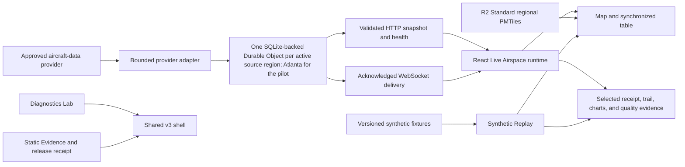

# Live Airspace v3 Ultra roadmap

Date: 2026-08-29

Status: authoritative roadmap, R3 locally complete, R4 acceptance and external release remain open

Product direction: A+B, regional Live Airspace with an evidence-first light workspace and selected-track investigation

Repository checkpoint: `80c1e47b1d3662163f297b67e8a3c86477159231` on `feat/live-airspace-v3`, dirty working tree

This document supersedes the scheduling and current-status portions of `v3-implementation-plan.md`. That larger file remains a historical engineering ledger. Requirements and test cases remain normative.

[`v3-execution-ledger.md`](v3-execution-ledger.md) is the current work-package and completion-audit companion. It does not turn planned or linked evidence into an executed result.

## 1. Decision

Live regional aircraft observations are the best major update for this dashboard.

The update adds the parts that make the project feel like a real full-stack system: an external data contract, provider-safe polling, one shared regional backend, WebSocket delivery, a real map, failure recovery, privacy boundaries, operating-cost controls, deployment evidence, and an honest public release process. It complements the existing synthetic Diagnostics Lab instead of replacing it.

The architecture should not be reset. The current provider-neutral React, Worker, Durable Object, MapLibre, PMTiles, Replay, Lab, Evidence, and unified offline foundation is the correct shape. Local R3 hardening is complete. The remaining work is frozen-source and retained-byte acceptance followed by separately authorized provider, platform, and release gates.

Public Live must fail closed. The complete A+B interface, Synthetic Replay, Diagnostics Lab, and Evidence route must remain demonstrable when the provider is disabled, unavailable, rate-limited, or not approved for public use.

## 2. Product promise

The public product description is:

> A near-real-time regional airspace observation and investigation workbench that displays recently received public ADS-B and MLAT observations, explains their freshness and limitations, and remains reproducible through synthetic replay and diagnostics.

It is not a complete flight tracker, dispatch tool, safety system, route predictor, owner lookup service, or aircraft-health monitor.

### The 90-second portfolio journey

1. Open the fixed Atlanta Live Airspace pilot.
2. Select a recently observed aircraft from the map or synchronized table.
3. Inspect the exact retained receipt, received position, altitude, speed, vertical rate, freshness, session trail, and charts.
4. Open the regional quality ledger and explain missing, stale, or uncertain data without treating it as an aircraft fault.
5. Switch to Synthetic Replay to reproduce an outage, stale observations, and recovery without a provider.
6. Open Evidence to show architecture, licenses, privacy boundaries, exact build identity, and executed verification.
7. Open Diagnostics Lab to demonstrate the existing analytical workflows.

Real provider data is the final operational proof, not a dependency for a reliable interview demo.

## 3. Scope

### Must ship in v3

- Real-source pilot: Atlanta only, using `GET /v2/point/33.6407/-84.4277/100`, one shared attempt no more often than every 20 seconds, and at most 25 attached or closing WebSocket viewers.
- Synthetic assurance may retain the Atlanta, Savannah / Statesboro, and Central Georgia presets; those additional presets are not public real-source routes.
- Live Airspace as the normal online entry point.
- A+B visual direction: light evidence-first workspace, dominant map, synchronized table, selected-track investigation rail, and session charts.
- Explicit source, receipt, observation-age, transport, data-quality, and limitation labels.
- Session-only aircraft trails and chart history.
- Synthetic Replay with deterministic pause, seek, and failure scenarios.
- All existing Diagnostics Lab capabilities, with a coherent v3 navigation path.
- Evidence route with exact artifact identity and honest gate status.
- Self-contained offline artifact with Live clearly unavailable and zero network requests.
- Provider-safe backend coordination, bounded delivery, backoff, admission control, observability, disablement, and rollback.
- Exact retained release candidate, hosted CI, SBOM, checksums, provenance, and deployment configuration receipt.

### Explicitly outside v3

- Worldwide or nationwide tracking.
- Military-only, PIA, LADD, or privacy-program discovery features.
- Owner or person lookup.
- Persistent watchlists or per-aircraft server history.
- Route, destination, schedule, or future-position inference.
- Aircraft maintenance, engine, fuel, safety, or fault claims.
- User accounts, social features, alerts, or generic AI chat.
- Silent failover to a different provider.

## 4. Current truth

| Area                | What is true now                                                                                                                                                                                                                                                                                                                                                                                                                         | What remains open                                                                                                                                                             |
| ------------------- | ---------------------------------------------------------------------------------------------------------------------------------------------------------------------------------------------------------------------------------------------------------------------------------------------------------------------------------------------------------------------------------------------------------------------------------------- | ----------------------------------------------------------------------------------------------------------------------------------------------------------------------------- |
| A+B product         | Dominant map, filters, table, selected exact receipt, session trail, altitude and speed charts, compact evidence strip, measurement ribbon, bounded regional quality ledger, responsive source order, and truthful boundary copy exist.                                                                                                                                                                                                  | Final frozen-source visual regression and retained-artifact proof remain open.                                                                                                |
| Backend             | Provider-neutral adapter, validated protocol, per-region Durable Object coordination, bounded acknowledged delivery, measured time, retry state, capacity controls, and aggregate-only persistence exist.                                                                                                                                                                                                                                | Physical Cloudflare behavior, account usage, and the final operating envelope are unproven.                                                                                   |
| Replay and Evidence | Deterministic Replay and a distinct Evidence route exist and have local tests. Browser and Worker identity now share one validated build source; historical load rows are source-bound and unbound checks no longer claim execution.                                                                                                                                                                                                     | A current retained artifact, complete gate receipts, and release identity remain open.                                                                                        |
| Diagnostics Lab     | All six workflows, Monitor, Diagnostics, Verification, Investigation, Campaign, and Configuration, are React-owned on the current dirty development tree with direct routes, retained session evidence, deterministic fault and campaign matrices, exact configuration and Investigation contracts, minimized versioned exports, explicit lifecycle cleanup, and a green complete post-offline local regression matrix.                  | Frozen-candidate, retained-artifact, hosted, and release evidence remain open.                                                                                                |
| Offline             | The unified one-file React artifact is implemented locally under `FDW-LUI-017` and `TC-LUI-018`. It defaults to a visible Live-unavailable state, exposes Replay, all six Lab workflows, and static Evidence, uses a map-unavailable substitute, retains in-memory navigation state, and passed its focused zero-network, parity, lifecycle, responsive, and accessibility browser gate plus the complete post-offline local regression. | A frozen retained artifact, hosted proof, and release evidence remain open.                                                                                                   |
| Local load evidence | Fresh raw-artifact smoke and exact 2,000-record maximum profiles pass for the current local R3-exit source identity. The earlier real 30-minute soak remains authentic historical evidence for digest `32d2ff35734f8dfebcdbab319d577b57587cdff379ea5ea285eb47b2f60353bb`.                                                                                                                                                                | These are local Miniflare and workerd results, not Cloudflare or production proof. Retained-candidate smoke, maximum, and soak must still repeat after R4 freezes the source. |
| Browser evidence    | The complete dirty-tree browser matrix, deterministic desktop and mobile A+B visual baselines, browser-persistence inspection, bundle budgets, 500-aircraft paint measurements, and 2,000-record browser-safety gates pass locally. React Investigation, Campaign, and unified offline are linked under `TC-LUI-016..018`.                                                                                                               | The same browser, visual, persistence, performance, fresh load, and fresh soak proof must repeat against one frozen retained candidate.                                       |
| Release             | Build isolation, rollback retention, and publication firebreaks are implemented locally.                                                                                                                                                                                                                                                                                                                                                 | Hosted exact-SHA CI, a current retained candidate, provider coordination, mock cloud staging, real-source staging, deployment, and public verification are open.              |

The current raw smoke and maximum reports are authentic only while their captured dirty-source identity matches this checkout. The earlier soak remains historical, and none of these local reports can substitute for the retained-candidate R4 matrix.

## 5. Target architecture

### Ownership boundaries

| Component               | Owns                                                                                                      | Must never own                                                          |
| ----------------------- | --------------------------------------------------------------------------------------------------------- | ----------------------------------------------------------------------- |
| Provider adapter        | Fixed approved query, timeout, payload bound, normalization, provider timestamps, rate-limit handling     | Browser-selected upstreams, silent fallback, unbounded retries          |
| Regional Durable Object | One eligible regional poll, durable control state, sequence and epoch, bounded fan-out, aggregate metrics | Persistent aircraft payloads, trails, callsigns, raw positions, IP logs |
| Browser session         | Current snapshot, selection, bounded 15-minute history, filters, charts, quality events                   | Durable watchlist or per-aircraft persistence                           |
| R2                      | Versioned PMTiles and map license assets                                                                  | Aircraft observations                                                   |
| Replay                  | Versioned synthetic scenarios and virtual time                                                            | Live transport or real-looking unmarked identities                      |
| Evidence                | Static architecture, licenses, limitations, exact artifact and gate receipt                               | Unverified claims or automatic provider requests                        |

Provider, region, feed epoch, sequence, delivery ID, aircraft identity, and receipt sequence remain explicit. Position time, measurement time, provider snapshot time, backend receipt time, and browser presentation time remain separate. The UI never combines them into a fabricated single timestamp.

## 6. Provider and map decision

### Aircraft source

ADSB.lol is the preferred primary provider candidate, not an approved production dependency yet.

ADSB.lol coordination response received on 2026-08-30. The provider confirmed general requirements for visible ODbL attribution, an identifiable contact-bearing User-Agent, respectful handling of HTTP errors and Retry-After, shared caching and deduplication, no rate-limit circumvention, and no service-level or stability guarantee. The response did not approve the proposed 20-second cadence, 25-viewer ceiling, exact User-Agent, public no-key access, incident contact, change-notification channel, or the ODbL obligations for transient normalized browser redistribution. G2 remains pending and Live remains disabled. The sanitized repository record is [`docs/provider/adsb-lol-coordination-2026-08-30.json`](provider/adsb-lol-coordination-2026-08-30.json).

Before public use, obtain operational acknowledgement for:

- the one exact Atlanta pilot query and 100-nautical-mile radius;
- minimum polling interval, concurrency, and daily ceiling;
- Cloudflare proxy and cache behavior;
- required headers or future API-key migration;
- browser display, transient normalization, and ODbL Produced Work treatment;
- visible attribution wording and link placement;
- aggregate-only retention;
- handling of military, PIA, LADD, and privacy-sensitive records.

OpenSky is not an automatic fallback. Its current formal terms require a prior written agreement for operational REST API integration, including a non-profit live product. Keep its adapter disabled unless a written agreement explicitly authorizes the exact public display, redistribution, hosting, identifiers, cadence, and retention model.

No browser request may select a provider or arbitrary upstream. A provider change creates a new configuration, license, test, and release decision.

### Map source

- MapLibre GL JS is BSD-3-Clause licensed.
- PMTiles reference code is BSD-3-Clause and the format specification is public domain or CC0 where applicable.
- Protomaps basemap tiles derived from OpenStreetMap are an ODbL Produced Work and require visible OpenStreetMap attribution.
- The map stays self-hosted from the versioned regional PMTiles artifact. Do not hotlink the Protomaps daily build.
- Preserve all software, icon, Natural Earth, Protomaps, and OpenStreetMap notices in the map manifest and Evidence route.

## 7. Hosting and operating envelope

Cloudflare Workers, SQLite-backed Durable Objects, WebSocket Hibernation, and R2 Standard remain the recommended platform because they fit the existing coordinator and map design.

Current official free limits include:

- Workers: 100,000 requests per day and 10 ms CPU per invocation.
- Durable Objects: 100,000 billed requests and 13,000 GB-seconds per day.
- SQLite-backed Durable Objects: 5 million rows read and 100,000 rows written per day.
- R2 Standard: 10 GB-month storage, 1 million Class A operations, and 10 million Class B operations per month.

The current one-region pilot makes at most 4,320 scheduled attempts per continuously viewed day. With the verified source-counted success path of nine KV-row writes plus two alarm-row writes per attempt, that is a minimum of 47,520 Durable Object row writes per day before initialization, early alarms, cleanup, failures, snapshot callers, or other workloads. This is below the published 100,000-row Free allowance, but it is source-counted modeling rather than platform billing proof. Therefore, `free-tier-first` remains a design goal, not a verified production claim.

G1 must choose and enforce one operating mode:

1. **Recommended first:** on-demand Atlanta activation, poll only while a viewer is present, idle shutdown, and strict daily budgets.
2. Restricted operating hours or a lower daily request budget.
3. A user-approved paid plan and explicit monthly ceiling.

Every mode needs hard application caps, tested quota-exhaustion behavior, a visible disabled or capacity state, usage alerts, and a one-action kill switch. Never enable an automatic paid upgrade.

## 8. A+B production experience

Keep the current light analytical system. Do not convert it into a decorative dark radar, cockpit, HUD, or marketing landing page.

### Desktop hierarchy

1. Workbench navigation and exact source banner.
2. Compact evidence toolbar with region, provider, transport, feed health, measured snapshot age, observation count, and shortened feed epoch.
3. Search and quality filters.
4. Dominant map and synchronized aircraft table.
5. Sticky selected-track investigation rail with viewport-bounded scrolling.

Transport and data freshness remain separate. `Connected` never means `current`.

### Investigation rail

- Selected identity and exact-versus-latest receipt mode.
- A compact measurement ribbon: altitude, ground speed, vertical rate or state, and freshness before detailed timestamps.
- Independent position, measurement, provider, and receipt times.
- Session-only trail and gap-preserving altitude and speed charts.
- Exact receipt table and textual chart equivalent.
- Regional quality ledger, clearly separated from selected-aircraft evidence.
- Explicit statements that data is received, incomplete, non-predicted, non-persistent, and not aircraft-health evidence.

The quality ledger shows the newest bounded events with code, kind, timestamp, optional aircraft ID, and a text label. Its empty state says no quality transitions were recorded in this browser session. It must not suggest that an unrelated regional delay belongs to the selected aircraft.

### Mobile and zoom behavior

Preserve one semantic DOM and this order:

1. Map
2. Selected investigation
3. Aircraft table

Use disclosure sections for charts, receipt history, and limitations to reduce the current long page. Do not duplicate the aircraft list for desktop and mobile. Verify 390 px, 320 CSS px, 200 percent text zoom, and the 1280 px at 400 percent reflow equivalent.

### Required visible states

| State                                | Required truth                                                                          |
| ------------------------------------ | --------------------------------------------------------------------------------------- |
| Loading                              | Source is not yet validated. No current-data claim.                                     |
| Valid empty                          | The query succeeded and returned no accepted observations. This is not an outage.       |
| No filter matches                    | Accepted observations exist, but the active filters hide them.                          |
| Current                              | Transport and source age are both acceptable.                                           |
| Degraded                             | Last valid evidence remains visible with the exact reason.                              |
| Stale                                | Observation age advances even if the socket remains connected.                          |
| Reconnecting                         | Show last valid evidence and retry state without promising recovery time.               |
| Provider unavailable or rate-limited | Show upstream status and wait deadline. Do not switch providers.                        |
| Protocol rejected                    | Reject the message before state mutation and preserve the last valid receipt when safe. |
| Map unavailable                      | Keep the table, charts, text evidence, and retry control usable.                        |
| Live disabled or offline             | Explain that Replay and Lab remain available. Make no provider or tile request.         |

All states need text, keyboard access, visible focus, announced changes, reduced motion, and no color-only meaning.

## 9. Delivery roadmap

### Gate summary

| Gate | Purpose                                          | Status                                                          |
| ---- | ------------------------------------------------ | --------------------------------------------------------------- |
| G0   | Frozen local product and retained mock candidate | Open; exact-SHA hosted proof requires commit and push authority |
| G1   | Bounded mock deployment on physical Cloudflare   | Requires Kato's account, budget, and deployment approval        |
| G2   | Provider-coordinated bounded real-source staging | Requires provider terms and Kato's exact authorization          |
| G3   | Exact public release and rollback verification   | Requires Kato's approval of the exact candidate and destination |

### Phase R0: reconcile truth and evidence

Status: completed locally on the current dirty development tree.

Deliverables:

- Update the stale Evidence catalog and status documentation for the recorded smoke, maximum, and soak reports.
- Add execution time, source digest, artifact digest, command, report path, review state, and truth boundary to every gate record.
- Distinguish `pending`, `passed-historical`, `passed-current`, `blocked-external`, and `released`.
- Make release traceability fail when a required test is pending, absent, or not executed for the target candidate.
- Wire immutable build identity into the normal Evidence route.

Exit gate:

- Every UI, backend, load, artifact, provider, platform, and release claim points to exact evidence or says pending.
- Structural traceability is not presented as test execution.

Estimated effort: 1 to 2 focused days.

### Phase R1: close the A+B product gaps

Status: completed locally on the current dirty development tree.

Deliverables:

- Render the regional session quality ledger.
- Add the selected-receipt measurement ribbon.
- Add the compact evidence toolbar without creating generic KPI cards.
- Improve desktop rail behavior and mobile disclosure.
- Preserve shared Live and Replay semantics and exact receipt identity.
- Scope CSS changes so Live redesign work cannot silently alter Lab, Replay, or Evidence.

Exit gate:

- Map, table, selected receipt, trail, charts, text evidence, measurement ribbon, and quality ledger agree for the same exact receipt.
- Loading, empty, filtered-empty, current, stale, reconnecting, provider failure, protocol failure, map failure, disabled, and offline states pass focused component tests.
- Live and Replay both pass after the shared view changes.

Estimated effort: 2 to 4 focused days.

### Phase R2: close offline v3 and complete the Lab boundary

Status: completed locally on the current dirty development tree. The zero-network legacy boundary, all six React Lab workflows, and the unified React offline v3 artifact are implemented and passed both focused proof and the complete post-offline local regression matrix. Every frozen, retained, hosted, provider, deployment, and release gate remains open.

Deliverables:

- Preserve the completed `TC-LUI-006` legacy boundary and the unified `TC-LUI-018` React offline boundary with explicit Live-unavailable copy and zero provider, tile, font, CDN, analytics, and telemetry-upload requests.
- Preserve the completed local React Campaign contract and the green complete post-offline verification matrix without changing verified domain behavior.
- Keep the approved v2.2.0 artifact intact for rollback.
- Bundle useful static Evidence and synthetic Replay context in the offline artifact. Do not bundle the full 133 MB regional map.

Exit gate:

- All six Lab workflows and required exports remain functional.
- Offline startup and the complete tested journey work from `file:` with networking disabled.
- Live is visibly unavailable and no background request is attempted.

Historical pre-completion estimate: 2 to 5 focused days. No local R2 implementation remains; frozen-candidate and release evidence belong to R3, R4, and G0 through G3.

#### React Lab migration sequence

The legacy `v2.html` workflow remains a retained rollback and regression artifact. Monitor, Diagnostics, Verification, Investigation, Campaign, and Configuration are fully React-owned in the current dirty development tree, and the unified offline cutover has reached its focused local parity gate. The completed migration sequence is:

1. **Monitor, completed locally:** source ingestion, profile selection, replay, charts, baseline capture, retained session evidence, and active-work cleanup are React-owned.
2. **Verification, completed locally:** direct Lab subview routing, baseline and candidate capture, blocked/pass/fail comparison, resolved/persisting/introduced groups, canonical requirement evidence, `verification.v2` conformance, and minimized versioned export are implemented.
3. **Diagnostics, completed locally:** exact nonmutating finding filters, distinct nominal and filter-empty states, safe quarantine evidence, deterministic canonical and legacy-CSV fault controls, atomic seeded-candidate generation, source-minimized fault provenance, cancellation, and retained React Verification handoff are implemented.
4. **Configuration, completed locally:** exact profile, channel, rule, adapter, unit, registry, artifact, canonical-configuration, quality-gate, and evidence-split contracts are implemented; every advisory model defaults off and fails closed; the bounded deterministic browser simulator remains zero-network and separate from public Live Airspace; `configuration-report.v1` remains source-minimized.
5. **Investigation, completed locally:** `#lab-investigation` owns the reviewed scenario defaults and validation, deterministic generation and analysis, linked replay position, expected/observed/predicted/estimated waveform evidence, strict comparison compatibility, overlays, accessible charts, advisory-model intent snapshots, exact identity and quality-gate evidence, stale-work cancellation, and privacy-minimized `investigation-report.v1` export. Deterministic rules remain authoritative, and generated lifecycle truth remains verification-only metadata.
6. **Campaign, completed locally:** `#lab-campaign` owns strict bounded seed controls, the exact 31-scenario fixed-wing matrix, one lazy worker, one-active-request enforcement, campaign and specification identity checks, monotonic processed-case progress, graceful cancellation with verified partial evidence, hard-stop and failure containment, stale-callback rejection, minimized `campaign-report.v1`, and teardown on terminal settlement, route or workspace exit, page hide, clear, stop, and React cleanup.
7. **Offline cutover, completed locally:** the dedicated React offline entry excludes the Live service and geographic map runtime, includes all six Lab workflows plus Synthetic Replay and static Evidence, and performs no network activity in the focused file-protocol acceptance journey.

The React Verification slice passed its focused current-tree gate: direct entry, Back and Forward behavior, skip-anchor and keyboard navigation, retained Lab session state, nominal/pass/fail/blocked/incompatible outcomes, exact comparison groups, canonical requirement evidence, source-minimized export, hidden replay/chart cleanup, 320 px and 390 px reflow, 200 percent text zoom, and serious/critical Axe checks. Nine local React Lab browser cases now pass with guarded same-origin synthetic data. This is dirty-tree local evidence, not retained-candidate or release proof.

The React Diagnostics slice passed its focused current-tree gate: all 13 declared fault scenarios cross the typed Lab session; filters retain exact legacy predicates without mutating or truncating export evidence; invalid, blocked, incompatible, failed, cancelled, and superseded work preserves settled evidence; canonical and legacy-CSV provenance reaches source-minimized reports and analytics; and the guarded browser journey passes direct entry/reload, Back/Forward retention, 390- and 320-pixel reflow, 200 percent text size, reduced motion, serious/critical Axe, zero Local or Session Storage, and zero Live/provider/map requests. The complete 25-case Live browser matrix and the 49-pass/one-skip legacy/offline oracle also pass after the migration. This remains dirty-tree local evidence, not retained-candidate or release proof.

The React Configuration slice passed its focused current-tree gate: `FDW-LUI-014` and `TC-LUI-015` now bind exact build, run, adapter, profile, channel, rule, mapping, registry, artifact, canonical-configuration, quality-gate, activation-purpose, compatibility, and authority evidence. A 171-test focused matrix and the guarded browser journey pass explicit robust and temporal model opt-in, Strict Mode lifecycle, simulator stop and route cleanup, minimized export, zero Live/provider/map/storage/data-plane access, 390- and 320-pixel reflow, 200 percent text size, reduced motion, and serious/critical Axe checks. This remains dirty-tree local evidence, not retained-candidate or release proof.

The React Investigation slice is implemented locally under `FDW-LUI-015` and `TC-LUI-016`. Coverage links the pure runner and prepared evidence contract, strict `investigation-report.v1` schema and privacy recursion tests, Lab session lifecycle, direct `#lab-investigation` routing, the six-tab React view, chart ownership and cleanup, and the guarded browser journey. Focused contract, session, component, chart, schema, and route checks pass on the dirty development tree, and the complete post-offline local matrix is now recorded below. This is not frozen-source, retained-candidate, hosted, provider, deployment, or release proof.

The React Campaign slice is implemented locally under `FDW-LUI-016` and `TC-LUI-017`. Coverage links strict bounded controls, the exact deterministic matrix, one-worker client identity and lifecycle checks, session ownership, terminal-state evidence, the `campaign-report.v1` schema and privacy exclusions, direct `#lab-campaign` routing, and guarded browser acceptance source. Its focused proof and the complete post-offline local matrix are green. This is dirty-tree implementation evidence only, not frozen-source, retained-candidate, hosted, provider, deployment, or release proof.

The unified React offline slice is implemented locally under `FDW-LUI-017` and `TC-LUI-018`. `dist-offline/index.html` is the only runtime file in the generated directory and measured 1,315,264 bytes at this checkpoint. It opens directly through `file:`, uses a no-connect CSP, renders Live as unavailable, preserves hash-addressable Replay, all six Lab subviews, and static Evidence, replaces geographic rendering with truthful offline context, and keeps the Campaign Worker inline as the only counted secondary execution resource. Focused browser acceptance passed three cases with one intentional duplicate mobile parity skip, including deterministic Investigation and Campaign parity, cleanup, empty browser storage, 390- and 320-pixel layouts, 200 percent text, reduced motion, and serious/critical Axe checks. Build inspection found no Live service, provider, health, socket, MapLibre, map-asset, or external subresource runtime. The complete post-offline regression also passed. This is current dirty-tree local proof only, not a frozen or retained candidate, hosted evidence, provider evidence, deployment, or release.

### Phase R3: harden quality, privacy, and observability

Status: locally complete on the dirty development tree. Kato selected Operational Evidence Option 1 and Runtime Policy Option 2 on 2026-08-29. The distributable [R3 hardening portfolio](../hardening/r3/hardening.md) records the selection, tradeoffs, and unchanged external-authority boundary. D1 and R3-01 through R3-06 are implemented and pass their current local gates. This does not freeze a source revision, retain a current candidate, execute hosted CI, or complete a release gate.

The generated Worker deployment-metadata blocker is resolved locally. Connected builds now emit a minimized allowlisted manifest, omit `configPath` and `userConfigPath`, and fail pre-use and pre-retention scans on forbidden metadata, path, identity, secret, source-map, binding, route, or target capability. Current production-disabled and mock-staging artifacts pass this policy. One future retained candidate must still prove the same boundary without rebuilding.

Selected-pair deliverables, activated by Kato's 2026-08-29 approval. A future selection change requires the roadmap and acceptance contracts to be updated before affected implementation continues:

- Stable `FDW-*` requirements, `TC-*` cases, traceability mappings, and evidence roots for every selected R3 contract before product-source changes begin.
- Application SLIs: static and API availability, WebSocket establishment, validation rejection, delivery and ACK health, and error rate.
- Provider SLIs: poll result, rate limit, retry deadline, provider snapshot age, contact age, and position age.
- A versioned `operations.v1` contract that separates application health from provider observation health, retains partial regional results, and classifies valid-empty, stale, disabled, unavailable, and rate-limited states with fixed reason codes.
- Bounded aggregate logs and metrics with no aircraft identifiers, callsigns, coordinates, trails, payloads, or client IP retention.
- One typed runtime and release policy for mode, provider egress, origins, headers, artifact fields, disablement, quotas, performance budgets, release receipts, and rollback identity.
- A whole-artifact privacy auditor plus a separate G2 no-capture harness that cannot retain screenshots, traces, HAR, response bodies, or aircraft-level evidence.
- Tested kill switch, quota-exhaustion state, provider-term-change procedure, stale-feed procedure, incident response, candidate retention, and rollback runbooks.
- Target-specific response headers, CSP, fixed upstream, route and origin allowlists, payload bounds, secret isolation, dependency review, and abuse controls.
- Mechanically enforced bundle budgets, 500-aircraft validated-snapshot-to-stable-paint measurement, 2,000-record browser safety, responsive layouts, reduced motion, and serious or critical accessibility checks.

Exit gate:

- Storage, browser persistence, logs, reports, screenshots, and release artifacts pass a privacy inspection.
- Retained candidate metadata contains no absolute local path, username, credential, temporary root, unapproved origin, or forbidden aircraft field.
- Operator can distinguish application failure from an upstream stale or empty feed.
- Disablement preserves Replay, Lab, Evidence, and rollback.
- The selected policy and health contracts pass deterministic fault, equivalence, maximum-record, performance, accessibility, incident, and rollback gates without weakening the current regression matrix.

Historical planning estimate before implementation: 2 to 4 focused days. The local R3 package is now complete.

### Phase R4: complete local acceptance and freeze G0

Current post-R3 Ultra checkpoint, verified on the dirty working tree on 2026-08-30. This is broad current-source development evidence, not a frozen, retained, committed-SHA, hosted, provider, deployment, or release result.

| Verification layer         | Current local result                                                                                                                                                                                                               |
| -------------------------- | ---------------------------------------------------------------------------------------------------------------------------------------------------------------------------------------------------------------------------------- |
| Static quality             | Formatting, ESLint with zero warnings, and all three TypeScript configurations pass.                                                                                                                                               |
| Application tests          | The complete configured application suite and coverage thresholds pass; the real-filesystem POSIX executable-mode integration remains intentionally skipped on Windows while its deterministic accounting path runs on every host. |
| Worker tests               | The complete Worker suite passes. Controlled failure-path exception logs are expected test fixtures.                                                                                                                               |
| Python analytics and ML    | The complete analytics and ML suites pass.                                                                                                                                                                                         |
| Live browser               | The complete Live/React Lab/Replay/Evidence suite passes, including all six Lab routes and the unified offline integration boundary.                                                                                               |
| Live failure flow          | The real guarded synthetic-provider outage and recovery case passes, 1 of 1.                                                                                                                                                       |
| Portfolio walkthrough      | The M3 desktop/mobile evidence-boundary walkthrough passes, 1 of 1.                                                                                                                                                                |
| Legacy and offline browser | The complete legacy, accessibility, responsive, and offline suite passes with one intentionally duplicated mobile parity case skipped. The offline artifact performs no application HTTP or WebSocket requests.                    |
| R3 browser hardening       | Desktop and mobile A+B visual baselines, bundle budgets, 500-aircraft paint, 2,000-record interaction safety, browser-persistence inspection, and aggregate-only performance receipts pass locally.                                |
| Builds and local services  | Normal, offline, production-disabled, and mock-staging builds pass. Production/mock artifact isolation, local R2 map seeding, privacy and runbook gates, and the generated Worker dry run pass.                                    |
| Traceability               | Strict traceability passes: 218 requirements map to 313 declared tests across 55 areas; all selected R3 evidence paths are regular files bound by the refreshed source-content manifest.                                           |

This checkpoint is not G0. The source is not frozen or retained, exact-SHA hosted CI has not run, and the load/soak reports remain historical for their recorded source digest.

Required automated proof:

- Formatting, lint, TypeScript, unit, integration, Worker, schema, traceability, normal build, Live build, mock-staging build, offline build, and Worker dry-run.
- Load tooling now requires an explicit raw artifact root or verified clean-source candidate root, protects candidate provenance and report-output boundaries, and binds the complete artifact tree before and after execution. The current raw-artifact smoke passed both local workerd topologies and its report contains no absolute repository path. Final smoke, maximum, and soak evidence must still execute in candidate mode against retained bytes without rebuilding.
- Full retained-artifact browser matrix, not only development-server tests.
- Exact-receipt selection through a real MapLibre trail point, chart, table, and text panel.
- Local deterministic visual regression for the light A+B hierarchy, dominant map, investigation rail, mobile order, and prohibited HUD styling passes; repeat it against the frozen retained candidate.
- Accessibility scans across all important states, keyboard-only journey, reduced motion, 200 percent zoom, 320 px reflow, and screen-reader spot checks.
- Browser persistence inspection for Local Storage, Session Storage, IndexedDB, Cache Storage, and service workers.
- Performance and capacity gates below.

Performance gates:

- Initial shell JavaScript below 200 kB gzip.
- Lazy map route JavaScript below 500 kB gzip.
- At 500 visible aircraft, p95 validated-snapshot-to-paint below 500 ms on the recorded desktop profile and below one second on the recorded mobile profile.
- At 2,000 accepted records, no crash, truncation, unbounded queue, or loss of filter, focus, selection, and table access.
- One Atlanta hub with 1, 10, and 25 WebSocket viewers, one stalled viewer, reconnect storm, hibernation, restart, and backoff remains bounded. Additional three-region synthetic regression does not expand the public pilot envelope.
- A fresh corrected smoke, maximum, and real 30-minute soak pass on the exact frozen source and artifact.

G0 exit gate:

- One committed source SHA is built once and retained.
- Candidate client, Worker, provider mode, non-secret environment, binding names, map, schemas, replay fixtures, Lab, rollback, SBOM, checksums, and provenance agree.
- The complete browser and release matrix runs against those retained bytes with zero retries.
- No build occurs after retention.

Estimated effort: 3 to 5 focused days, plus the fixed soak duration.

### Gate G1: physical Cloudflare mock proof

Preconditions requiring Kato's approval:

- exact account and target;
- Free or paid plan decision;
- maximum dollar budget and alerts;
- deployment window and stop conditions;
- authorization to create or use Workers, Durable Object, and R2 resources.

Execution:

- Deploy the exact retained mock candidate to an isolated non-public target.
- Keep every real provider path disabled and deny unexpected egress.
- Exercise one Atlanta-equivalent mock region with 1, 10, and 25 synthetic WebSocket viewers within the approved window.
- Verify R2 byte ranges, Durable Object hibernation and restart, alarms, capacity rejection, reconnects, aggregate metrics, disablement, and cleanup.
- Measure actual requests, rows read and written, duration, CPU, R2 operations, and headroom.

Exit gate:

- Select and enforce the operating mode with at least 25 percent measured headroom or an approved paid ceiling.
- Prove the kill switch and quota-exhaustion state.
- Retain aggregate-only evidence and delete temporary mock resources if that is the approved stop condition.

No G1 result is provider approval or public release evidence.

### Gate G2: provider-coordinated real-source staging

The 2026-08-30 response closes the provider-contact substep only. It is not an approved provider-gate receipt and does not authorize a real-source request.

Preconditions requiring external and Kato approval:

- dated provider terms and operational acknowledgement or written license;
- exact `GET /v2/point/33.6407/-84.4277/100` endpoint, no-faster-than-20-second shared cadence, 25-WebSocket-viewer ceiling, daily request ceiling, attribution, cache, redistribution, retention, and API-key decisions;
- exact target, time window, request ceiling, stop conditions, and privacy plan;
- production candidate with no mock code, binding, or client-selectable source.

Execution:

- Use only the fixed Atlanta endpoint, never start attempts more often than every 20 seconds, and admit at most 25 attached or closing WebSocket viewers.
- Run a bounded health and valid-empty check, then a nonempty observation walkthrough if observations are available within the approved limit.
- Verify attribution, freshness, server time, rate-limit handling, disablement, and recovery.
- Retain only aggregate gate evidence. Do not retain aircraft identifiers, callsigns, positions, trails, payloads, or screenshots containing live aircraft data.

Exit gate:

- One real observation passes through the deployed pipeline with honest source and age labels for any real-observation claim.
- A valid empty result proves connectivity and validation only. It does not prove that a real aircraft was displayed.
- No cadence, region, provider, or duration may expand without new approval.

### Gate G3: exact public release

Preconditions requiring Kato's explicit approval:

- exact retained production candidate and configuration receipt;
- public hostname and target;
- provider and map attribution;
- operating mode and budget;
- rollback version and stop conditions.

Execution:

- Deploy the exact retained candidate without rebuilding.
- Verify HTTPS and WSS, root and direct routes, four workspaces, map ranges, exact Evidence identity, provider-disabled behavior, live flow, accessibility, privacy headers, observability, and rollback.
- Preserve v2.2.0 until cutover and rollback both pass.
- Monitor the first bounded window and disable Live if provider, freshness, quota, error, privacy, or cost thresholds fail.

Exit gate:

- Public URL, artifact hashes, runtime configuration, Evidence identity, provider mode, map digest, schemas, SBOM, and rollback receipt all agree.
- Only then update README and portfolio claims to say Live is deployed.

### Phase R5: portfolio packaging and operations

Deliverables:

- A synthetic-data screenshot set and 90-second demo script.
- Architecture diagram, data card, threat model, provider and map license card, and verification summary.
- Resume-ready project bullets tied only to executed evidence.
- Operator runbook for provider rate limits, empty feed, stale feed, quota exhaustion, disablement, provider-term change, incident response, and rollback.

Estimated effort: 1 to 2 focused days after G3.

## 10. Release evidence model

Every accepted gate receipt must include:

- gate and test-case IDs;
- start and finish time;
- committed source SHA and source-content digest;
- client, Worker, map, schema, replay, Lab, rollback, and SBOM digests;
- non-secret deployment configuration, allowed origins, provider mode, target, binding names, and secret-version identity;
- exact commands, environment, fixtures, profiles, and results;
- report and artifact paths;
- reviewer status and truth boundary;
- explicit distinction among local, retained-artifact, hosted CI, Cloudflare, provider, staging, and public proof.

The release checker must fail if required evidence is missing, pending, stale for the candidate, or merely linked but not executed.

## 11. Definition of Done

v3 is complete only when all of the following are true:

1. Live is described as recent public ADS-B and MLAT observations, never aircraft telemetry, health, route, ownership, safety, or complete coverage.
2. Map, table, selected receipt, trail, charts, measurement ribbon, quality ledger, source age, and failure state stay synchronized and accessible.
3. Loading, empty, degraded, stale, reconnecting, rate-limited, offline, protocol-error, map-error, disabled, and recovered states are distinct and tested.
4. Aircraft identifiers, callsigns, positions, payloads, trails, and client IPs are absent from server persistence, logs, release artifacts, retained real-source evidence, and browser persistence.
5. Replay and Lab remain usable when Live is disabled or unavailable.
6. The complete offline artifact works with zero network requests.
7. Provider, ODbL, map licenses, attribution, cadence, redistribution, retention, and API-key obligations have dated evidence.
8. G1 establishes an enforceable operating envelope. The product is not called free-tier-safe before that proof.
9. Hosted CI passes on the exact committed SHA and exact retained candidate bytes.
10. Candidate bytes, deployment configuration, map, schemas, SBOM, checksums, Evidence identity, and rollback receipt agree.
11. G2 proves the bounded real-source pipeline without retaining aircraft-level evidence.
12. G3 independently verifies the public deployment, disablement, monitoring, and rollback.
13. The 90-second synthetic portfolio demo works even if Live is unavailable.

If provider coordination prohibits the proposed cadence or public display, or G1 finds no acceptable free-first or approved paid operating envelope, release the complete A+B, Replay, Lab, and Evidence product with Live disabled. Reopen provider selection only through a new license, privacy, configuration, and acceptance decision.

## 12. Immediate next implementation slice

Steps 1 through 9 are local and require no provider, account, billing, deployment, commit, or publication action. Step 10 requires separate commit and push authority for exact-SHA hosted proof:

1. Completed locally: render the regional quality ledger and selected-receipt measurement ribbon.
2. Completed locally: improve desktop rail and mobile disclosure while preserving map, investigation, table semantic order.
3. Completed locally: close `TC-LUI-006` with explicit offline Live-unavailable copy and zero-network proof.
4. Completed locally: repair the Evidence catalog and inject target-aware build identity with an exact-SHA path for frozen CI artifacts.
5. Completed locally for the current development tree: current-source builds, 25-case Live browser matrix, outage/recovery flow, M3 walkthrough, legacy/offline regression, static checks, and application, Worker, analytics, and ML suites.
6. Completed locally: implement React Monitor, React Verification, React Diagnostics, React Investigation, React Campaign, React Configuration, and six-tab Lab subview navigation with versioned evidence, deterministic fault and campaign provenance, exact model and configuration contracts, strict Investigation comparison and privacy boundaries, parity, schemas, responsive, accessibility, export, and lifecycle test sources.
7. Completed locally: build the dedicated unified React offline v3 entry and prove its one-file, zero-network, six-workflow, Replay, Evidence, parity, responsive, accessibility, and cleanup boundary.
8. Completed locally: rerun and record the complete post-offline matrix without weakening the completed Investigation, Campaign, or offline contracts.
9. Completed locally: the selected [hardening pair](../hardening/r3/hardening.md), D1, and R3-01 through R3-06 pass on the current dirty tree. Stable requirements, source-bound evidence, artifact privacy, aggregate-only G2 firebreak, typed numeric policy, failure compatibility, browser budgets and performance, deterministic visual baselines, eight executable runbooks, and candidate-bound receipt verification are in place.
10. After explicit commit and push authority, freeze one source revision, run exact-SHA hosted CI, retain one build, execute the retained-artifact matrix without rebuilding, and rerun corrected smoke, maximum, and 30-minute soak through the verified candidate input and its private hash-matched execution snapshot before accepting G0.

Do not request G1 until the complete local G0 candidate and a source-counted operating-budget packet are ready.

## 13. Planning estimate

The current foundation avoids an architecture rewrite. R0 through R3 are locally complete, including all six visible React Lab workflows, the unified zero-network React v3 artifact, the complete dirty-tree regression, and the selected hardening package. A frozen source and retained candidate remain before local G0. The remaining ranges are planning estimates, and provider and account waiting time remains separate:

| Remaining work                             |    Estimate |
| ------------------------------------------ | ----------: |
| Full local acceptance and frozen candidate | 3 to 5 days |
| Portfolio packaging                        | 1 to 2 days |

G1, G2, and G3 are separately authorized operational gates, not work hidden inside the local estimate.

## 14. Primary references refreshed for this replan

- [ADSB.lol deployed API documentation](https://api.adsb.lol/docs)
- [ADSB.lol API repository and dynamic-rate-limit notice](https://github.com/adsblol/api)
- [ADSB.lol privacy and license](https://www.adsb.lol/privacy-license/)
- [Open Data Commons ODbL 1.0](https://opendatacommons.org/licenses/odbl/1-0/)
- [OpenSky terms of use](https://opensky-network.org/about/terms-of-use)
- [OpenSky REST API documentation](https://openskynetwork.github.io/opensky-api/rest.html)
- [Cloudflare Workers pricing](https://developers.cloudflare.com/workers/platform/pricing/)
- [Cloudflare Durable Objects pricing](https://developers.cloudflare.com/durable-objects/platform/pricing/)
- [Cloudflare Durable Objects limits](https://developers.cloudflare.com/durable-objects/platform/limits/)
- [Cloudflare R2 pricing](https://developers.cloudflare.com/r2/pricing/)
- [MapLibre GL JS license](https://github.com/maplibre/maplibre-gl-js/blob/main/LICENSE.txt)
- [Protomaps basemap licensing and attribution](https://github.com/protomaps/basemaps#licensing-and-attribution-guidelines)
- [PMTiles license](https://github.com/protomaps/PMTiles/blob/main/LICENSE)

Provider, platform, pricing, and license facts are time-sensitive. Refresh them immediately before G1, G2, and G3.
